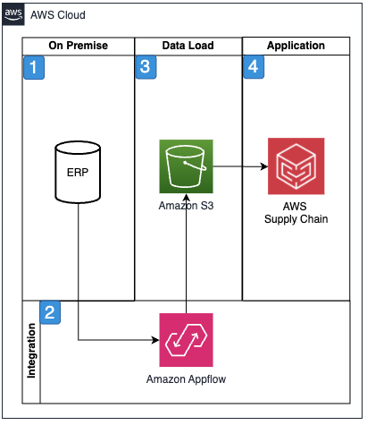

# Supply chain command center (SC3)

Global enterprises today face critical gaps in their supply chain
systems that hamper visibility, coordination, and responsiveness
across their operations. These gaps often manifest as disconnected
data silos, manual intervention requirements, and the inability to
adapt quickly to market changes or disruptions. Legacy systems,
while robust in their core functions, frequently lack the agility
and intelligence needed to manage modern supply chain
complexities, leading to inefficiencies, increased costs, and
missed opportunities for optimization.

Amazon SC3 provides capabilities to addresses these gaps in the
end-to-end (E2E) supply chain. Organizations can either fully
implement the SC3 as a stand-alone application or integrate its
microservices with existing supply chain systems to coordinate
operations. This flexible approach enables real-time
decision-making for optimal resource allocation and workload
balancing.

SC3 uses AWS's advanced AI and generative AI capabilities,
including Amazon Bedrock and custom machine learning models, to
automatically cleanse and standardize product master data across
enterprise systems. The solution's intelligent algorithms identify
duplicate SKUs by analyzing product descriptions, specifications,
and attributes, even when items are listed with different naming
conventions or in multiple languages.

Using natural language processing and similarity matching, SC3 can
detect and consolidate redundant product entries, flag obsolete
items based on usage patterns, and correct inaccurate
specifications through cross-referencing with vendor catalogs and
industry databases.

For example, when analyzing maintenance parts data, the system
might recognize that 1/2-inch steel bolt - zinc plated and
Zinc-coated steel bolt 12.7mm refer to the same item,
automatically suggesting consolidation while maintaining
traceability of historical transactions. This automated data
cleansing not only helps prevent erroneous purchase orders but
also enables strategic sourcing opportunities by providing clear
visibility into consolidated vendor spend, resulting in cost
savings through improved vendor negotiations and reduced
administrative overhead.

SC3 transforms spare parts management by combining predictive
maintenance capabilities with intelligent inventory optimization.
SC3 employs Amazon SageMaker AI machine learning algorithms to analyze
equipment sensor data, maintenance histories, and usage patterns
to forecast potential failures and automatically trigger parts
ordering at optimal times.

This predictive approach allows organizations to reduce working
capital tied up in excess inventory while maintaining high service
levels. For example, SC3 can integrate with equipment IoT sensors
to monitor component wear, environmental conditions, and
performance metrics, automatically adjusting safety stock levels
based on predicted failure rates and lead times.

The system also considers factors such as part criticality,
replacement costs, and downstream impact of equipment failure to
optimize stocking strategies across multiple locations. By
synchronizing maintenance schedules with parts availability and
technician resources, SC3 helps organizations minimize both
planned and unplanned downtime while reducing inventory carrying
costs.

Quality control and compliance management gaps are resolved
through SC3's AI/ML capabilities, which can be deployed either as
a comprehensive solution or as targeted microservices. The system
analyzes data from quality inspection stations, temperature
sensors in storage or transit, and production line monitoring
systems to identify potential quality issues before they impact
downstream operations.

Organizations can implement SC3 for automated hold orders,
inventory rerouting, stock recalls and replenishment from recall,
automated notifications, and root cause analysis workflows.

## Reference architecture

## Architecture description

1. Ingest data from internal or external systems into Amazon S3
   for loading into Amazon Redshift.
2. AWS Glue and AWS Glue DataBrew convert the raw data from
   Amazon S3 into Amazon Redshift for application access,
   queries, and dashboards.
3. Amazon SageMaker AI provides AI/ML for data management,
   analysis, decision support, and recommendations.
4. Amazon Amplify provides the front-end user experience. AWS Step Functions manage automated process flows. Amazon
   Location Services provides map-based visualizations. AWS Lambda holds business Logic. Amazon Quicksight provides
   dashboards and metrics.

## Architecture objectives

- Enable near real-time updates to supply chain visibility and
  decision making across multiple parties.
- Scalable data ingestion and management.
- Automate data governance and cleansing using AI/ML.
- Enhance quality control through automated, standardized
  processes.
- Provide flexible deployment options as a complete solution
  or select microservices to support existing systems.

## Metrics

Based on the supply chain command center (SC3) scenario,
relevant metrics for an AWS Well-Architected Framework analysis
are:

- Incident response time:
  - **Primary metric**: Time
    taken to detect, respond to, and resolve supply chain
    disruptions.
  - **Supporting metrics**:
    - Mean Time to Detect (MTTD) supply chain anomalies
    - Mean Time to Resolve (MTTR) critical issues
    - Percentage of incidents automatically resolved
      without human intervention
    - **Relevance**:
      Critical for measuring SC3's effectiveness in
      handling supply chain disruptions and maintaining
      business continuity, especially given its role in
      predictive maintenance and quality control

- Automation rate:
  - **Primary metric**:
    Percentage of supply chain tasks and processes that are
    fully automated.
  - **Supporting metrics:**
    - Number of manual interventions required per week
    - Percentage reduction in manual data entry tasks
    - Time saved through automated processes
    - **Relevance**:
      Directly measures SC3's core value proposition of
      automating supply chain operations and reducing
      manual intervention

- Resource utilization:
  - **Primary metric**:
    Percentage of available computing resources utilized
    during peak operations
  - **Supporting metrics**:
    - API response times under load
    - Database query performance
    - ML model inference latency
    - **Relevance**:
      Essential for SC3's scalability and
      cost-effectiveness, particularly important given the
      system's heavy reliance on AI/ML processing

- Compliance adherence:
  - **Primary metric**:
    Percentage of workflows that meet regulatory and quality
    control requirements
  - **Supporting metrics:**
    - Number of compliance violations detected and
      prevented
    - Percentage of quality control checks automated
    - Completeness of audit trails for regulated processes
    - Time to generate compliance reports
    - **Relevance**:
      Essential for measuring SC3's effectiveness in
      maintaining quality control and regulatory
      compliance, particularly important given the
      system's role in automated quality management and
      parts tracking

These metrics were selected because they:

- Align directly with SC3's core objectives of automation and
  efficiency
- Focus on critical aspects of system reliability and
  performance
- Provide actionable insights for optimization
- Align with regulatory and quality control objectives
- Support the AWS Well-Architected Framework's pillars
  (particularly operational excellence, performance
  efficiency, and cost optimization)
