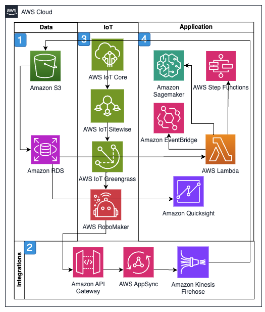

# Transportation visibility and fleet tracking

Today's complex supply chains require end-to-end visibility to
manage disruptions, optimize delivery scheduling, and meet
customer expectations for real-time tracking information.
Transportation visibility and fleet tracking services have become
essential for logistics providers to maintain competitive
advantage and service levels. AWS provides a comprehensive set of
services enabling organizations to achieve real-time visibility,
optimize last-mile delivery operations, and enhance customer
experience.

AWS Location Services enable critical transportation visibility
through integration of two applications: a driver appointment
scheduling interface and a mobile tracking application. Key
workload requirements include real-time location tracking, dynamic
task assignment, direct driver communication channels, and
automated geofencing capabilities. The solution connects with
mobile devices, processes location data streams, and delivers
instant notifications to multiple stakeholders.

This architecture uses AWS managed services to deliver a scalable,
reliable tracking solution. At its foundation, Amazon Location
Services provides the core mapping and tracking functionality
essential for fleet management and route visualization. AWS IoT Core serves as the backbone for secure device connectivity,
enabling real-time data streaming from vehicles and mobile devices
across the transportation network. The backend services for
appointment scheduling and notification delivery are powered by
Amazon API Gateway and AWS Lambda, for responsive and scalable
processing of logistics operations. To support cross-system
compatibility and enhance user experience, the mobile applications
are built using AWS Amplify, providing a seamless interface for
both drivers and dispatchers.

The implemented solution delivers comprehensive transportation
visibility through multiple integrated capabilities. Real-time
vehicle tracking and location monitoring provide constant
awareness of fleet positions, while automated geofence creation
and breach notifications enable proactive management of delivery
zones and waypoints. Dynamic route optimization and task
assignment capabilities facilitate efficient resource utilization
and adapt to changing conditions throughout the day. The solution
includes robust in-app driver communication capabilities,
facilitating direct coordination between drivers, dispatchers, and
support teams. Additionally, customer-facing delivery status
updates and ETAs enhance the end-customer experience by providing
transparent and accurate delivery information. These combined
features create a unified system that optimizes transportation
operations while maintaining high service levels and customer
satisfaction.

AWS services can seamlessly integrate with third-party Electronic
Logging Device (ELD) solutions to create a comprehensive fleet
management and route optimization system. ELD devices, which are
mandated for commercial vehicles to track Hours of Service (HoS)
compliance, connect to the vehicle's engine control module to
collect critical data including driving time, rest periods, engine
health, and fuel consumption. This data is ingested into AWS
through Amazon API Gateway or AWS IoT Core, which provides secure
device connectivity and message routing. Amazon Kinesis Data Streams processes the real-time ELD data streams alongside GPS
locations, while Amazon S3 stores the historical compliance
records and vehicle diagnostics.

The route optimization engine incorporates HoS constraints from
the ELD data to make sure routes comply with driver work limits
and required break periods. AWS Lambda functions monitor ELD
alerts and driver status changes, triggering route adjustments
through Amazon EventBridge when needed. Amazon DynamoDB maintains
current driver status and available hours, while Quick Suite
provides fleet managers with compliance dashboards and driver
performance analytics. Amazon SageMaker AI models can analyze the
combined ELD and route data to optimize driver assignments and
predict maintenance needs based on engine diagnostics. This
integrated solution supports regulatory compliance while
maximizing fleet efficiency, with Amazon CloudWatch monitoring the
entire system and Amazon SNS delivering critical alerts to fleet
managers when compliance issues or vehicle problems are detected.

These capabilities result in improved operational efficiency,
enhanced customer satisfaction, and optimized last-mile delivery
performance. The solution's scalable architecture facilitates
reliable performance during peak delivery periods while
maintaining cost efficiency during normal operations.

## Reference architecture

## Architecture description

1. Amazon S3 holds raw data before it's loaded into Amazon DynamoDB.
2. Integration services include Amazon API Gateway and AWS AppSync for managing API endpoints. Amazon SNS provides
   notifications. Amazon Kinesis Data Streams processes near
   real-time data feeds for transportation assets.
3. AWS IoT Core in conjunction with Amazon Location Services
   combines the field device locations with maps for
   visibility.
4. Front end application is built in AWS Amplify using Amazon
   Sagemaker for AI/ML recommendations, AWS Lambda for business
   logic, Amazon EventBridge for routing and managing events,
   and Amazon Quicksight for presenting metrics or dashboards.

## Architecture objectives

- Near real-time fleet tracking
- Route optimization
- Electronic logging device (ELD) compliance monitoring
- Drive communication
- Customer delivery updates
- Analytics and reporting

## Metrics

Based on the transportation visibility and fleet tracking
scenario, the four most relevant metrics are:

- Real-time tracking accuracy:
  - **Primary metric:**
    Location data accuracy and update frequency
  - **Supporting metrics:**
    - GPS position accuracy
    - Location update latency
    - Geofence detection reliability
    - Signal coverage percentage
    - **Relevance**: Core
      functionality for fleet visibility and customer
      tracking

- ELD compliance performance:
  - **Primary metric:** Hours
    of service (HoS) compliance rate
  - **Supporting metrics:**
    - Driver violation incidents
    - Rest period adherence
    - Data logging reliability
    - Compliance reporting accuracy
    - **Relevance**:
      Critical for regulatory compliance and driver safety

- Route optimization efficiency:
  - **Primary metric:**
    Delivery efficiency improvement percentage
  - **Supporting metrics:**
    - Fuel consumption reduction
    - On-time delivery rate
    - Route completion time
    - Distance per delivery
    - **Relevance**:
      Measures operational efficiency and cost savings

- System integration reliability:
  - **Primary metric:**
    End-to-end system uptime and data flow reliability
  - **Supporting metrics:**
    - API response times
    - Device connectivity rates
    - Data synchronization success
    - Event processing latency
    - **Relevance**:
      Essential for maintaining continuous visibility and
      operations

These metrics were selected due to the following reasons:

- Focus on critical aspects of transportation visibility
- Address regulatory compliance requirements
- Measure operational efficiency improvements
- Evaluate system reliability and performance
- Support both technical and business objectives of the
  solution
