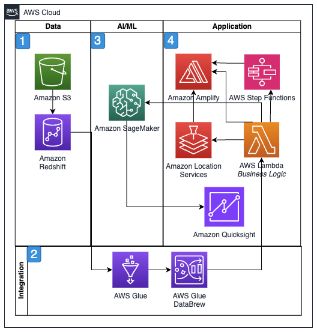

# Warehouse automation and optimization (WAO)

Modern warehouse operations face unprecedented challenges in
meeting the demands of e-commerce growth, labor constraints, and
customer expectations for rapid delivery. Drawing from Amazon's
extensive experience in operating over 150 million square feet of
fulfillment center space globally, the Amazon Global Engineering
team has developed proven approaches for warehouse automation and
optimization. These insights, combined with AWS Cloud
capabilities, form the foundation of the warehouse automation and
optimization (WAO) offering from AWS Professional Services,
providing customers with battle-tested solutions for their
warehouse operations.

WAO uses multiple AWS services for physical facility design and
simulation. Special cameras take images plus create dimensional
data for 2D models of the facility that are fed through
visualization GenAI services to transform into 3D, realistic
models of operations. The three-dimensional models enable
sophisticated scenario analysis by simulating various throughput
calculations, thereby generating actionable insights for strategic
decision-making. Real-time visualization of warehouse operations
and KPIs can then be integrated with the model using AWS IoT Core
to connect and sensors and automated systems throughout the
facility. AWS IoT SiteWise creates a digital twin of the warehouse
for monitoring and optimization. Amazon S3 and Amazon RDS store
facility layouts, operational data, and simulation results. These
simulation models validate design changes and predict operational
impacts, for strategically laying out warehouses to maximize
efficiency.

For automation and robotics integration, WAO employs AWS RoboMaker
to develop, test, and deploy robotics applications, while AWS IoT Greengrass enables local compute and machine learning at the edge
for automated guided vehicles (AGVs) and robotic picking systems.
Amazon SageMaker AI powers ML models for demand forecasting,
inventory optimization, and predictive maintenance. Real-time data
processing is handled through Amazon Kinesis Data Streams and
Amazon MSK, feeding into Amazon EMR for large-scale data
processing. Amazon EventBridge orchestrates workflows between
warehouse management systems, while AWS Step Functions manages
complex automation sequences.

The solution's integration layer utilizes Amazon API Gateway and
AWS AppSync to connect various warehouse systems and external
applications. Security is maintained through AWS Identity and Access Management and AWS Security Hub, for proper access controls and compliance. Amazon CloudWatch and AWS X-Ray provide comprehensive monitoring and
troubleshooting capabilities. The entire solution is deployed and
managed using AWS CloudFormation and AWS Systems Manager, enabling
consistent implementation across multiple facilities. This
comprehensive technology stack, combined with expert advisory
consulting from AWS Professional Services, delivers a modern,
efficient warehouse operation that reflects Amazon's own journey
in warehouse innovation and excellence.

## Reference architecture

## Architecture description

1. Raw data is stored in Amazon SFormatted data is stored in
   Amazon RDS.
2. Amazon API Gateway provides endpoints for inbound data which
   is translated and loaded through AWS AppSync. Amazon Kinesis
   Firehose processes real-time data from IoT devices.
3. AWS IoT Core, AWS IoT SiteWise, and AWS IoT Greengrass
   provide the system for managing IoT devices. AWS RoboMaker
   provides the environment to build, test, and deploy robotics
   applications.
4. Amazon SageMaker AI provides AI/ML for measuring throughput and
   optimization recommendations. AWS Step Functions and Amazon EventBridge coordinate event driven process flows. AWS Lambda holds programming logic. Amazon Quick Suite presents
   dashboards and metrics.

## Architecture objectives

- Physical design and simulation.
- Automation of operational IoT workflows.
- Data and analytics for warehouse operations.
- Integration of IoT operations and warehouse systems.

## Metrics

Based on the warehouse automation and optimization (WAO)
scenario, five relevant metrics are:

- Throughput efficiency:
  - **Primary metric:**
    Orders processed per hour compared to theoretical
    maximum
  - **Supporting metrics:**
    - Pick rate per automated system
    - Order fulfillment cycle time
    - Cross-dock processing speed – mainly applicable in
      retail operations where ocean containers are broken
      down for over the road transportation
    - **Relevance:**
      Directly measures the core operational efficiency of
      the automated warehouse

- Robotics performance:
  - **Primary metric:** Robot
    utilization rate and efficiency
  - **Supporting metrics:**
    - AGV navigation accuracy
    - Robot picking success rate
    - Mean time between robotic system failures
    - Automated task completion rates
    - **Relevance**:
      Critical for measuring the effectiveness of the
      robotics integration using AWS RoboMaker

- Digital twin accuracy:
  - **Primary metric:**
    Percentage variance between digital twin predictions and
    actual operations
  - **Supporting metrics:**
    - IoT sensor data accuracy
    - Simulation model precision
    - Real-time synchronization latency
    - Prediction accuracy of operational changes
    - **Relevance**:
      Essential for validating the AWS IoT SiteWise
      implementation and simulation reliability

- Edge computing performance:
  - **Primary metric:** Edge
    processing latency for critical operations
  - **Supporting metrics:**
    - AWS IoT Greengrass processing times
    - Local ML inference speed
    - Edge-to-cloud synchronization efficiency
    - Resource utilization at edge locations
    - **Relevance:**
      Crucial for real-time operation of automated systems

- System integration health:
  - **Primary metric:**
    End-to-end system integration uptime
  - **Supporting metrics:**
    - API response times
    - Inter-system communication latency
    - Event processing success rate
    - Integration error frequency
    - **Relevance:**
      Measures the effectiveness of the complex
      integration between various AWS services and
      warehouse systems

These metrics were selected because they:

- Focus on critical aspects of warehouse automation and
  performance
- Cover both physical and digital aspects of the solution
- Align with key AWS services used in the implementation
- Support measurement of operational excellence and efficiency
- Enable proactive monitoring and optimization of the
  warehouse automation system
