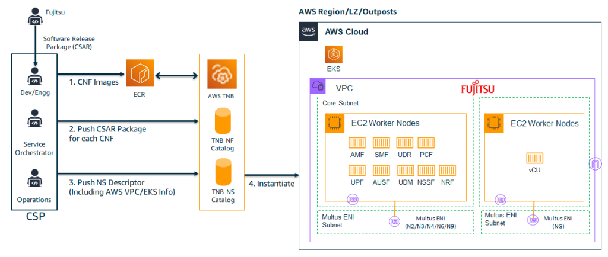

# Automatic lifecycle management of telco network functions

This scenario explores the deployment of end-to-end 5G networks, including radio
access network (RAN) and 5G core, using the AWS telco Network Builder (TNB) service. It
addresses the challenges faced by CSPs in unifying their operating model and automating
network deployments across the 5G environment, including RAN, core, and edge
infrastructure.

## Reference architecture

_Fujitsu 5G network deployment using AWS TNB_
