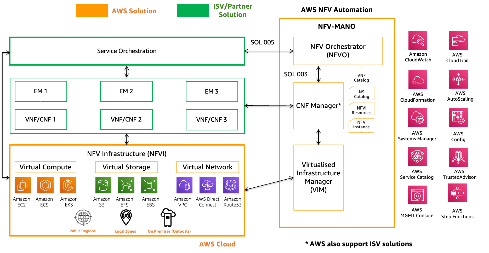
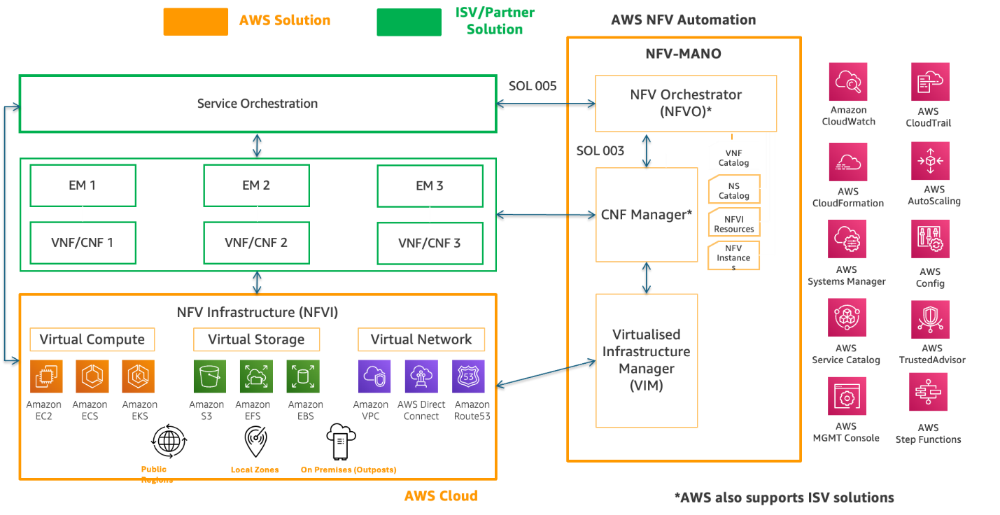
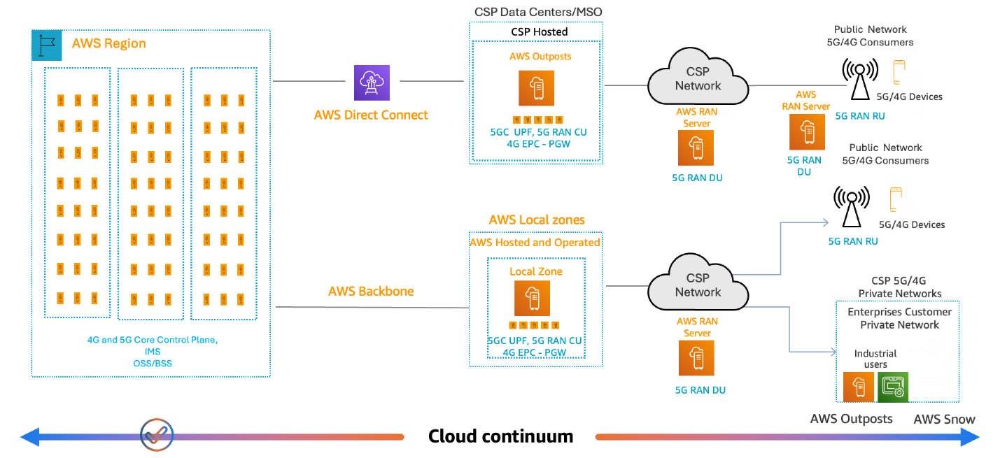

# 5G core deployment on AWS

This scenario explores deploying 5G core networks in the AWS Cloud. The 5G core is
the center of 5G networks, providing key functionalities such as session management, user
authentication, and policy control. As telecommunications providers transition to 5G,
migrating the 5G core to the cloud can offer significant benefits. This scenario covers
topics such as virtualizing and containerizing 5G network functions and using AWS
infrastructure services like AWS Outposts and AWS Local Zones to address performance and
data residency requirements.

Key considerations include managing vendor dependencies, providing high availability
and resiliency, and adopting the service-based architecture (SBA) for the 5G core.
Practical advice includes evaluating current 5G core architectures, identifying
opportunities to decouple and modernize components, and adopting DevOps practices for
streamlined 5G core operations on AWS. By deploying the 5G core on AWS, telecommunications
providers can unlock the agility, scalability, and cost optimization benefits of the cloud
while future-proofing their networks for the evolving 5G landscape.

## Reference architecture

_Figure 1. 5G core on globally available AWS
infrastructure._

This reference architecture shows standard telecommunication architecture to deploy
and manage virtual network functions (VNFs) or containerized network functions (CNFs). The
set of AWS services can deliver the capabilities on the infrastructure and management
layer. The part shown in green is provided by the ISV, which deploys these VNFs and CNFs
using listed AWS services.

_Figure 2. Bringing the cloud where the network needs
it._

The network functions (NFs) in a telco core network can be split into control and
user plane. The user plane NFs are throughput intensive and depend heavily on packet
forwarding mechanisms. However, the control plane functions are compute intensive and
require higher levels of resiliency and reliability. In a distributed architecture, these
control plane NFs are deployed in AWS Regions to offer better scalability and resilience.
On the other hand, the user plane NFs are moved closer to the end user for better
experience and low latency, using the higher throughput capabilities of Local Zones or AWS
Outpost Racks. Outpost servers can be used to deploy the RAN part of the network as shown
in the previous diagram.
