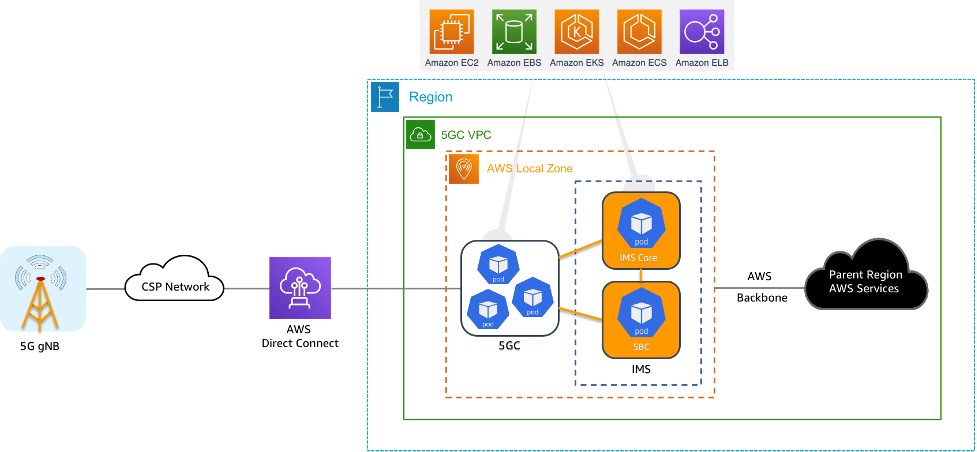

# Modernizing IMS networks on AWS

This scenario explores modernizing IP multimedia subsystem (IMS) networks on the AWS Cloud. IMS is a key component of 5G networks, providing IP-based multimedia services like
voice, video, and messaging. As telecommunications providers modernize their
infrastructure for 5G, migrating legacy IMS deployments to the cloud can offer significant
benefits.

This scenario covers topics such as virtualizing and containerizing IMS network
functions, using AWS infrastructure services like Outposts and Local Zones to address
latency and data residency requirements and implementing CI/CD pipelines using AWS
developer tools for agile IMS deployments.

Key considerations include managing vendor dependencies, providing high availability
and resiliency and transitioning towards a service-based architecture (SBA) for IMS.
Practical advice includes evaluating current IMS architectures, identifying opportunities
to decouple and modernize components, and adopting DevOps practices for streamlined IMS
operations on AWS.

## Reference architecture

AWS' global infrastructure of Regions and Availability Zones provides the foundation
for deploying highly available and resilient IMS networks. Deploying IMS workloads across
multiple AWS Regions offers benefits such as:

- **High availability and fault tolerance:** IMS
  components can be distributed across Availability Zones within a Region, or even
  across Regions, to provide continuous service in the event of a failure.
- **Disaster recovery and business continuity:** You can
  architect active-active or active-passive setups between Regions to enable fast
  recovery and failover in the case of a Regional disruption.
- **Scalability and elasticity:** The virtually unlimited
  capacity of AWS Regions assists to scale IMS resources up or down based on demand,
  improving overall system responsiveness.
- **Data sovereignty:** Strategically placing IMS data
  and workloads in specific AWS Regions can assist you to meet data residency and other
  regulatory requirements.
- Use AWS Global Accelerator and CloudFront to optimize network performance and
  reduce latency for geographically distributed IMS end users.
- Establish robust cross-Region monitoring, alerting, and automated remediation
  processes to improve the reliability and resilience of your global IMS deployment.

By incorporating the global AWS infrastructure and services, you can verify that your
modernized IMS network meets the highest standards for availability, durability, and
responsiveness, as outlined in the Reliability pillar of the AWS Well-Architected
Framework.

When modernizing IMS networks on AWS, verify the tight integration between the IMS,
5GC, and other network components to maintain end-to-end visibility and manageability.
Jsing AWS monitoring and observability services like Amazon CloudWatch, AWS X-Ray, and AWS App Mesh can provide comprehensive insights into IMS workload performance.

Implement robust security controls such as AWS IAM, VPCs, security groups, and
network ACLs to protect critical IMS assets. Plan disaster recovery and business
continuity, using features like multi-AZ database deployments and AWS' global
infrastructure. Continuous optimization of resource utilization, scaling, and load
balancing based on traffic patterns and metrics is crucial. Establish a proactive
maintenance and patching cadence for OS, middleware, and application components to
maintain a secure and reliable IMS environment. Finally, implement automated testing and
canary deployments to mitigate the risk of changes to these critical telecommunications
systems.
