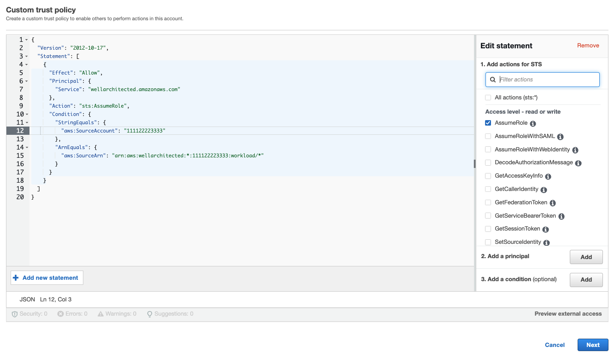

# Activating Trusted Advisor for a workload in

IAM

###### Note

Workload owners should **Activate Discovery support** for
their account before creating a Trusted Advisor workload. Choosing to
**Activate Discovery support** creates the role
required for the workload owner. Use the following steps for all other
associated accounts.

The owners of associated accounts for workloads that have activated Trusted Advisor
must create a role in IAM to see Trusted Advisor information in AWS Well-Architected Tool.

**To create a role in IAM for AWS WA Tool to get information from
Trusted Advisor**

1. Sign in to the AWS Management Console and open the IAM console at [https://console.aws.amazon.com/iam/](https://console.aws.amazon.com/iam/ "https://console.aws.amazon.com/iam/").
2. In the navigation pane of the **IAM** console,
   choose **Roles**, and then choose **Create role**.
3. Under **Trusted entity type** choose **Custom
   trust policy**.
4. Copy and paste the following **Custom trust policy** into the
   JSON field in the **IAM** console, as shown in the
   following image. Replace
   `WORKLOAD_OWNER_ACCOUNT_ID` with
   the workload owner's account ID, and choose **Next**.

JSON

```
`{
 "Version":"2012-10-17",
 "Statement": [
 {
 "Effect": "Allow",
 "Principal": {
 "Service": "wellarchitected.amazonaws.com"
 },
 "Action": "sts:AssumeRole",
 "Condition": {
 "StringEquals": {
 "aws:SourceAccount": "`WORKLOAD_OWNER_ACCOUNT_ID`"
 },
 "ArnEquals": {
 "aws:SourceArn": "arn:aws:wellarchitected:*:`111122223333`:workload/*"
 }
 }
 }
 ]
}`

```



###### Note

The `aws:sourceArn` in the condition block of the preceeding custom trust policy is
`"arn:aws:wellarchitected:*:`WORKLOAD_OWNER_ACCOUNT_ID`:workload/*"`,
which is a generic condition stating this role can be used by AWS WA Tool for
all of the workload owner's workloads. However, access can be narrowed
to a specific workload ARN, or set of workload ARNs. To specify multiple
ARNs, see the following example trust policy.

JSON

```
`{
 "Version":"2012-10-17",
 "Statement": [
 {
 "Effect": "Allow",
 "Principal": {
 "Service": "wellarchitected.amazonaws.com"
 },
 "Action": "sts:AssumeRole",
 "Condition": {
 "StringEquals": {
 "aws:SourceAccount": "`111122223333`"
 },
 "ArnEquals": {
 "aws:SourceArn": [
 "arn:aws:wellarchitected:`us-east-1`:`111122223333`:workload/`WORKLOAD_ID_1`",
 "arn:aws:wellarchitected:`us-east-1`:`111122223333`:workload/`WORKLOAD_ID_2`"
 ]
 }
 }
 }
 ]
}`

```

5. On the **Add permissions** page, for **Permissions policies** choose **Create
   policy** to give AWS WA Tool access to read data from Trusted Advisor. Selecting
   **Create policy** opens a new window.

###### Note

Additionally, you have the option to skip creating the permissions during
the role creation and create an inline policy after creating the role.
Choose **View role** in the successful role
creation message and select **Create inline
policy** from the **Add
permissions** dropdown in the **Permissions** tab. 6. Copy and paste the following **Permissions policy** into the JSON field. In
the `Resource` ARN, replace
`YOUR_ACCOUNT_ID` with your
own account ID, specify the Region or an asterisk (`*`), and
choose **Next:Tags**.

For details about ARN formats, see [Amazon Resource Name (ARN)](../../../general/latest/gr/aws-arns-and-namespaces.md "../../../general/latest/gr/aws-arns-and-namespaces.md") in the _AWS General Reference Guide_.

JSON

```
`{
 "Version":"2012-10-17",
 "Statement": [
 {
 "Effect": "Allow",
 "Action": [
 "trustedadvisor:DescribeCheckRefreshStatuses",
 "trustedadvisor:DescribeCheckSummaries",
 "trustedadvisor:DescribeRiskResources",
 "trustedadvisor:DescribeAccount",
 "trustedadvisor:DescribeRisk",
 "trustedadvisor:DescribeAccountAccess",
 "trustedadvisor:DescribeRisks",
 "trustedadvisor:DescribeCheckItems"
 ],
 "Resource": [
 "arn:aws:trustedadvisor:*:`111122223333`:checks/*"
 ]
 }
 ]
}`

```

7. If Trusted Advisor is activated for a workload and the **Resource
   definition** is set to **AppRegistry** or
   **All**, all of the accounts that own a resource in
   the AppRegistry application attached to the workload must add the following
   permission to their Trusted Advisor role's **Permissions
   policy**.

JSON

```
`{
 "Version":"2012-10-17",
 "Statement": [
 {
 "Sid": "DiscoveryPermissions",
 "Effect": "Allow",
 "Action": [
 "servicecatalog:ListAssociatedResources",
 "tag:GetResources",
 "servicecatalog:GetApplication",
 "resource-groups:ListGroupResources",
 "cloudformation:DescribeStacks",
 "cloudformation:ListStackResources"
 ],
 "Resource": "*"
 }
 ]
}`

```

8. (Optional) Add tags. Choose **Next: Review**.
9. Review the policy, give it a name, and select **Create
   policy**.
10. On the **Add permissions** page for the role, select the
    policy name you just created, and select **Next**.
11. Enter the **Role name**, which must use the following syntax:
    `WellArchitectedRoleForTrustedAdvisor-`WORKLOAD_OWNER_ACCOUNT_ID`and choose **Create role**. Replace`WORKLOAD_OWNER_ACCOUNT_ID`` with
    the workload owner's account ID.

You should get a success message at the top of the page notifying you that the
role has been created. 12. To view the role and associated permissions policy, in the left navigation
pane under **Access management**, choose **Roles** and search for the
`WellArchitectedRoleForTrustedAdvisor-`WORKLOAD_OWNER_ACCOUNT_ID``
name. Select the name of the role to verify that the **Permissions** and **Trust
relationships** are correct.
