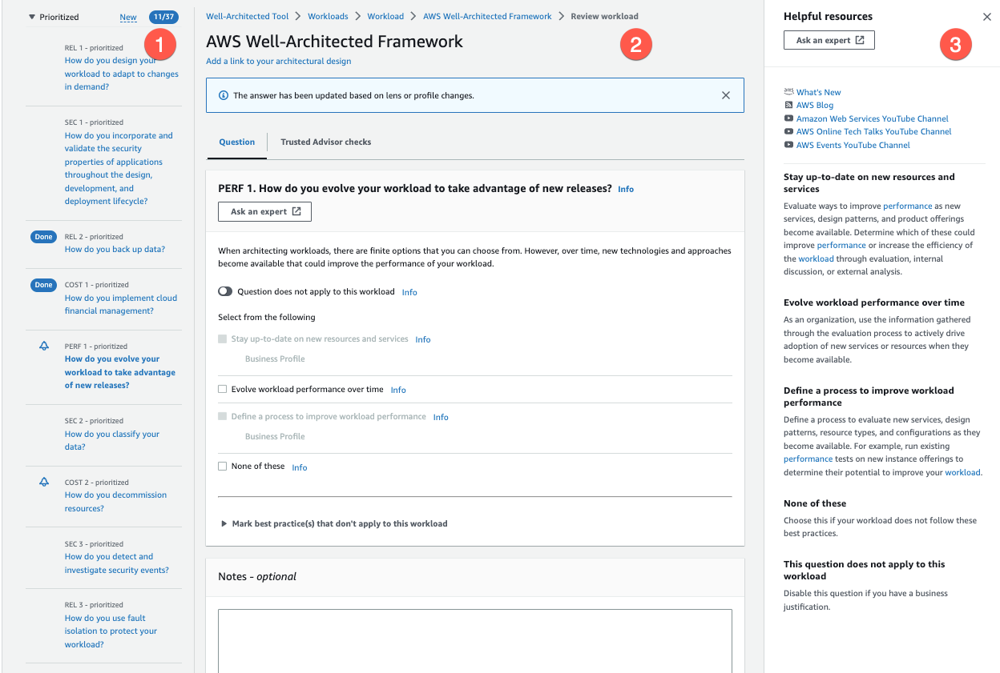

# Reviewing a workload with AWS Well-Architected Framework

You can review your workload in the console on the Review workload page. This page
provides best practices and helpful resources for your workload's
performance.

1. To open the Review workload page, from the workload details page, choose
   **Continue reviewing**. The left navigation pane shows the questions for each
   pillar. Questions that you have answered are marked
   **Done**. The number of questions answered in each
   pillar is shown next to the pillar name.

You can navigate to questions in other pillars by choosing the pillar name
and then choosing the question you want to answer.

(Optional) If a profile is associated with your workload, then
AWS WA Tool uses the information in the profile to determine which
questions in the workload review are **Prioritized** and
which questions are not applicable for your business. In the left navigation
pane you can use the **Prioritized** questions to help
speed up the workload review process. A notification icon appears next to
questions that are newly added to the list of
**Prioritized** questions. 2. The middle pane displays the current question. Select the best practices
that you are following. Choose **Info** to get additional
information about the question or a best practice. Choose **Ask an
expert** to access the AWS re:Post community dedicated to
[AWS Well-Architected](https://repost.aws/topics/TA5g9gZfzuQoWLsZ3wxihrgw/well-architected-framework?trk=1053da05-d131-4bfd-8d08-01af135ae52a&sc_channel=el "https://repost.aws/topics/TA5g9gZfzuQoWLsZ3wxihrgw/well-architected-framework?trk=1053da05-d131-4bfd-8d08-01af135ae52a&sc_channel=el"). AWS re:Post is a topic-based
question-and-answer community replacement for AWS Forums. With re:Post,
you can find answers, answer questions, join a group, follow popular topics,
and vote on your favorite questions and answers.

(Optional) To mark one or more best practices as not applicable, choose
**Mark best practice(s) that don't apply to this
workload** and select them.

Use the buttons at the bottom of this pane to go to the next question,
return to the previous question, or save your changes and exit. 3. The right help pane displays additional information and helpful resources.
Choose **Ask an expert** to access the AWS re:Post
community dedicated to [AWS Well-Architected](https://repost.aws/topics/TA5g9gZfzuQoWLsZ3wxihrgw/well-architected-framework?trk=1053da05-d131-4bfd-8d08-01af135ae52a&sc_channel=el "https://repost.aws/topics/TA5g9gZfzuQoWLsZ3wxihrgw/well-architected-framework?trk=1053da05-d131-4bfd-8d08-01af135ae52a&sc_channel=el"). In this community, you can ask
questions related to designing, building, deploying, and operating workloads
on AWS.
