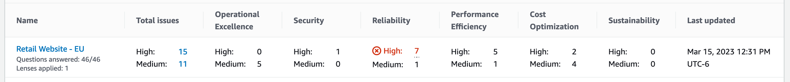

# Well-Architected Framework issues per workload

The **Well-Architected Framework issues per workload** section
displays information for each workload.

The following information is displayed for each workload:

**Name**

The name of the workload. The number of questions answered, and the number of lenses applied to the workload
are also shown.

Choose the workload name to visit the workload details page and view milestones, improvement plans, and shares.

**Total issues**

The total number of issues identified by the Well-Architected Framework
lens for the workload.

Choose the number of high or medium risk issues to view the recommended
improvement plans for those issues.

**Operational Excellence**

The number of high risk issues (HRIs) and medium risk issues (MRIs) identified in the workload
for the Operational Excellence pillar.

**Security**

The number of HRIs and MRIs identified for the Security pillar.

**Reliability**

The number of HRIs and MRIs identified for the Reliability pillar.

**Performance Efficiency**

The number of HRIs and MRIs identified for the Performance Efficiency pillar.

**Cost Optimization**

The number of HRIs and MRIs identified for the Cost Optimization pillar.

**Sustainability**

The number of HRIs and MRIs identified for the Sustainability pillar.

**Last updated**

Date and time that the workload was last updated.

For each workload, the pillar with the highest number of high risk issues (HRIs)
is highlighted.

###### Note

Only issues from the Well-Architected Framework lens are included in this
section.
