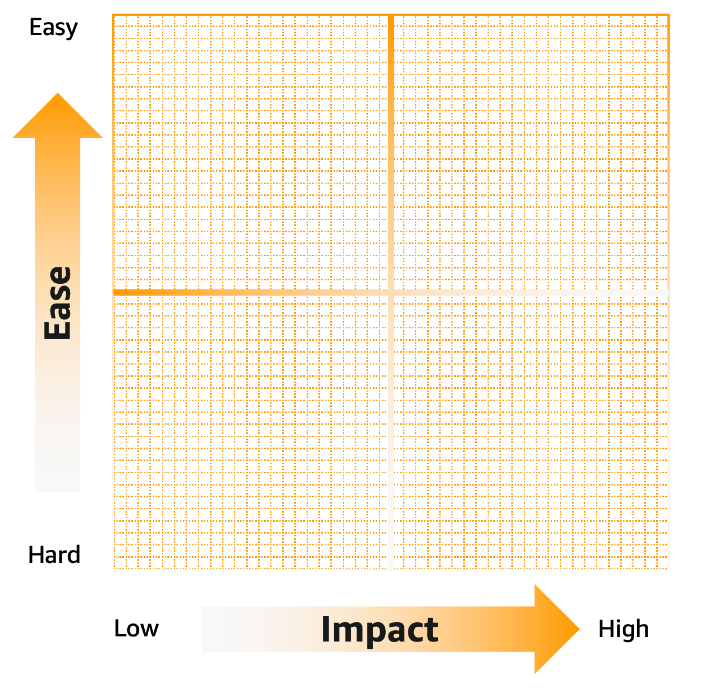

# Prioritize improvements

No organization has unlimited time and resources. Addressing all
identified HRIs and MRIs at once might not be the right way to get
the most out of a WAFR.

Start with a selected number of issues that can make the most impact
on the business and that are easier to implement. Work on the
solution. Track the improvement, and then iterate on that approach.

## Prioritize for implementation

One approach that can help you visualize solutions priority is the
[Eisenhower-style
plot](https://www.eisenhower.me/eisenhower-matrix/ "https://www.eisenhower.me/eisenhower-matrix/"). There are different ways to use the tool. When
evaluating, consider both the importance of the improvement (how
much value it brings to your business) and the effort to implement
the improvement (time required, complexity to implement, or
headcount).

The output of this analysis provides a set of risks that have the
most impact on your business but are not too complex to implement.
These are good candidates to start implementing in the first
iteration.

## Solution characteristics

When selecting a solution for an identified risk, consider the
following:

- [**SMART
  goals:**](https://www.forbes.com/advisor/business/smart-goals/ "https://www.forbes.com/advisor/business/smart-goals/") Think of specific, measurable,
  achievable, relevant, and time-bound (SMART) goals.
- **Owners:** For every solution,
  identify an owner.
- **Simple over complex:**
  Complex solutions can work, but they make the improvement more
  difficult to implement, and they can take longer to create.
  Choose simplicity over complexity unless the complex solution
  is a non-negotiable requirement.
- [**Make
  two-way door decisions:**](https://aws.amazon.com/executive-insights/content/how-amazon-defines-and-operationalizes-a-day-1-culture/ "https://aws.amazon.com/executive-insights/content/how-amazon-defines-and-operationalizes-a-day-1-culture/") Solutions should be
  extensible and designed to improve and evolve over time. When
  possible, avoid static solutions that cannot adapt as your
  architecture develops.
- **Target pattern-based
  solutions:** Consider solutions that can be codified,
  reused, and re-shared. Don't reinvent the wheel. Access the
  [AWS Architecture Center](https://aws.amazon.com/architecture/ "https://aws.amazon.com/architecture/") for examples.
- **Work continually as a team:**
  Work as a group to create a list of solutions for the HRIs.
  Prioritize them in an Eisenhower matrix.
