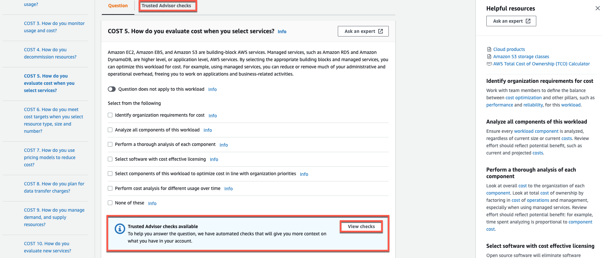
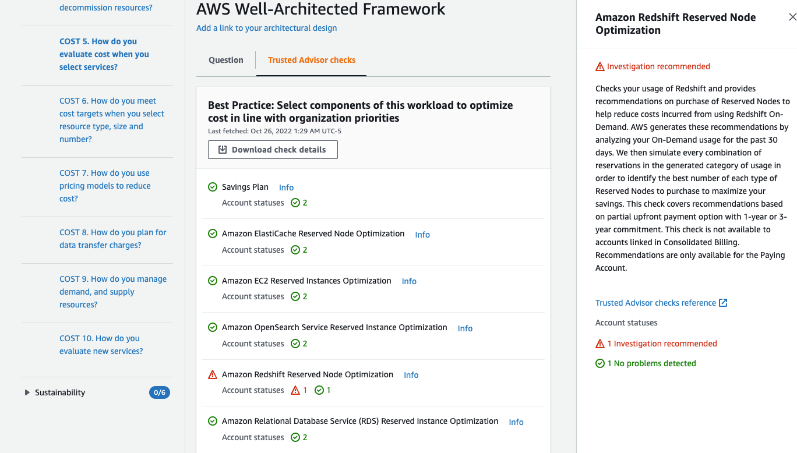

# Viewing Trusted Advisor checks for your workload

If Trusted Advisor is activated for your workload, a **Trusted Advisor checks**
tab is displayed next to **Question**. If there are any checks
available for the best practice, a notification that there are Trusted Advisor checks
available is displayed following the question selection. Selecting **View
checks** takes you to the **Trusted Advisor checks** tab.

On the **Trusted Advisor checks** tab, you can view more detailed
information about the best practice checks from Trusted Advisor, view links to the Trusted Advisor
documentation in the **Help resources** pane, or **Download
check details**, which provides a report of the Trusted Advisor checks and
statuses for each best practice in a CSV file.

The check categories from Trusted Advisor are displayed as colored icons, and the number next to each icon shows the number of accounts in that status.

- **Action recommended (red)** – Trusted Advisor recommends an
  action for the check.
- **Investigation recommended (yellow)** – Trusted Advisor detects
  a possible issue for the check.
- **No problems detected (green)** – Trusted Advisor doesn't detect
  an issue for the check.
- **Excluded items (gray)** – The number of checks that have
  excluded items, such as resources that you want a check to ignore.
  For more information on the checks Trusted Advisor provides, see [View check categories](../../../awssupport/latest/user/get-started-with-aws-trusted-advisor.md#view-check-categories "../../../awssupport/latest/user/get-started-with-aws-trusted-advisor.md#view-check-categories") in the _Support User
  Guide_.

Selecting the **Info** link next to each Trusted Advisor check displays
information about the check in the **Help resources** pane. For more information, see [AWS Trusted Advisor check reference](../../../awssupport/latest/user/trusted-advisor-check-reference.md "../../../awssupport/latest/user/trusted-advisor-check-reference.md") in the _Support User
Guide_.
