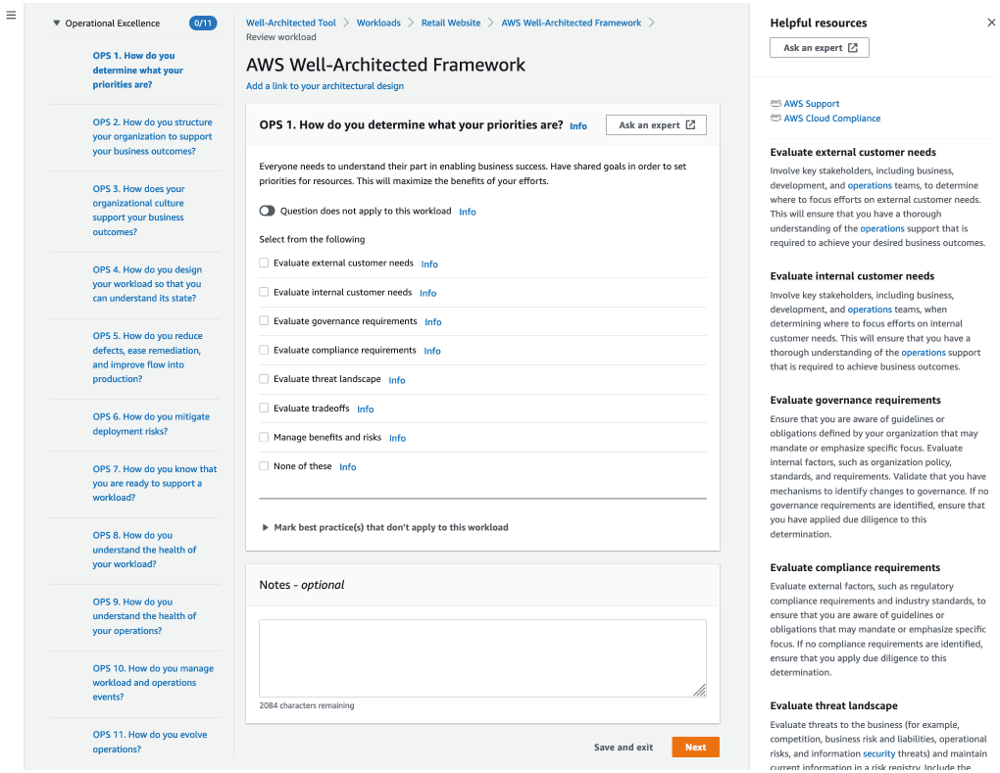
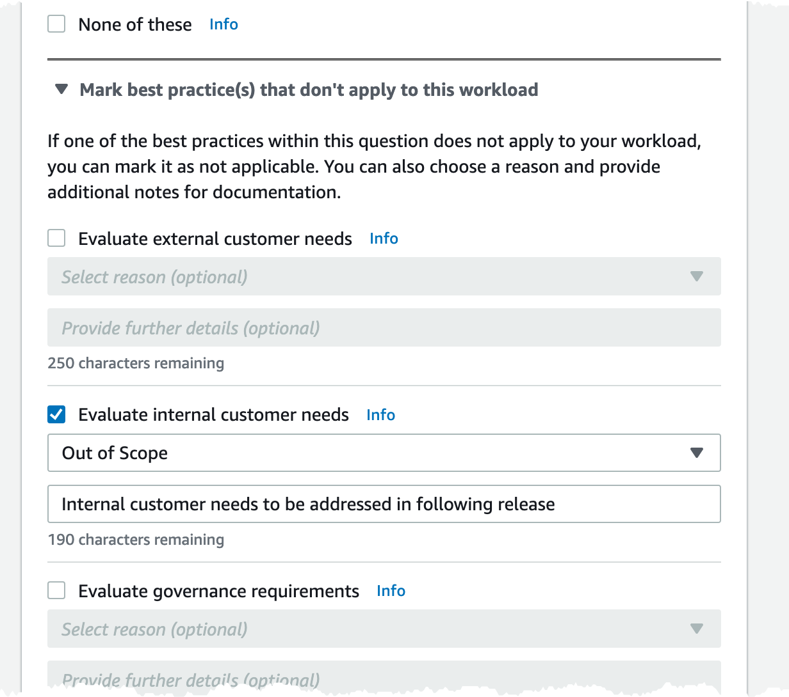
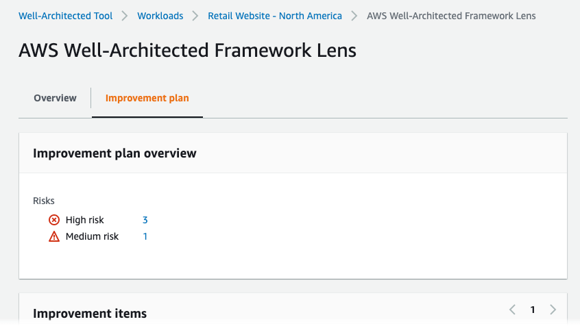
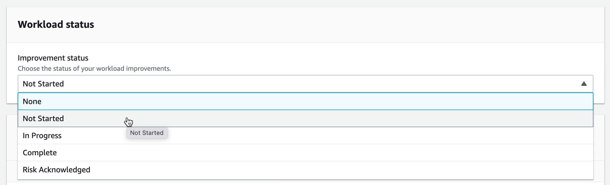
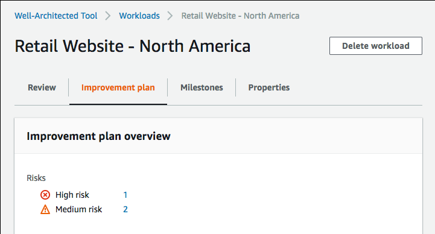

# Tutorial: Document an AWS Well-Architected Tool workload

This tutorial describes using AWS Well-Architected Tool to document and measure a workload. This example
illustrates, step by step, how to define and document a workload for a retail ecommerce
website.

###### Topics

- [Step 1: Define a workload](#tutorial-step1 "#tutorial-step1")
- [Step 2: Document the workload state](#tutorial-step2 "#tutorial-step2")
- [Step 3: Review the improvement plan](#tutorial-step3 "#tutorial-step3")
- [Step 4: Make improvements and measure progress](#tutorial-step4 "#tutorial-step4")

## Step 1: Define a workload

You begin by defining a workload. There are two ways to define a workload. In this
tutorial, we are not defining a workload from a review template. For more details on
defining a workload from a review template, see [Define a workload in AWS Well-Architected Tool](workloads-define.md "workloads-define.md").

###### To define a workload

1. Sign in to the AWS Management Console and open the AWS Well-Architected Tool console at [https://console.aws.amazon.com/wellarchitected/](https://console.aws.amazon.com/wellarchitected/ "https://console.aws.amazon.com/wellarchitected/").

###### Note

The user who documents the workload state must have [full access permissions](iam-auth-access.md "iam-auth-access.md") to
AWS WA Tool. 2. In the **Define a workload** section, choose **Define
workload**. 3. In the **Name** box, enter `Retail Website - North
 America` as the workload name. 4. In the **Description** box, enter a description for the
workload. 5. In the **Review owner** box, enter the name of the person
responsible for the workload review process. 6. In the **Environment** box, indicate that the workload is in
a production environment. 7. Our workload runs on both AWS and at our local data center:

    1. Select **AWS Regions**, and choose the two Regions
     in North America where the workload runs.
    2. Also select **Non-AWS regions**, and enter a name
     for the local data center.

8. The **Account IDs** box is optional. Do not associate any
   AWS accounts with this workload.
9. The **Application** box is optional. Do not enter an
   Application ARN for this workload.
10. The **Architectural diagram** box is optional. Do not
    associate an architectural diagram with this workload.
11. The **Industry type** and **Industry** boxes
    are optional and are not specified for this workload.
12. The **Trusted Advisor** section is optional. Do not **Activate Trusted Advisor
    Support** for this workload.
13. The **Jira** section is optional. Do not **Override account level settings** in the Jira section for this workload.
14. For this example, do not apply any tags to the workload. Choose
    **Next**.
15. The **Apply profile** step is optional. Do not apply a
    profile for this workload. Choose **Next**.
16. For this example, apply the AWS Well-Architected Framework lens, which is
    automatically selected. Choose **Define workload** to save
    these values and define the workload.
17. After the workload is defined, choose **Start reviewing** to
    begin documenting the state of the workload.

## Step 2: Document the workload state

To document the state of the workload, you are presented with questions for the
selected lens that span the pillars of the AWS Well-Architected Framework: operational
excellence, security, reliability, performance efficiency, cost optimization, and
sustainability.

For each question, choose the best practices that you are following from the list
provided. If you need details about a best practice, choose **Info**
and view the additional information and resources in the right panel.

Choose **Ask an expert** to access the AWS re:Post community
dedicated to [AWS Well-Architected](https://repost.aws/topics/TA5g9gZfzuQoWLsZ3wxihrgw/well-architected-framework?trk=1053da05-d131-4bfd-8d08-01af135ae52a&sc_channel=el "https://repost.aws/topics/TA5g9gZfzuQoWLsZ3wxihrgw/well-architected-framework?trk=1053da05-d131-4bfd-8d08-01af135ae52a&sc_channel=el"). In this community, you can ask questions related to
designing, building, deploying, and operating workloads on AWS.

1. Choose **Next** to proceed to the next question. You can use the left
   panel to navigate to a different question in the same pillar or to a question in a
   different pillar.
2. If you choose **Question does not apply to this workload** or
   **None of these**, AWS recommends that you include the reason in
   the **Notes** box. These notes are included as part of the workload
   report and can be helpful in the future as changes are made to the workload.

###### Note

Optionally, you can mark one or more individual best practices as not applicable.
Choose **Mark best practice(s) that don't apply to this workload** and
select the best practice that does not apply. You can optionally select a reason and
provide additional details. Repeat for each best practice that does not apply.

###### Note

You can pause this process at any time by choosing **Save and exit**.To resume later, open the AWS WA Tool console and choose **Workloads** in the
left navigation pane. 3. Select the name of the workload to open the workload details page. 4. Choose **Continue reviewing** and then navigate to where you left
off. 5. After you complete all of the questions, an overview page for the workload appears.
You can review these details now or navigate to them later by choosing
**Workloads** in the left navigation pane and selecting the
workload name.

After documenting the state of your workload for the first time, you should save a
milestone and generate a workload report.

A milestone captures the current state of the workload and enables you to measure
progress as you make changes based on your improvement plan.

From the workload details page:

1. In the **Workload overview** section, choose
   the **Save milestone** button.
2. Enter `Version 1.0 - initial review` as the
   **Milestone name**.
3. Choose **Save**.
4. To generate a workload report, select the desired lens and choose **Generate
   report** and a PDF file is created. This file contains the state of the
   workload, the number of risks identified, and a list of suggested improvements.

## Step 3: Review the improvement plan

Based on the best practices selected, AWS WA Tool identifies areas of high and medium risk
as measured against the AWS Well-Architected Framework Lens.

To review the improvement plan:

1. Choose **AWS Well-Architected Framework** from the
   **Lenses** section of the **Overview**
   page.
2. Then choose **Improvement plan**.

For this particular example workload, three high risk issues and one medium risk issue
were identified by the AWS Well-Architected Framework Lens.

Update the **Improvement status** for the workload to
indicate that improvements to the workload have not been started.

To change the **Improvement status**:

1. From the Improvement plan, click on the name of the workload
   (`Retail Website - North America`) in the breadcrumbs
   at the top of the page.
2. Click on the **Properties** tab.
3. Navigate to the **Workload status** section and
   select **Not Started** from the dropdown
   list.

 4. Navigate back to the Improvement plan from the **Properties** tab by clicking on the **Overview** tab and then clicking on the **AWS
Well-Architected Framework** link in the **Lenses** section. Then click on the **Improvement plan** tab at the top of the page.

The **Improvement items** section shows the recommended improvement
items identified in the workload. The questions are ordered based on the pillar priority
that is set, with any high risk issues listed first followed by any medium risk issues.

Expand **Recommended improvement items** to show the best practices
for a question. Each recommended improvement action links to detailed expert guidance to
help you eliminate, or at least mitigate, the risks identified.

If a profile is associated with the workload, a count of prioritized risks is
displayed in the **Improvement plan overview** section, and you can
filter the list of **Improvement items** by selecting
**Prioritized by profile**. The list of improvement items display a
**Prioritized** label.

## Step 4: Make improvements and measure progress

As part of this improvement plan, one of the high risk issues was addressed by adding
Amazon CloudWatch and AWS Auto Scaling support to the workload.

From the **Improvement items** section:

1. Choose the pertinent question and update the selected best practices to reflect the
   changes. **Notes** are added to record the improvements.
2. Then choose **Save and exit** to update the state of the
   workload.
3. After making changes, you can return to the **Improvement plan** and
   see the effect those changes had on the workload. In this example, those actions have
   improved the risk profile — reducing the number of high risk issues from three to
   only one.

You can save a milestone at this point, and then go to **Milestones**
to see how the workload has improved.
