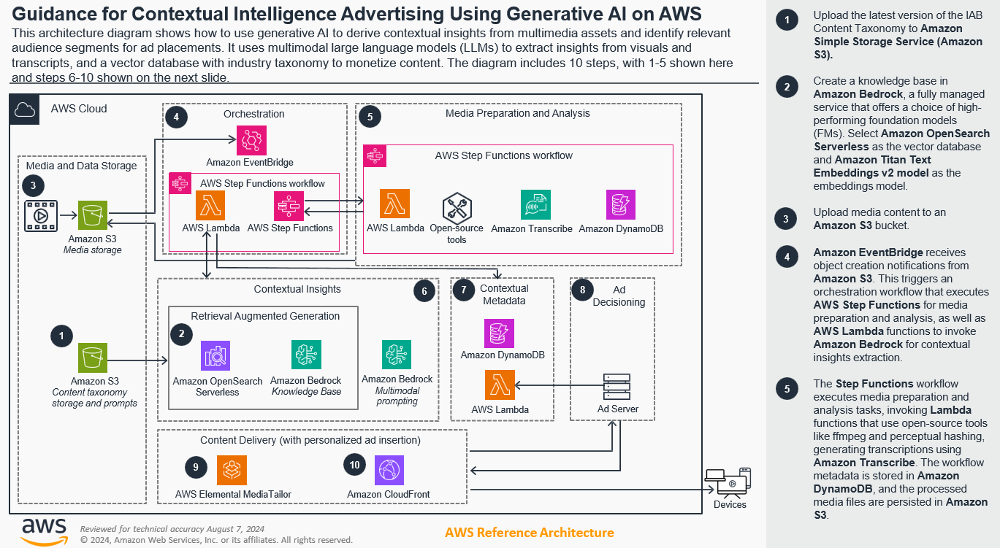
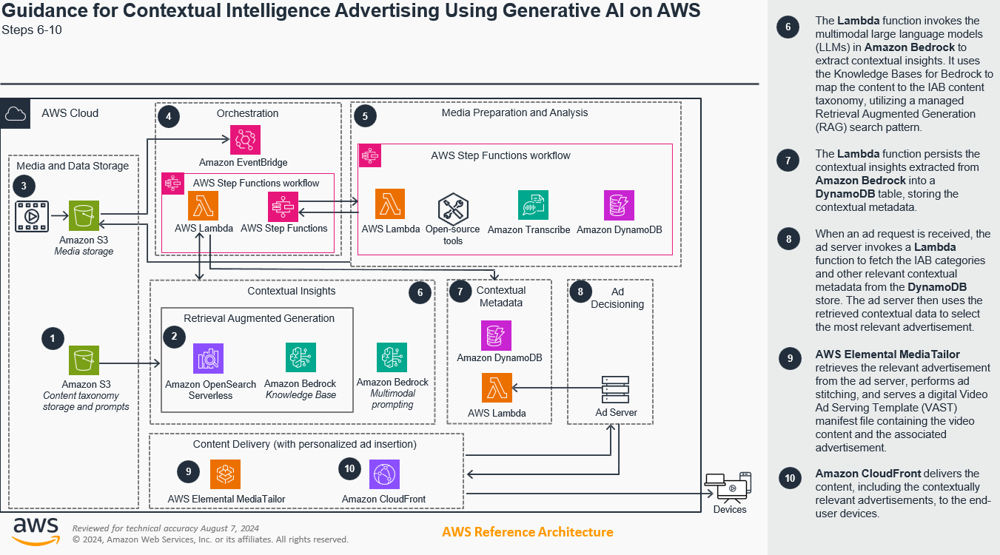
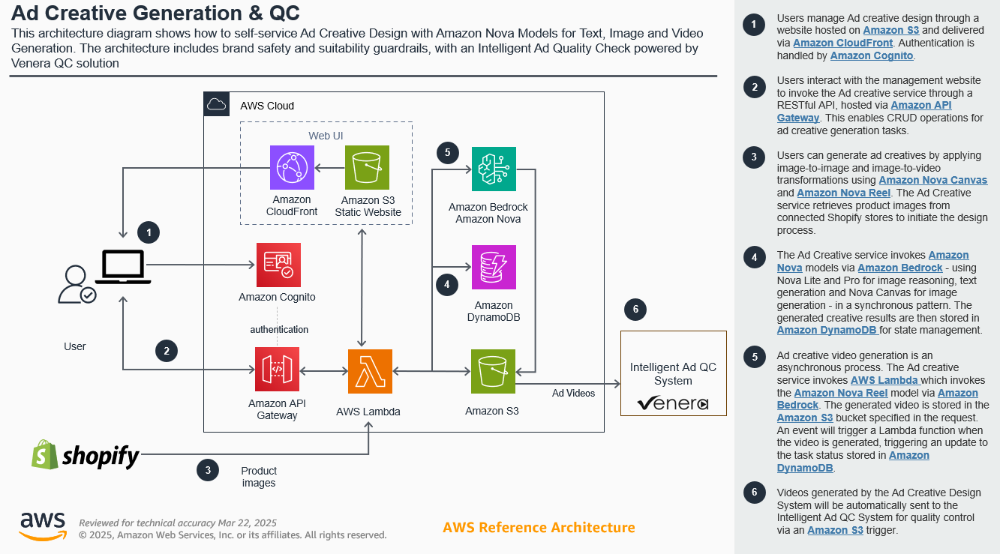
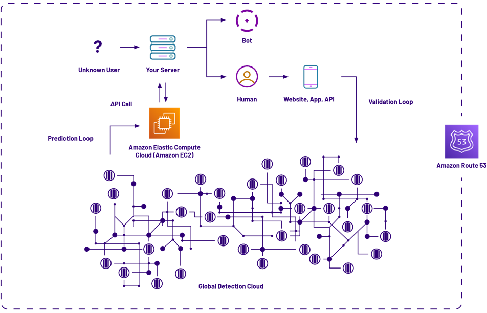

# Ad intelligence, measurement, and

security

This scenario covers the solution guidance for digital ad content creation with brand
safety, verification, and fraud detections.

## Contextual advertising

This guidance shows how to use generative AI to derive contextual insights from
multimedia assets and identify relevant audience segments for targeted advertising
placements. By analyzing video, audio, and text, you can identify the most relevant audience
segments and deliver personalized advertising experiences. Moreover, the use of multimodal
large language models (LLMs) facilitates the extraction of insights from both visual and
transcript components so you can align your media with the right advertising opportunities
and monetize content more effectively.

For additional details, see [Guidance for Contextual Intelligence Advertising Using Generative AI on AWS](https://aws.amazon.com/solutions/guidance/contextual-intelligence-advertising-using-generative-ai-on-aws "https://aws.amazon.com/solutions/guidance/contextual-intelligence-advertising-using-generative-ai-on-aws").

## Generative AI-generated

ad creative and moderation

The solution guidance demonstrates the Intelligent Ad QC solution leveraging the power
of AWS AI and generative AI to enable media publishers to efficiently manage advertising
content at scale, facilitate alignment with brand and audience requirements, and deliver a
high-quality viewer experience - ultimately improving the monetization of their ad-supported
streaming services.

## Fraud protection using the HUMAN AWS Marketplace

The HUMAN AWS Marketplace solution provides protection from ad fraud to stakeholders in the
digital advertising solution. The scalability, availability, and efficiency of Amazon Web Services
(AWS) enable the HUMAN technology to help prevent ad fraud, no matter where it
originates—within 12 milliseconds or less as the page loads.

Prediction services are deployed on [Amazon Elastic Compute Cloud](https://aws.amazon.com/ec2/ "https://aws.amazon.com/ec2/") (Amazon EC2) instances, and [Amazon Route 53](https://aws.amazon.com/route53/ "https://aws.amazon.com/route53/") is used for the HUMAN authoritative domain name system (DNS).

The HUMAN fraud-protection solution on AWS makes it simple for DSPs, SSPs, and
businesses to protect their digital investments. By deploying the HUMAN solution, AWS
customers can benefit from the following:

- **Solution verification:** The HUMAN solution assists DSPs
  and SSPs improve inventory quality by using genuine ad servers and verifying ad fraud is
  not part of their advertising solution. DSPs and SSPs have the means to provide their
  customers with proof their solutions are trustworthy and free from abuse.
- **Trustworthy data:** When fraudulent activity is avoided,
  businesses can rely on their data when making business decisions. With accurate insight
  into an advertising campaign’s performance, businesses do not need to waste advertising
  budget on fraudulent impressions.
- **Maintain reputation:** By avoiding fraud before it enters
  their solution, HUMAN assists publishers provide a trustworthy experience for visitors
  to their site and advertisers, supporting their brand integrity.
- **Optimize return:** By delivering only verified human
  impressions, DSPs and SSPs can deliver greater value for their customers through
  better-performing inventory, verifying their resources, time, technology, and budget are
  used effectively.
- **Increase trust in the digital marketplace:** By
  protecting against phishing, malvertising, and other ad fraud, HUMAN provides DSPs,
  SSPs, publishers, and advertisers with a way to verify the experience is consistent with
  expectation, restoring trust and transparency to digital advertising in every industry.
- **Take advantage of the latest technology:** With the
  visibility of HUMAN into the internet and through its network effect, customers know
  they are receiving the latest abuse protection techniques for their technology
  solutions—one that keeps pace with the speed of innovation.

For additional details, see [How HUMAN Advertising Intelligence Solutions Help Protect Against Ad Fraud in the Ad Tech
Industry](https://aws.amazon.com/blogs/apn/how-human-advertising-intelligence-solutions-help-protect-against-ad-fraud-in-the-ad-tech-industry/ "https://aws.amazon.com/blogs/apn/how-human-advertising-intelligence-solutions-help-protect-against-ad-fraud-in-the-ad-tech-industry/").
