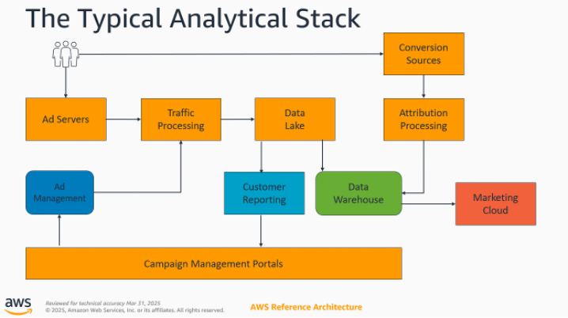
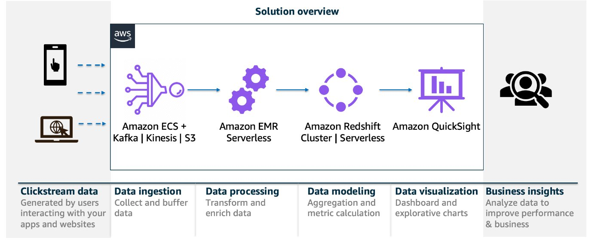
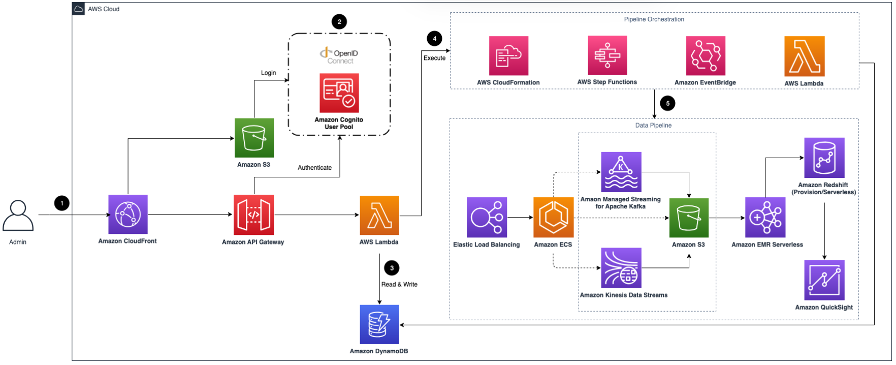
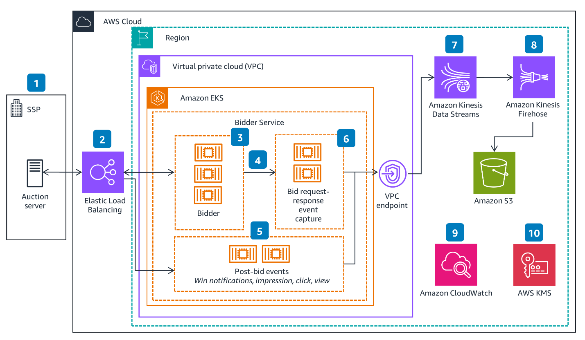

# Data pipelines architecture

The typical analytical logical architecture is depicted as follows:

The key objectives and best practices for this architecture are as follows:

- **Data ingestion from source and data standardization:**
  Involves preprocessing and moving of events and ad server data from sources and storing
  them in a landing zone. The key objectives are to preprocess data to common format,
  control data quality, ingest and store data in landing zone, and separate data for
  downstream systems. Best practices are to aggregate data in a single Region for cost
  reduction, certify data completeness and register new data, convert to standard format
  before storing into the landing zone, and store raw data for max 30 days for compliance
  alignment.
- **Measurement, exploration, and data science:** Processing
  anonymized, aggregated data for machine learning and business intelligence. The key
  objectives are to prepare data for downstream consumption, enrich data with dimensions,
  and transform for loading into fact spaces. Best practices are to use micro-batches for
  scale, avoid raw data, store aggregates, preprocess for downstream use, implement data
  catalog and partitioning for efficient querying.
- **Advertising data warehouse (ADW):** An engine for querying
  of data when necessary. The key objectives are to support research questions, serve intake
  as data source for ML workloads, and store partitioned campaign metrics. Best practice is
  to load aggregates and dimensions from your data lake.
- **Reporting:** Campaign and ads performance reporting. The
  key objectives are to support low latency (one to two seconds), handle continually updated data, and
  support multiple reporting granularity. Best practice is to use indexes or search engine
  like OpenSearch.
- **Attribution and event-level data:** Processing and storing
  event-level data that may include transaction details, behavioral data and PII. The key
  objectives are to enable event-level data storage or querying, integrate with analytical
  pipelines and process in prescribed geographic regions. Best practices are to use near
  real-time stores like DynamoDB, use aggregates instead of PII where possible, and implement
  data handling per regulations.

## Data pipeline solution guidance

_caption text_

This solution provides the implementation details for a data pipline that uses AWS
services.

**Ingestion module**

The ingestion module serves as web server for ingesting the Clickstream data.

**Data processing module**

The data processing module transforms and enriches the ingested data to solution's data
model by the Apache Spark application running in EMR serverless.

**Data modeling module**

The data modeling module loads the processed data in a lake house. It supports the
following features:

- Support both provisioned Redshift and Redshift Serverless as data warehouse
  - Users can specify the time range for storing data in Redshift
  - Users can specify the interval to update user dimension table

- Support use Athena to query the data in data lake

  **Reporting module**

The reporting module creates a secure connection to the data warehouse and provisions
the out-of-the-box dashboards in business intelligence Amazon Quick Suite.

For more information, see [Guidance for Clickstream Analytics on AWS](../../../pdfs/solutions/latest/clickstream-analytics-on-aws/clickstream-analytics-on-aws.md "../../../pdfs/solutions/latest/clickstream-analytics-on-aws/clickstream-analytics-on-aws.md").

## Clickstream analytics on AWS

Clickstream analytics on AWS collects, ingests, analyzes, and visualizes clickstream
data from your websites and mobile applications. Clickstream data is critical for analyzing
user behavior, customer data, and marketing campaigns. This data derives insights into the
patterns of user interactions on a website or application, better understanding of user
navigation, preferences, and engagement levels to drive product innovation and optimize
marketing investments.

- **Step 1:**
  [Amazon CloudFront](https://aws.amazon.com/cloudfront/ "https://aws.amazon.com/cloudfront/") distributes the frontend web
  user interface (UI) assets hosted in the [Amazon Simple Storage Service](https://aws.amazon.com/s3/ "https://aws.amazon.com/s3/") (Amazon S3) bucket and the backend APIs hosted with [Amazon API Gateway](https://aws.amazon.com/api-gateway/ "https://aws.amazon.com/api-gateway/") and [AWS Lambda](https://aws.amazon.com/lambda/ "https://aws.amazon.com/lambda/").
- **Step 2:** The [Amazon Cognito](https://aws.amazon.com/cognito/ "https://aws.amazon.com/cognito/") user pool, or OpenID Connect (OIDC), is used for authentication.
- **Step 3:** The web UI console uses [Amazon DynamoDB](https://aws.amazon.com/dynamodb/ "https://aws.amazon.com/dynamodb/") to store persistent data.
- **Step 4:**
  [AWS Step Functions](https://aws.amazon.com/step-functions/ "https://aws.amazon.com/step-functions/"), [AWS CloudFormation](https://aws.amazon.com/cloudformation/ "https://aws.amazon.com/cloudformation/"), **Lambda**, and
  [Amazon EventBridge](https://aws.amazon.com/eventbridge/ "https://aws.amazon.com/eventbridge/") orchestrate the lifecycle
  management of data pipelines.
- **Step 5:** The data pipeline is provisioned based on the
  configurations specified by the user in the web console. It consists of [Application Load Balancer](https://aws.amazon.com/elasticloadbalancing/application-load-balancer/ "https://aws.amazon.com/elasticloadbalancing/application-load-balancer/")
  (ALB), [Amazon Elastic Container Service](https://aws.amazon.com/ecs/ "https://aws.amazon.com/ecs/") (Amazon ECS), [Amazon Managed Streaming for Apache Kafka](https://aws.amazon.com/msk/ "https://aws.amazon.com/msk/") (Amazon MSK), [Amazon Kinesis Data Streams](https://aws.amazon.com/kinesis/data-streams/ "https://aws.amazon.com/kinesis/data-streams/"), **Amazon S3**,
  [Amazon EMR Serverless](https://aws.amazon.com/emr/ "https://aws.amazon.com/emr/"), [Amazon Redshift](https://aws.amazon.com/redshift/ "https://aws.amazon.com/redshift/"), and [Amazon Quick Sight](https://aws.amazon.com/quicksight/ "https://aws.amazon.com/quicksight/").

For more information, see [Guidance for Clickstream Analytics on AWS](../../../pdfs/solutions/latest/clickstream-analytics-on-aws/clickstream-analytics-on-aws.md "../../../pdfs/solutions/latest/clickstream-analytics-on-aws/clickstream-analytics-on-aws.md").

## RTB event capture solution guidance

This guidance assists ad-tech companies capture open real-time bidding (OpenRTB) events
and establish a foundation for near real-time and batch analytics. During a programmatic
advertising transaction, a demand-side platform (DSP) service generates a series of events.
Capturing these events assists ad-tech companies keep their budgets updated and understand
signals for optimizing the bid response. By tracking events, such as a successful win bid,
advertisers can better measure the effectiveness of their campaigns. They can also analyze
these events to make informed decisions for future bids.

- **Step 1:** The supply-side platform (SSP) receives an ad
  request from a publisher and launches an auction.
- **Step 2:** An OpenRTB bid request is sent to a DSP public
  endpoint that is configured on an [Elastic Load Balancer](https://aws.amazon.com/elasticloadbalancing/ "https://aws.amazon.com/elasticloadbalancing/").
- **Step 3:** The bidder application service receives the bid
  request. This service runs on [Amazon Elastic Kubernetes Service](https://aws.amazon.com/eks/ "https://aws.amazon.com/eks/")
  (Amazon EKS) within an [Amazon Virtual Private Cloud](https://aws.amazon.com/vpc/ "https://aws.amazon.com/vpc/") (VPC).
- **Step 4:** The bid request-response event capture service
  is hosted on a different container pod in the same cluster. To reduce latency of the bid
  response, combine the publishing of the bid request and response event as a single call
  per bid asynchronously to the bid request-response event capture service endpoint.
- **Step 5:** Post bid events capture service is hosted on a
  separate container pod that exposes the service to SSPs. This service is used to receive
  post bid events.
- **Step 6:** Implement the event capture service in Java to
  take advantage of [Amazon Kinesis](https://aws.amazon.com/kinesis/ "https://aws.amazon.com/kinesis/") Producer
  Library (KPL). KPL simplifies implementation of an asynchronous producer application and
  reduces costs for sending data to the [Amazon Kinesis Data Streams](https://aws.amazon.com/kinesis/data-streams/ "https://aws.amazon.com/kinesis/data-streams/") API.
- **Step 7:** The event messages are routed to **Kinesis Data Streams** through a dedicated VPC endpoint
- **Step 8:**
  [Amazon Data Firehose](https://aws.amazon.com/kinesis/data-firehose/ "https://aws.amazon.com/kinesis/data-firehose/") consumes these
  aggregated records and de-aggregates and sends individual events to [Amazon Simple Storage Service](https://aws.amazon.com/s3/ "https://aws.amazon.com/s3/") (Amazon S3) for long-term storage and
  analytics.
- **Step 9:**
  [Amazon CloudWatch](https://aws.amazon.com/cloudwatch/ "https://aws.amazon.com/cloudwatch/") captures application logs for
  traceability.
- **Step 10:**
  [AWS Key Management Service](https://aws.amazon.com/kms/ "https://aws.amazon.com/kms/") (AWS KMS) stores and manages
  encryption keys used for securing persisted data in Kinesis Data Streams and Amazon S3.

Additional reference available [here](https://aws.amazon.com/solutions/guidance/building-a-real-time-bidder-for-advertising-on-aws/ "https://aws.amazon.com/solutions/guidance/building-a-real-time-bidder-for-advertising-on-aws/")
