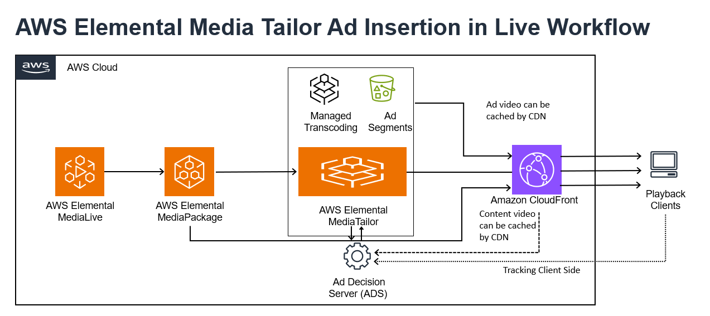
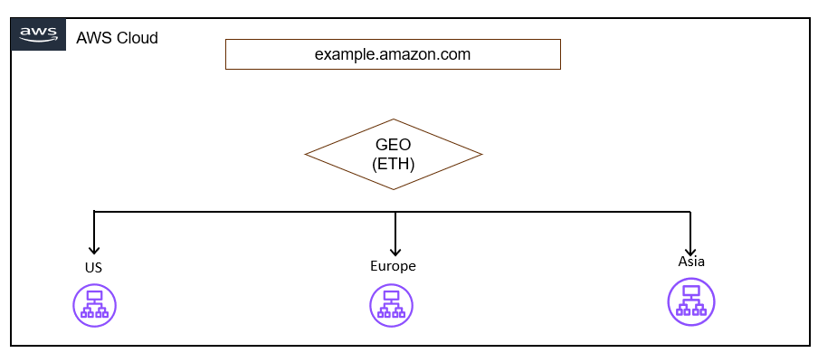
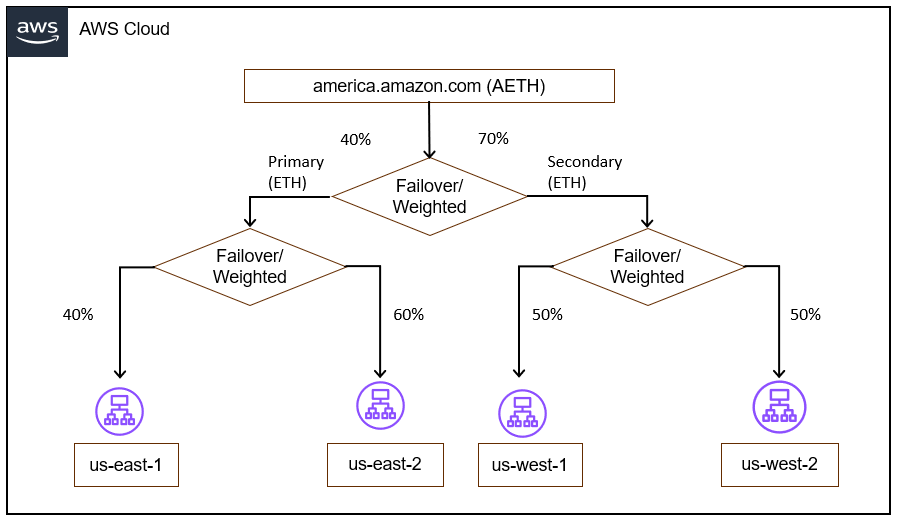
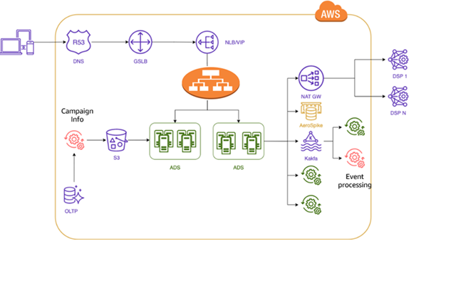

# Multi-Region advertising

workloads

The section expands on ad decision service (ADS) invoked by the publisher ad insertion
workflow provided in the following diagrams. This comprises of SSP, ad network, Ad exchange,
DSP, and DMP systems as part of the direct and programmatic ad serving process.

## ADS intake traffic distribution

1. Using Route 53 geolocation or geo proximity routing policies, the intake traffic from
   publisher can be routed to the ADS regional workloads with a continent based on data
   residency requirements for that continent. The example referenced in the following
   diagram shows intake traffic routed to US, Europe, and Asia based on the geolocation of
   the intake origin from the publisher.

 2. Furthermore, for traffic routing within a content across the various AWS Regions,
you can use the weighted routing policy of Amazon Route 53. This can be also combined with the
failover routing policy of Route 53 to implement resiliency feature.

For example, in the following diagram for the intake traffic routed to the America
continent:

    1. Traffic is distributed between us-east and us-west regions in ratio of 70:30.
     In case of a Regional failure, traffic will be routed 100 % to the other region.
    2. The same combination of weighted is implemented to split traffic between
     us-east-1 and us-east-2 in the ratio of 40:60, &
     between us-west-1 and us-west-2 in the ratio of 50:50.

    
    3. Traffic pattern between an ad network and DSP for programmatic bidding is local
     within the boundaries of a Region due to latency concerns.
    4. DSP patterns are replicated at a Regional boundary, and the calls from the ad
     network to DSP are made over the internet through RTB protocol to DSP load
     balancers.

## Data management considerations

**Low-latency data (real-time or near real-time):** Bid data,
user data, ad impression data, and real-time campaign performance data (clicks, impressions,
and conversions). This data needs to be processed and acted upon within milliseconds to
facilitate optimal ad delivery, real-time bidding, and accurate tracking of user
interactions.

**Medium-latency data (near real-time or batch processing):**
User behavior data, audience segmentation data, campaign optimization data, and attribution
data. This data can be processed in near real-time (within minutes or hours) or in batches,
as it is used for audience targeting, campaign optimization, and attribution analysis.

**High-latency data (batch processing or offline):** Historical
campaign data, third-party data, and ad creative data. This data can be processed in batches
or offline, as it is typically used for analysis, reporting, and long-term decision-making
rather than real-time ad delivery or optimization.

Data is confined within a continent for data residency requirements and replicated
cross-AZ and cross-Region within the continent.

Campaign data for frequency capping perspective is replicated globally.

The ad serving workload is replicated in each Region with data stores for local and
global storage.

_Ad serving workload at a Regional level with interaction with 1:
many DSPs at a Region_
