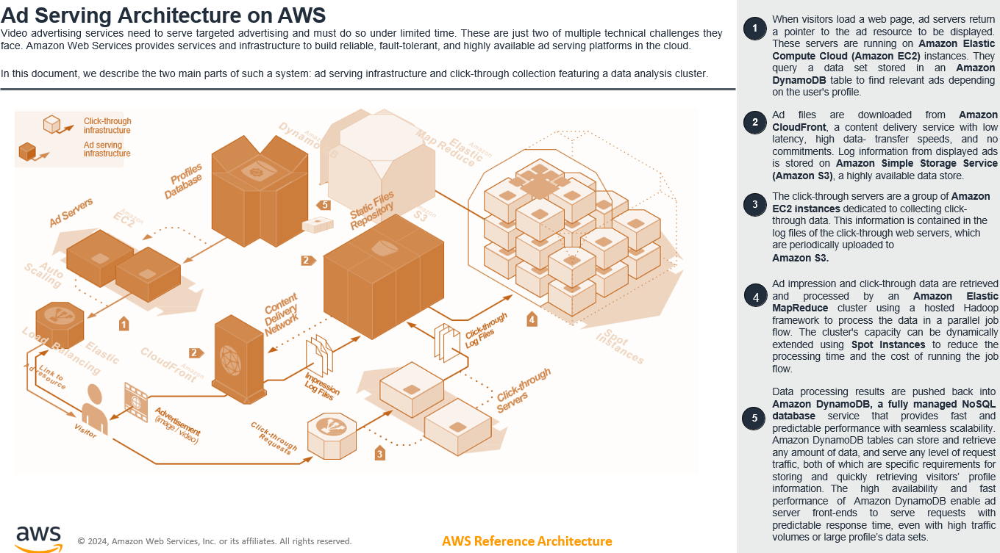
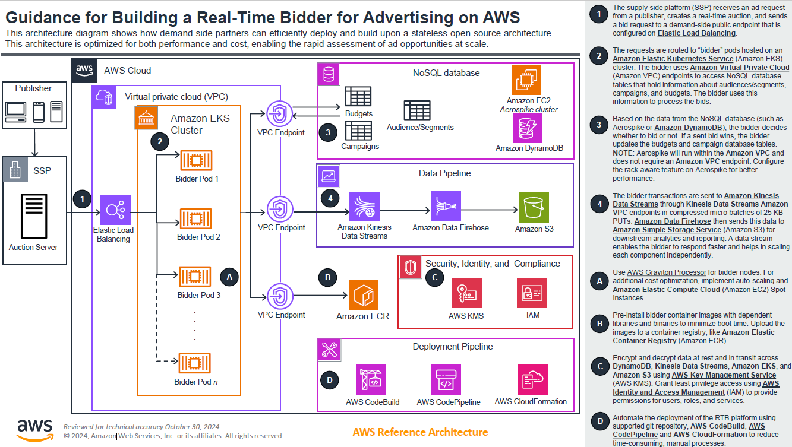
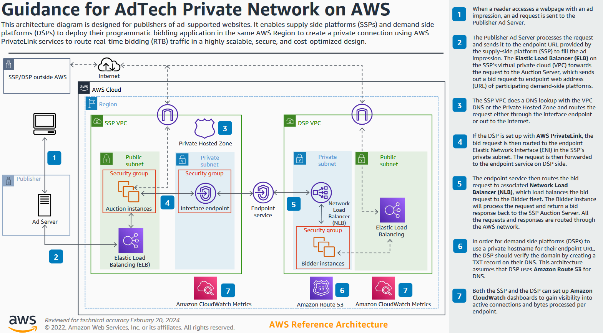

# Scenarios

The following are common scenarios that can influence the design and
architecture of your advertising workloads on AWS. This section
covers the common drivers for the design, along with prescribed
reference architecture. 

## Operate highly scalable programmatic advertising workloads

The petabyte-scale, millisecond latency world of programmatic
advertising brings significant challenges for performance,
throughput, latency, and costs to advertising platforms. The key
platforms in programmatic advertising are ad servers, ad exchanges
and SSPs, and DSPs.

_Ad serving architecture_

_Real-time bidding (RTB) reference
architecture_

For additional detail, see
[Guidance
for Building a Real Time Bidder for Advertising on AWS](https://aws.amazon.com/solutions/guidance/building-a-real-time-bidder-for-advertising-on-aws/ "https://aws.amazon.com/solutions/guidance/building-a-real-time-bidder-for-advertising-on-aws/").

_Adtech private network
architecture_

For additional detail, see
[Guidance
for AdTech Private Network on AWS](https://aws.amazon.com/solutions/guidance/adtech-private-network-on-aws/ "https://aws.amazon.com/solutions/guidance/adtech-private-network-on-aws/").

## Future scenario revisions

The future incremental versions of the lens will cover additional
scenarios:

- **Ad intelligence, measurement, and
  security:** Best practices for digital ad
  measurement, verification, and fraud protection.

- **Data management:**
  - Data management platform (DMP) best practices addressing
    data collection, storage, segmentation, user profiles,
    distribution, analytics, and reporting.
  - Multi-Region architecture best practices with distributed
    or centralized data management, along with distributed or
    centralized analytics architecture.
  - Best practices for handling low latency distributed data
    (user profiles and decision data) for frequency capping
    and budget pacing activities.

- **Privacy-enhanced data
  collaboration:** Best practices for collaboration
  between advertising, publishers, and agencies to improve
  campaign planning, activation, and measurement while
  protecting consumer data privacy.
