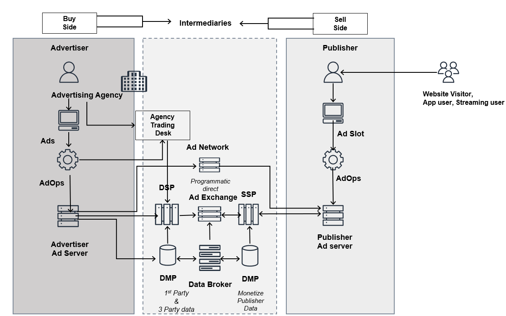

# Scope

This lens focuses on programmatic advertising, specifically online video advertising and
streaming media advertising. This document provides best practices applicable to supply-side
platforms (SSPs), ad exchanges, demand-side platforms, and related programmatic advertising
platforms. It complements the best practices for ad supported content monetization (a part of
the [Streaming Media
Lens](../streaming-media-lens/streaming-media-lens.md "../streaming-media-lens/streaming-media-lens.md") for publishers).

The following programmatic advertising lifecycle describes the complex end-to-end
interaction between a user, the publication used, the selling and buying platforms, and the
advertiser.

_Online video advertising logical
environment_

On the Buy Side (or the advertiser), the personas are:

- **Advertiser:** A person, organization, or company that
  places free or paid promotion of a specific product, event, service in a public medium to
  attract potential or new customers
- **Agency:** An organization that, on behalf of clients, plans
  marketing and advertising campaigns, drafts and produces advertisements, and places
  advertisements in the media. In interactive advertising, agencies often use third party
  technology (ad servers) and may place advertisements with publishers, ad networks and
  other industry participants.
- **DSP:** Demand-side platforms provide centralized
  (aggregated) media buying from multiple sources, including ad exchanges, ad networks, and
  sell-side platforms, often bidding in real time. While there is some similarity between a
  DSP and an ad network, DSPs are differentiated from ad networks because they do not
  provide standard campaign management services, publisher services, or direct publisher
  relationships.
  On the Sell Side (or the publisher), the personas are:

- **Publisher:** A person or company that makes content (in any
  form) available for consumption, for free or for sale
- **Ad network:** Ad networks provide an outsourced sales
  capability for publishers and a means to aggregate inventory and audiences from numerous
  sources in a single buying opportunity for media buyers. Ad networks may provide specific
  technologies to enhance value to both publishers and advertisers, including unique
  targeting capabilities, creative generation, and optimization. Ad networks' business
  models and practices may include features that are similar to those offered by ad
  exchanges.
- **SSP:** Sell-side platforms provide outsourced media selling
  and ad network management services for publishers. Sell-side platform and ad networks
  business models and practices are similar. Sell-side platforms are typically
  differentiated from ad networks in not providing services for advertisers.
- **Ad server:** An ad server is a technological platform that
  manages, delivers, and tracks online ads. Ad servers are used by publishers, advertisers,
  and ad networks.
  The technology Intermediary layer that connects the Buy and Sell Sides is:

- **Ad exchange:** An ad exchange provides a sales channel to
  publishers and ad networks, as well as aggregated inventory to advertisers. They bring a
  technology platform that facilitates automated auction-based pricing, selling, and buying
  in real-time.
- **Data management platform (DMP):** A DMP is an aggregator of
  third-party data. This data is made available on a commercial basis to enrich the ad
  supply of publishers, expand the attributes available for audience segmentation, and
  expand targeting by advertisers. The data is also available to advertisers to expand the
  attributes available to their users and widen campaign definitions.
- **Customer data platform (CDP):** A CDP is a data solution
  that centralizes customer related data, so that retailers can link and bridge
  multi-channel customer journeys through one identity profile, which assists publishers to
  understand the customer needs demands and make better decisions.
