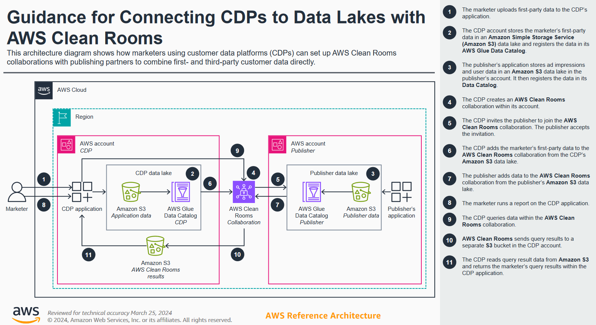
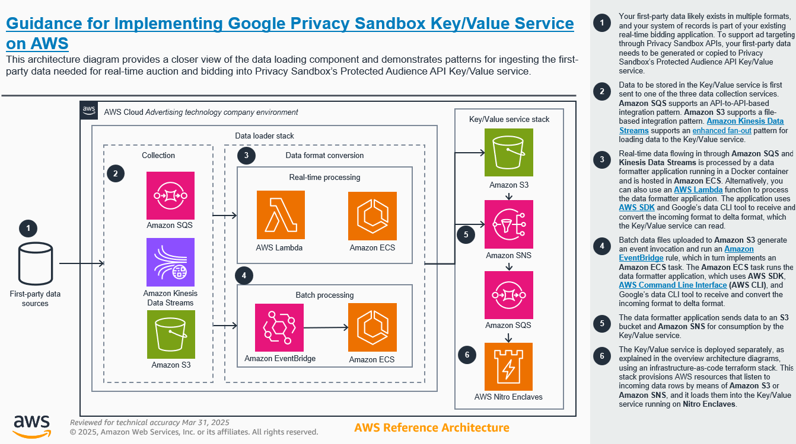
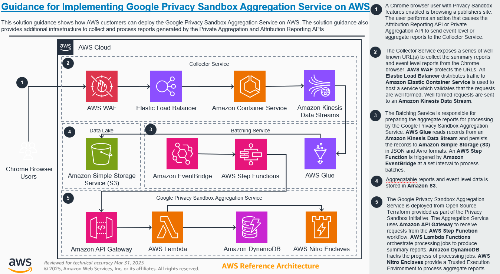
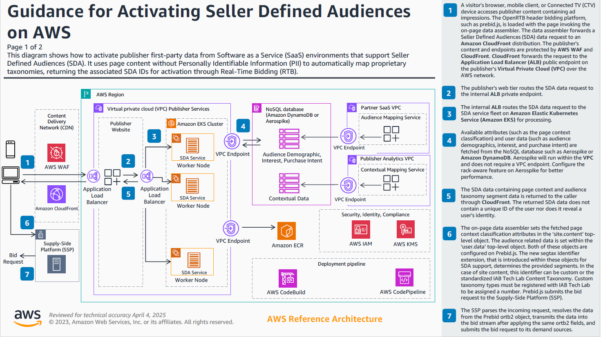
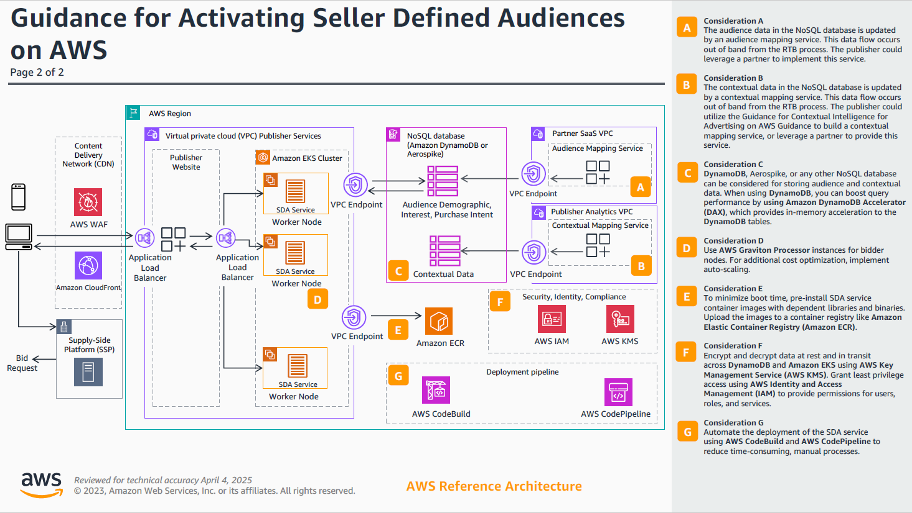

# Using privacy-enhanced collaboration

This scenario covers the best practices for collaboration between advertising, publishers
and agencies, to improve campaign planning, activation, and measurement while protecting
consumer data privacy.

## AWS Clean Rooms implementation connecting

marketing and publisher customer data platform

This guidance shows you how to use customer data platforms (CDPs) to set up a
collaboration between first-party marketing data and third-party data from a publishing
partner. By using an AWS Clean Rooms collaboration, CDPs can facilitate the connection between
separate data lakes on AWS. Marketers can upload their data to the CDP application, then
use the application to run reports from the compiled data, and activate their audiences.

## Browser and OS-mediated campaigns

There are three privacy sandbox APIs that have dependencies to back-end services that
the adtech companies need to host on a public cloud.

- **Topics API:** With this API, each publisher or the adtech
  acting on behalf of the publisher can use the topics API to add a particular browser or
  device to an interest group. Chrome will not share the unique identifier of the device
  or browser. But a publisher can use first party cookies to collect signals around user
  interaction on their property and identify them being part of 1 or more interest groups.
  This is then available to the bidders. On the demand side, DSP’s will only get to see
  the interest groups and they have to decide to bid or not and how much to bid for based
  on this.
- **Protected audience API:** The associated cloud hosted
  service is a Key value server. During the auction or bidding process SSP’s and DSP’s
  respectively need to access data that is to be used in auction logic or bidding logic.
  Adtech customers have to run a key value server on Nitro enclaves to store and retrieve
  data to be compatible with protected audience API.
- **Measurement API:** Private aggregation and attribution
  reporting API and the associated cloud service is private aggregation service.

## Hosting protected audience API

This guidance demonstrates how to deploy the Google Chrome Privacy Sandbox Key or value
service within a trusted execution environment (TEE) on AWS. The key or value service
allows implementers to fetch real-time signals to inform remarketing to custom audiences
through the protected audience API (PAAPI). This real-time data assists ad buyers determine
how to bid and assists sellers to pick winning bids in a privacy-enhanced way. This guidance
intends to simplify the implementation of the Key/Value service while optimizing cost and
latency.

For additional details, see [Guidance for Implementing Google Privacy Sandbox Key/Value Service on AWS](https://aws.amazon.com/solutions/guidance/implementing-google-privacy-sandbox-key-value-service-on-aws "https://aws.amazon.com/solutions/guidance/implementing-google-privacy-sandbox-key-value-service-on-aws").

## Measurement API

This guidance demonstrates how to deploy the Google Privacy Sandbox Aggregation Service
within a trusted execution environment (TEE) using AWS services. The Aggregation Service
can be used to produce event or aggregate campaign measurement data through the Privacy
Sandbox Attribution Reporting API (ARA) or Private Aggregation API.

For additional details, see [Guidance for Implementing the Google Privacy Sandbox Aggregation Service on
AWS](https://aws.amazon.com/solutions/guidance/implementing-the-google-privacy-sandbox-aggregation-service-on-aws/ "https://aws.amazon.com/solutions/guidance/implementing-the-google-privacy-sandbox-aggregation-service-on-aws/").

## Activating seller-defined audiences

This guidance shows how to activate publisher first-party data from software as a
service (SaaS) environments that support seller-defined audiences (SDA). It uses page
content without personally identifiable information (PII) to automatically map to industry
standard taxonomies, returning the associated SDA identifications for activation through
real-time bidding (RTB).

For additional details, see [Guidance for
Activating Seller Defined Audiences on AWS](https://aws.amazon.com/solutions/guidance/activating-seller-defined-audiences-on-aws "https://aws.amazon.com/solutions/guidance/activating-seller-defined-audiences-on-aws").
