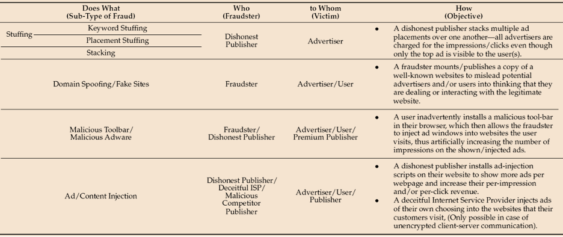
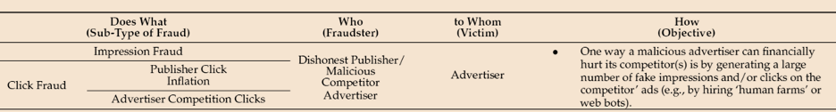
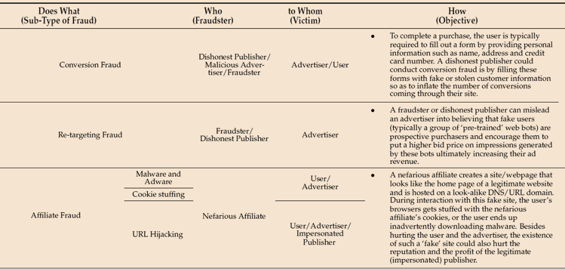

# Video Streaming Advertising Lens - AWS Well-Architected Framework

Publication date: **December 9, 2025** ([Document revisions](document-revisions.md "document-revisions.md"))

This paper describes the Video Streaming Advertising (VSA) Lens for the
AWS Well-Architected Framework. The lens explores how to review and
improve your cloud-based architectures and better understand the
impact of design decisions. We present general design principles and
specific best practices aligned to the six pillars of the
Well-Architected Framework. 

## Introduction

The AWS Well-Architected Framework helps cloud architects build
secure, high-performing, resilient, and efficient infrastructure for
their applications and workloads. The AWS Well-Architected Framework
is based on six pillars. The pillars are operational excellence,
security, reliability, performance efficiency, cost optimization and
sustainability. AWS Well-Architected provides a consistent approach for
customers and AWS Partners to evaluate architectures, remediate
risks, and implement designs that deliver business value.

In this lens, we focus on how to design, architect, and deploy your
advertising workloads in the AWS Cloud. We define components,
explore common workload scenarios, and outline design principles
that help you apply the AWS Well-Architected Framework. We recommend
that you begin designing your architecture by considering the best
practices and questions from the AWS Well-Architected Framework
whitepaper.

Operational challenges with the advertising workloads are:

- High traffic volumes with tens of millions of transactions per
  second.
- Low latency application and data retrieval responses with
  single-digit millisecond response time SLA.
- Rapid changes in traffic volumes and associated fluctuations in
  compute and network infrastructure.
- Data transfer is a significant part of overall operational costs
  and a focus area.
- Very low revenue (and profit margin) per transaction drives the
  focus on cost. Cost efficiency is the dominant design principle.
- End-to-end network latency impacts time available for response
  processing. Roundtrip latency of under 300 milliseconds is
  required to meet industry trading service-level objectives (SLOs).
- The use of 3rd party ISVs (independent software vendors) requires
  responses under two milliseconds to meet end-to-end processing
  SLAs.
- Rapid traffic changes require stateless and flexible
  infrastructure to facilitate automated up and down scaling of
  platform.
- Flexible supply and demand reduces redundancy requirements.
- Handling massive data volumes (100+ petabytes) and high throughput (up to 1+ trillion events per week).
- Verify data privacy compliance with regulations like GDPR and CCPA while processing large amounts of user data.
- Providing low-latency reporting and ad-hoc querying capabilities for campaign performance analysis and business intelligence.
- Scaling data processing pipelines cost-effectively as data volumes and business complexity grow rapidly.
- Enabling advanced use cases like machine learning for advertising performance measurement and attribution modeling.
- Maintaining operational efficiency with managed services as engineering team sizes may not keep up with data growth.
- Achieving high availability and resilience in data pipelines to support critical advertising workloads.
- Address alternate solution option for addressable targeting to deliver personalized ads, due to significant signal loss of traditional data points like third-party cookies, mobile IDs (IDFA for iOS and the Android Advertising ID (AAID)), hashed emails, and IP addresses, driven by privacy regulations.
- In addition to these individual challenges, organizations face multiple interconnected challenges:
  - Protecting user privacy while complying with evolving regulations like GDPR and CCPA
  - Combating sophisticated ad fraud and verifying brand safety through robust content moderation
  - Adapting to the phaseout of third-party cookies by developing alternative measurement approaches using first-party data and modeling
  - Managing data quality and secure collaboration across multiple solutions and partners
  - Effectively using AI/ML technologies for fraud detection, content moderation, and cross-system measurement while maintaining transparency and human oversight

- Three main categories of digital advertising fraud: placement fraud, traffic fraud, and action fraud. These fraudulent activities employ both automated and manual methods, targeting different aspects of the advertising solution.
  - _Placement fraud_ involves manipulating ad placements through techniques like malvertising, ad stacking, fake websites, domain spoofing, and ad injection.

  
  _Placement fraud_
  - _Traffic fraud_ focuses on artificially inflating visitor numbers and clicks using bots or human labor.

  
  _Traffic fraud_
  - _Action fraud_ includes falsifying conversions, manipulating re-targeting data, and various forms of affiliate fraud.

  
  _Action fraud_

This lens specifies best practices that address the unique characteristics of building and operating advertising workloads in the cloud. They are based on our experience with industry developers and operations teams. It provides guidance on how to design and operate your environment addressing the operational challenges.

This document is intended for those in technology roles, such as chief technology officers (CTOs), Technical directors, architects, developers, and operations team members. After reading this document, you will understand AWS best practices and recommended strategies to use when designing and operating architectures for advertising workloads.

## Lens availability

Custom lenses extend the best practice guidance provided by AWS Well-Architected Tool. AWS WA Tool allows you to create your own
[custom
lenses](../userguide/lenses-custom.md "../userguide/lenses-custom.md"), or to use lenses created by others that have been
shared with you.

To begin reviewing your advertising workload, download and import the [Video Streaming Advertising Lens](https://github.com/aws-samples/sample-well-architected-custom-lens/blob/main/video-streaming-advertising-lens/video-streaming-advertising-lens.json "https://github.com/aws-samples/sample-well-architected-custom-lens/blob/main/video-streaming-advertising-lens/video-streaming-advertising-lens.json") into AWS Well-Architected Tool from the public [AWS Well-Architected custom lens GitHub repository](https://github.com/aws-samples/sample-well-architected-custom-lens "https://github.com/aws-samples/sample-well-architected-custom-lens").
