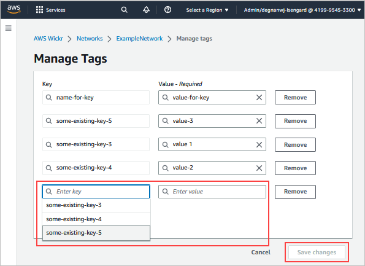

This guide documents the classic version of the AWS Wickr administration console, released before March
13, 2025. For documentation on the new AWS Wickr administration console, see [Administration Guide](../adminguide/what-is-wickr.md "../adminguide/what-is-wickr.md").

# Add a network tag in AWS Wickr

You can add a network tag to your Wickr network.

Complete the following procedure to add a tag to your Wickr network. For more
information about managing tags, see [Manage network tags in AWS Wickr](manage-tags.md "manage-tags.md").

1. On the **Manage tags** page, choose **Add new
   tag**.
2. In the blank **Key** and **Value**
   fields that appear, enter the new tag key and value.
3. Choose **Save changes** to save the new tags.

