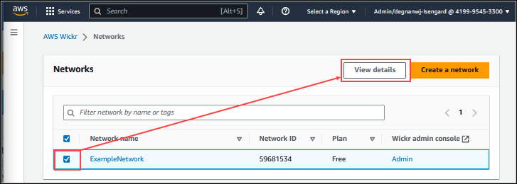

This guide documents the classic version of the AWS Wickr administration console, released before March
13, 2025. For documentation on the new AWS Wickr administration console, see [Administration Guide](../adminguide/what-is-wickr.md "../adminguide/what-is-wickr.md").

# Edit network name in AWS Wickr

You can edit the name of your Wickr network.

Complete the following procedure to edit your Wickr network name.

1. Open the AWS Management Console for Wickr at [https://console.aws.amazon.com/wickr/](https://console.aws.amazon.com/wickr/ "https://console.aws.amazon.com/wickr/").
2. Choose **Manage network**.
3. On the **Networks** page, select the checkbox next to the
   network name you want to edit, and then choose **View
   details**.

 4. In the **Network overview** section, choose
**Edit**. 5. Enter your new network name into the **Network Name**
text box. 6. Choose **Save changes** to save your new network
name.
