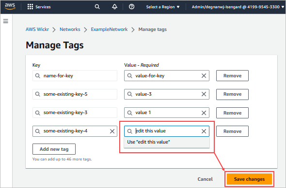

This guide documents the classic version of the AWS Wickr administration console, released before March
13, 2025. For documentation on the new AWS Wickr administration console, see [Administration Guide](../adminguide/what-is-wickr.md "../adminguide/what-is-wickr.md").

# Edit a network tag in AWS Wickr

You can edit a network tag to your Wickr network.

Complete the following procedure to edit a tag associated with your Wickr
network. For more information about managing tags, see [Manage network tags in AWS Wickr](manage-tags.md "manage-tags.md").

1. On the **Manage tags** page, edit the value of a
   tag.

###### Note

You can't edit the key of a tag. Instead, remove the key and value
pair, and add a new tag using the new key.

 2. Choose **Save changes** to save your edits.
