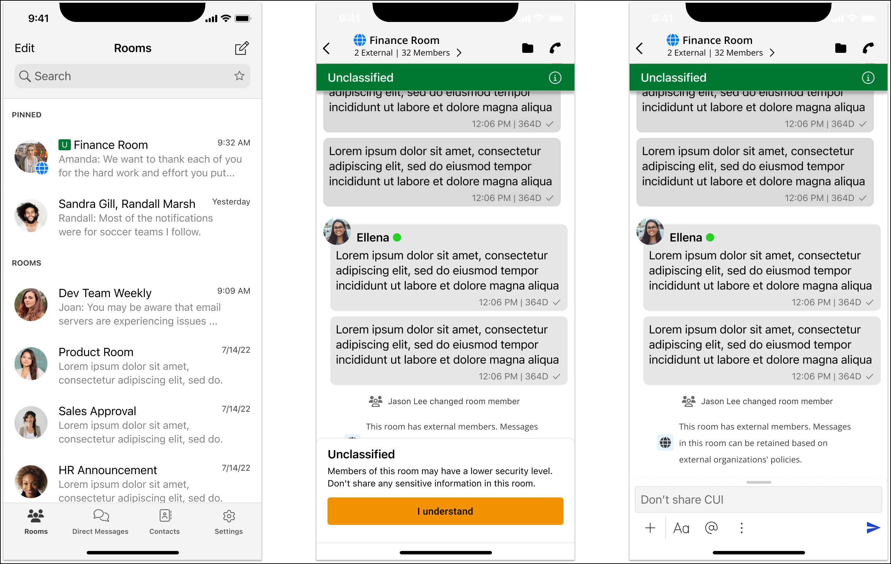

This guide documents the classic version of the AWS Wickr administration console, released before March
13, 2025. For documentation on the new AWS Wickr administration console, see [Administration Guide](../adminguide/what-is-wickr.md "../adminguide/what-is-wickr.md").

# GovCloud cross boundary classification and

federation

AWS Wickr offers WickrGov client tailored for GovCloud users. The GovCloud Federation
allows communication between GovCloud users and commercial users. The cross boundary
classification feature enables user interface changes to conversations for GovCloud users. As a
GovCloud user, you must adhere to strict guidelines concerning government defined classification. When
GovCloud users engage in conversations with commercial users (Enterprise, AWS Wickr, Guest
users), they will see the following unclassified warnings displayed:

- A U tag in the room list
- An unclassified acknowledgment on the message screen
- An unclassified banner on top of the conversation

###### Note

These warnings will only be shown when a GovCloud user is in conversation or part of a room
with external users. They will disappear if the external users leave the conversation. No
warnings will be shown in conversations between GovCloud users.
