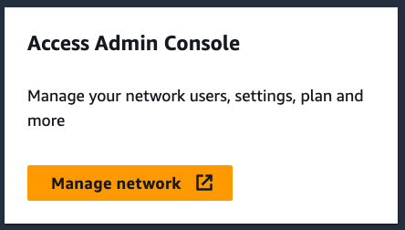
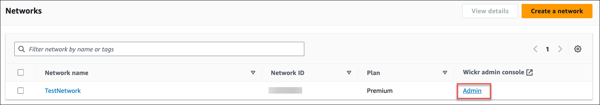

This guide documents the classic version of the AWS Wickr administration console, released before March
13, 2025. For documentation on the new AWS Wickr administration console, see [Administration Guide](../adminguide/what-is-wickr.md "../adminguide/what-is-wickr.md").

# Transfer Wickr Pro to AWS Wickr

###### Note

Wickr Pro has been discontinued. If you have lost access to Wickr Pro, follow the steps in this
guide to move to AWS Wickr.

In this guide, we show you how to you transfer from Wickr Pro and start using
AWS Wickr.

Follow the steps in this guide if you have an existing Wickr Pro network, but DO NOT have
an AWS account yet. Please reach out to support at any step if you need assistance.

If your organization already has an AWS account complete the [Migrate from Wickr Pro to
AWS Wickr](https://pages.awscloud.com/Wickr-Pro-Migration.html "https://pages.awscloud.com/Wickr-Pro-Migration.html") form and AWS Wickr support will assist you.

You will need an AWS account ID to manage your AWS Wickr network as an AWS service.
For more information on what an AWS account is, and how to manage the account, see [AWS Account
Management Reference Guide](../../../accounts/latest/reference/accounts-welcome.md "../../../accounts/latest/reference/accounts-welcome.md").

###### Topics

- [Step 1: Create an AWS account](#transfer-wickr-pro-to-aws-wickr-step1 "#transfer-wickr-pro-to-aws-wickr-step1")
- [Step 2: Retrieve your Wickr network
  ID](#transfer-wickr-pro-to-aws-wickr-step2 "#transfer-wickr-pro-to-aws-wickr-step2")
- [Step 3: Submit a request](#transfer-wickr-pro-to-aws-wickr-step3 "#transfer-wickr-pro-to-aws-wickr-step3")
- [Step 4: Login to your AWS Console](#transfer-wickr-pro-to-aws-wickr-step4 "#transfer-wickr-pro-to-aws-wickr-step4")

## Step 1: Create an AWS account

Complete the following procedure to create an AWS account.

1. If your organization does not have an existing AWS Account ID you can start by creating a
   standalone AWS account ID. A few key things you will need for this:
   - A credit/debit card for billing
   - An email address that can be accessed by a group (Recommended, not required)
   - Select an Support plan. For more information, see [Changing Support
     Plans](../../../awssupport/latest/user/changing-support-plans.md "../../../awssupport/latest/user/changing-support-plans.md").

   ###### Note

   You can always change your Support plan as you learn more about your needs.

2. Set up administrative access through IAM as a security best practice (optional but
   recommended). For more information, see [AWS Identity and Access
   Management](../../../IAM/latest/UserGuide/getting-set-up.md#create-an-admin "../../../IAM/latest/UserGuide/getting-set-up.md#create-an-admin"). For more specific instructions about AWS Wickr administrative access,
   see [AWS managed policy: AWSWickrFullAccess](../adminguide/security-iam-awsmanpol.md#security-iam-awsmanpol-AWSWickrFullAccess "../adminguide/security-iam-awsmanpol.md#security-iam-awsmanpol-AWSWickrFullAccess").
3. Once you complete the previous steps, you will be able to log in to the AWS Management Console to
   find your 12-digit AWS account ID under your account name.

## Step 2: Retrieve your Wickr network

ID

Complete the following procedure to retrieve your Wickr network ID.

1. Login to your current Wickr admin console, and select the network(s) you want to
   migrate, then choose **Network Profile**.
2. The **Network Profile** page displays your network ID and is an 8-digit
   numeric ID.

## Step 3: Submit a request

Now that you have your AWS account ID and Wickr Pro network ID you will need to
complete the [Migrate from
Wickr Pro to AWS Wickr](https://pages.awscloud.com/Wickr-Pro-Migration.html "https://pages.awscloud.com/Wickr-Pro-Migration.html") form.

When completed, typically within 14 days, an AWS Wickr support representative will
contact you to confirm that your Wickr network has been added to your AWS account.

## Step 4: Login to your AWS Console

###### Note

**Follow these steps AFTER you receive confirmation that your Wickr Pro network
has been added to your AWS account.**

1. You can login to the AWS console as a root user OR with an IAM user you previously
   (as recommended) created in Step 2 for AWS Wickr.
2. Navigate to your AWS Wickr service. You can do this from the
   **Services** menu or by searching for AWS Wickr in the search
   bar.
3. On the AWS Wickr page, choose **Manage network** to access your
   Wickr network list.

 4. On the **Networks** page, under the **Wickr admin
console** column, select the Admin link to the right of the desired Network
name.

 5. The transfer is now complete! You will see your Wickr network dashboard.

Billing for your network will now be transferred to your AWS account. Allow up to 3
business days for support to reach out with a confirmation. After receiving your confirmation,
you can view and pay your bill through the AWS console.
