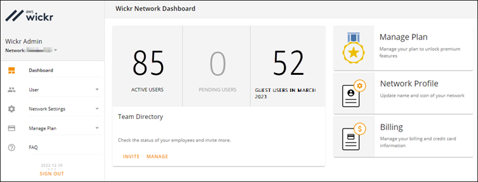

This guide documents the classic version of the AWS Wickr administration console, released before March
13, 2025. For documentation on the new AWS Wickr administration console, see [Administration Guide](../adminguide/what-is-wickr.md "../adminguide/what-is-wickr.md").

# View security groups in AWS Wickr

You can view the details of your Wickr security groups.

Complete the following procedure to view security groups.

1. Open the AWS Management Console for Wickr at [https://console.aws.amazon.com/wickr/](https://console.aws.amazon.com/wickr/ "https://console.aws.amazon.com/wickr/").
2. On the **Networks** page, choose the **Admin** link,
   to navigate to Wickr Admin Console for that network.

You're redirected to the Wickr Admin Console for a specific network.

 3. In the navigation pane of the Wickr Admin Console, choose
**Network Settings**, and then choose
**Security Group**.

The **Security Groups** page displays your current
Wickr security groups and gives you the option to view their details or
create a new group.
