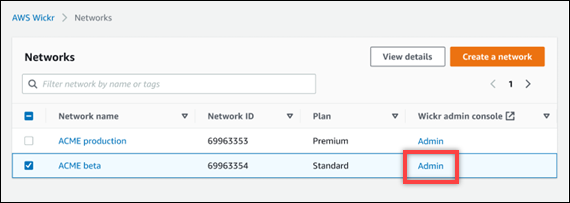

This guide documents the classic version of the AWS Wickr administration console, released before March
13, 2025. For documentation on the new AWS Wickr administration console, see [Administration Guide](../adminguide/what-is-wickr.md "../adminguide/what-is-wickr.md").

# View users in AWS Wickr network

You can view the details of users registered to your Wickr network.

Complete the following procedure to view users registered to your Wickr
network.

1. Open the AWS Management Console for Wickr at [https://console.aws.amazon.com/wickr/](https://console.aws.amazon.com/wickr/ "https://console.aws.amazon.com/wickr/").
2. On the **Networks** page, choose the **Admin** link,
   to navigate to Wickr Admin Console for that network.

You're redirected to the Wickr Admin Console for a specific network.

 3. In the navigation pane of the Wickr Admin Console, choose
**User**, and then choose **Team
Directory**.

The **Team Directory** page displays users registered to
your Wickr network, including their name, email address, assigned security
group, and current status. For current users, you can view their devices,
edit their details, suspend, delete, and
switch them to another Wickr network.
