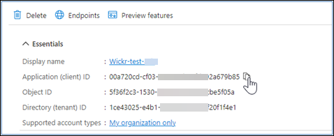
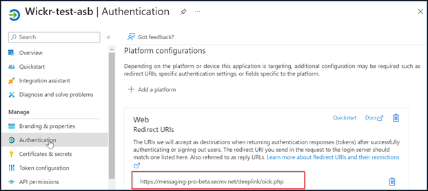
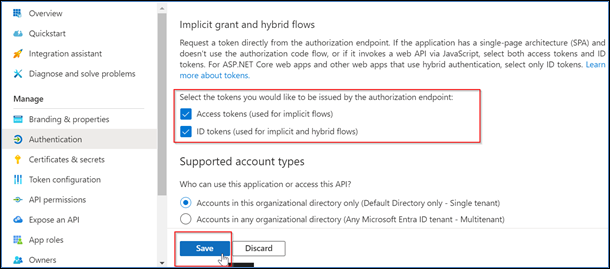
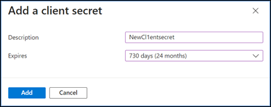
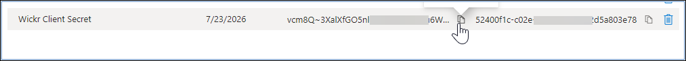
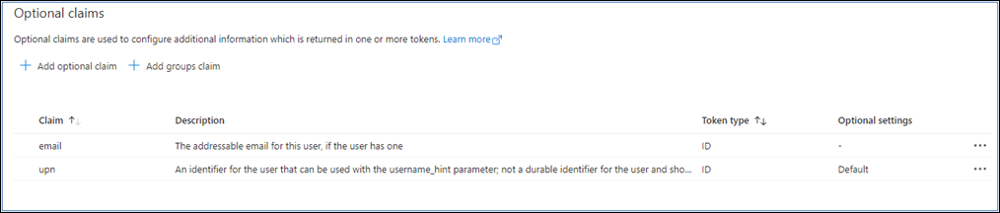
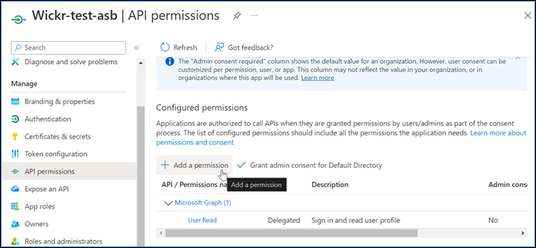
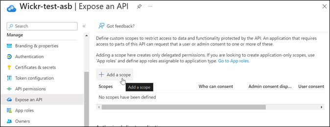
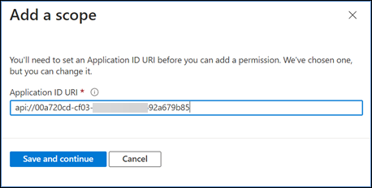
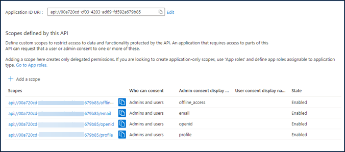

This guide documents the new AWS Wickr administration console, released on
March 13, 2025. For documentation on the classic version of the AWS Wickr administration console, see [Classic
Administration Guide](../adminguide-classic/what-is-wickr.md "../adminguide-classic/what-is-wickr.md").

# Configure AWS Wickr with Microsoft Entra (Azure AD) single

sign-on

AWS Wickr can be configured to use Microsoft Entra (Azure AD) as an identity provider. To
do so, complete the following procedures in both Microsoft Entra and the AWS Wickr admin
console.

###### Warning

After SSO is enabled on a network it will sign active users out of Wickr and force them to
re-authenticate using the SSO provider.

Complete the following procedure to register AWS Wickr as an application in Microsoft
Entra.

###### Note

Refer to the Microsoft Entra documentation for detailed screenshots and troubleshooting.
For more information, see [Register an application with the Microsoft identity platform](https://learn.microsoft.com/en-us/entra/identity-platform/quickstart-register-app "https://learn.microsoft.com/en-us/entra/identity-platform/quickstart-register-app")

1. In the navigation pane, choose **Applications** and then choose
   **App Registrations**.
2. On the **App Registrations** page, choose **Register an
   application**, and then enter an application name.
3. Select **Accounts in this organizational directory only (Default Directory only -
   Single tenant)**.
4. Under **Redirect URI**, select **Web**, and then enter
   the redirect URI available in SSO configuration settings in the AWS Wickr Admin
   console
5. Choose **Register**.
6. After registration, copy/save the Application (Client) ID generated.

 7. Select the **Endpoints** tab to make a note of the following:

    1. Oauth 2.0 authorization endpoint (v2): E.g.:
     `https://login.microsoftonline.com/1ce43025-e4b1-462d-a39f-337f20f1f4e1/oauth2/v2.0/authorize`
    2. Edit this value to remove the 'oauth2/" and "authorize". E.g. fixed URL will look like
     this:
     `https://login.microsoftonline.com/1ce43025-e4b1-462d-a39f-337f20f1f4e1/v2.0/`
    3. This will be referenced as the **SSO Issuer**.

Complete the following procedure to setup authentication in Microsoft Entra.

1. In the navigation pane, choose **Authentication**.
2. On the **Authentication** page, make sure that the **Web
   Redirect URI** is the same as entered previously (in _Register AWS Wickr
   as an Application_).

 3. Select **Access tokens used for implicit flows** and **ID tokens
used for implicit and hybrid flows**. 4. Choose **Save**.

Complete the following procedure to setup certificates and secrets in Microsoft
Entra.

1. In the navigation pane, choose **Certificates & secrets**.
2. On the **Certificates & secrets** page, select the **Client
   secrets** tab.
3. Under the **Client secrets** tab, select **New client
   secret**.
4. Enter a description and select an expiration period for the secret.
5. Choose **Add**.

 6. After the certificate is created, copy the **Client secret
value**.

###### Note

The client secret value (not Secret ID) will be required for your client application
code. You may not be able to view or copy the secret value after leaving this page. If you do
not copy it now, you will have to go back to create a new client secret.
Complete the following procedure to setup token configuration in Microsoft Entra.

1. In the navigation pane, choose **Token configuration**.
2. On the **Token configuration** page, choose **Add optional
   claim**.
3. Under **Optional claims**, select the **Token type** as
   **ID**.
4. After selecting **ID**, under **Claim**, select
   **email** and **upn**.
5. Choose **Add**.

Complete the following procedure to setup API permissions in Microsoft Entra.

1. In the navigation pane, choose **API permissions**.
2. On the **API permissions** page, choose **Add a
   permission**.

 3. Select **Microsoft Graph** and then select **Delegated
Permissions** . 4. Select the checkbox for **email** , **offline_access**,
**openid**, **profile**. 5. Choose **Add permissions**.
Complete the following procedure to expose an API for each of the 4 scopes in Microsoft
Entra.

1. In the navigation pane, choose **Expose an API**.
2. On the **Expose an API** page, choose **Add a
   scope**.

**Application ID URI** should auto populate, and the ID that follows the
URI should match the **Application ID** (created in _Register
AWS Wickr as an application_).

 3. Choose **Save and continue**. 4. Select the **Admins and users** tag, and then enter the scope name as
**offline_access**. 5. Select **State**, and then select **Enable**. 6. Choose **Add scope**. 7. Repeat steps 1—6 of this section to add the following scopes: **email**,
**openid**, and **profile**.

 8. Under **Authorized client applications**, choose **Add a client
application**. 9. Select all four scopes created in the previous step. 10. Enter or verify the **Application (client) ID**. 11. Choose **Add application**.
Complete the following configuration procedure in the AWS Wickr console.

1.  Open the AWS Management Console for Wickr at [https://console.aws.amazon.com/wickr/](https://console.aws.amazon.com/wickr/ "https://console.aws.amazon.com/wickr/").
2.  On the **Networks page**, select the network name to navigate to that
    network.
3.  In the navigation pane, choose **User management**, and then choose
    **Configure SSO**.
4.  Enter the following details:

        * **Issuer** — This is the endpoint that was modified previously (E.g.
         `https://login.microsoftonline.com/1ce43025-e4b1-462d-a39f-337f20f1f4e1/v2.0/`).
        * **Client ID** — This is the **Application (client)
         ID** from the **Overview** pane.
        * **Client secret (optional)** — This is the **Client
         secret** from the **Certificates & secrets** pane.
        * **Scopes** — These are the scope names exposed on the **Expose
         an API** pane. Enter **email**, **profile**,
         **offline\_access**, and **openid**.
        * **Custom username scope (optional)** — Enter
         **upn**.
        * **Company ID**  — This can be a unique text value including
         alphanumeric and underscore characters. This phrase is what your users will enter when
         registering on new devices.

    _Other fields are optional._

5.  Choose **Next**.
6.  Verify the details in the **Review and save** page, and then choose
    **Save changes**.
    SSO configuration is complete. To verify, you can now add a user to the application in
    Microsoft Entra, and login with the user using SSO and Company ID.

For more information on how to invite and onboard users, see [Create and invite
users](getting-started.md#getting-started-step3 "getting-started.md#getting-started-step3").

Following are common issues you might encounter and suggestions for resolving them.

- SSO Connection test fails or is unresponsive:
  - Make sure the **SSO Issuer** is configured as expected.
  - Make sure the required fields in the **SSO Configured** are set as
    expected.

- Connection test is successful, but the user is unable to login:
  - Make sure the user is added to the Wickr application you registered in Microsoft
    Entra.
  - Make sure the user is using the correct company ID, including the prefix.
    _E.g. UE1-DemoNetworkW_drqtva_.
  - The **Client Secret** may not be set correctly in the
    **AWS Wickr SSO Configuration**. Re-set it by creating another
    **Client secret** in Microsoft Entra and set the new **Client
    secret** in the **Wickr SSO Configuration**.
