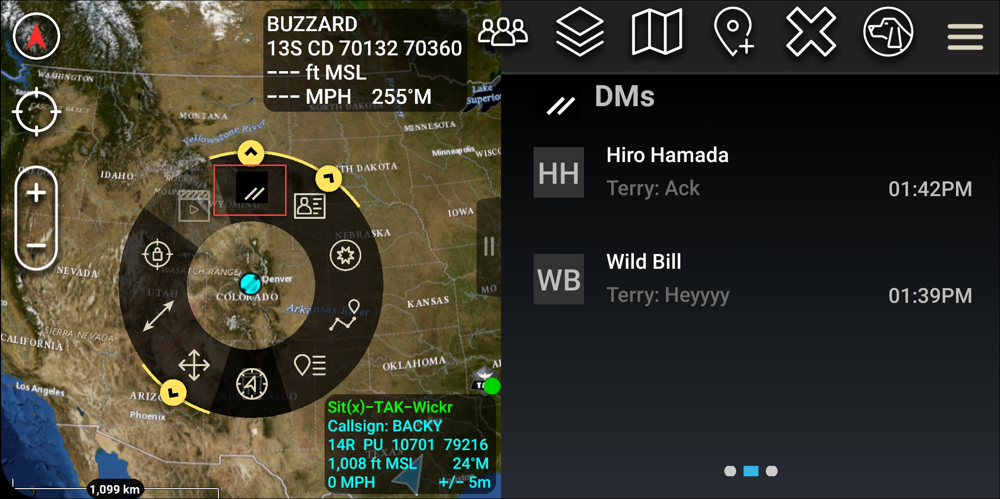
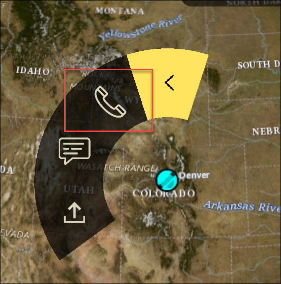
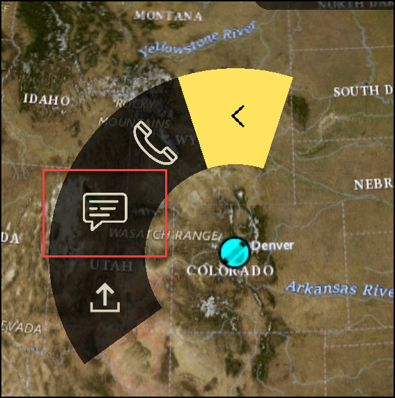
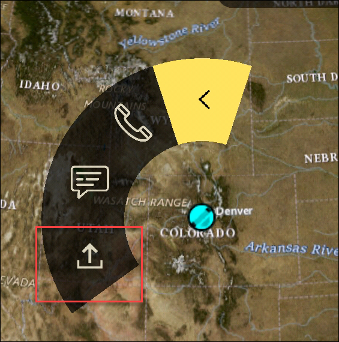

This guide documents the new AWS Wickr administration console, released on
March 13, 2025. For documentation on the classic version of the AWS Wickr administration console, see [Classic
Administration Guide](../adminguide-classic/what-is-wickr.md "../adminguide-classic/what-is-wickr.md").

# Pinwheel (Quick Access) for ATAK

The pinwheel or quick access feature is used for one-one-one conversations or direct
messages.

Complete the following procedure to use the pinwheel.

1. Open the split screen view of the ATAK map and the Wickr for ATAK plugin
   simultaneously. The map displays your teammates or assets on the map
   view.
2. Choose the user icon to open the pinwheel.
3. Choose the Wickr icon to view the available options for the selected
   user.

 4. On the pinwheel, choose one of the following icons:

    * **Phone**: Choose to call.

    
    * **Message**: Choose to chat.

    
    * **File send**: Choose to send a file.

    
