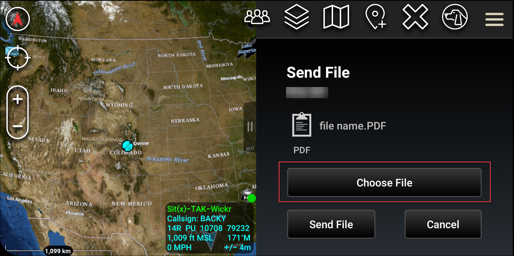

This guide documents the new AWS Wickr administration console, released on
March 13, 2025. For documentation on the classic version of the AWS Wickr administration console, see [Classic
Administration Guide](../adminguide-classic/what-is-wickr.md "../adminguide-classic/what-is-wickr.md").

# Send a file in ATAK

You can send a file in the Wickr plugin for ATAK.

Complete the following procedure to send a file.

1. Open a chat window.
2. In the **Map** view, search for the user that you want to
   send a file.
3. When you find the user that you want to send a file, select their name.
4. On the **Send File** screen, select **Choose
   File**, and then navigate to the file that you want to send.

 5. On the browser window, choose the desired file. 6. On the **Send File screen**, choose **Send
File**.

The download icon displays, indicating the file you selected is being
downloaded.
