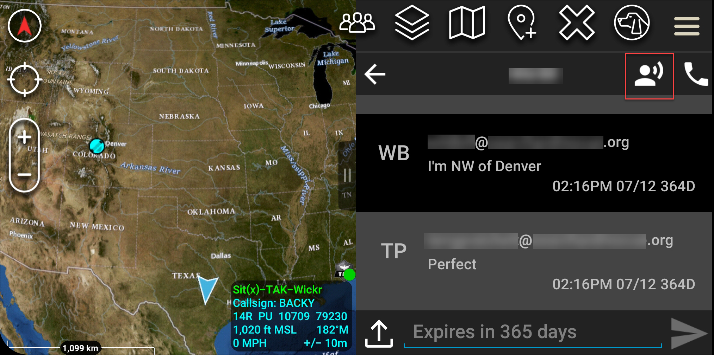
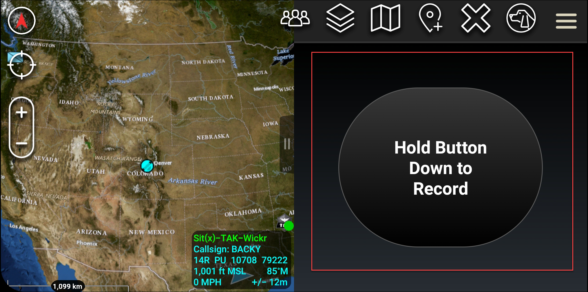

This guide documents the new AWS Wickr administration console, released on
March 13, 2025. For documentation on the classic version of the AWS Wickr administration console, see [Classic
Administration Guide](../adminguide-classic/what-is-wickr.md "../adminguide-classic/what-is-wickr.md").

# Send a secure voice message (Push-to-talk)

in ATAK

You can send a secure voice message (Push-to-talk) in the Wickr plugin for
ATAK.

Complete the following procedure to send a secure voice message.

1. Open a chat window.
2. Choose the Push-to-Talk icon at the top of the screen, indicated by an icon of
   a person talking.

 3. Select and hold the **Hold Button Down to Record**
button.

 4. Record your message. 5. After you record your message, release the button to send.
