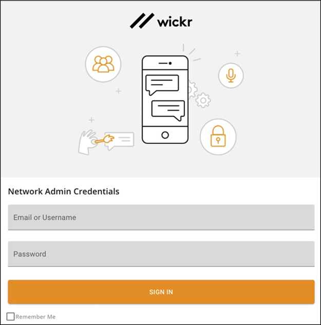

This guide provides documentation for Wickr Enterprise. If you're using AWS Wickr, see [AWS Wickr
Administration Guide](../adminguide/what-is-wickr.md "../adminguide/what-is-wickr.md").

# Getting started with Wickr Enterprise

In this guide, we show you how to get started with Wickr Enterprise by signing in as a Super Administrator.

###### Topics

- [Prerequisites](#prerequisites "#prerequisites")
- [Sign In](#sign-in "#sign-in")
  **Common Terms**

- **Super Administrator** - Creates and manages network
  administrators.
- **Network** - A group of users allowed to find and communicate with each
  other by default.
- **Network Administrator** - Creates new networks and provision users within
  a network.
- **Security Group** - Specific settings for users within a network.
- **Expiration** - The maximum amount of time a message will live across all
  devices.
- **Verification** - Additional security for users to verify their contact's
  identity.
- **Federation** - Allows communication between different networks
- **Global Federation** - Allows communication outside the local Enterprise
  deployment.
- **Direct Message** - A private conversation between two users. Each user
  manages their expiration and BOR settings.
- **Room** - A group of users (up to 500 users in a room) with settings
  managed by moderators.
- **Group** - A group of users who each manage their own message
  settings.
- **Wickr Open Access** - An additional method of network traffic.
- **User Presence** - Users can view other users’ app idle time.
- **Location** - Users can share their location via link or map.
- **Live Location** - Users can share their location over a set period of
  time. (Android and iOS only.)
- **Link Previews** - Shows a header and image of the link being shared as a
  preview.

## Prerequisites

Before you start, verify that the following requirement is met:

Ports to allowlist: 443/TCP for HTTPS and TCP Calling traffic; 16384-19999/UDP for UDP Calling traffic; TCP/8443

## Sign In

The first step in getting started with Wickr Enterprise is signing in as a Super
Administrator. The Super Administrator can provision, update, and delete network
administrators.

###### Important

Super Administrator and Network Administrator usernames are separate from normal users.
Administrators cannot login to the Wickr apps and normal users cannot login to the admin
panel.

**To sign in as a Super Administrator**

1. Enter your username and password, and then choose **Sign In** to log into
   the Super Administrator console.

###### Important

Only one active session per logged in administrator is allowed. If the same administrator
logs in again from a different browser, they will be logged out of the original
session. 2. Once logged into the Super Administration panel, you’ll be forced to change the default
password. You can also enable 2 Factor Authentication using your preferred authenticator. We
recommend Google Authenticator, but any OTP Auth software will work.

###### Important

You cannot reset the Super Administrator account if the authentication method for 2FA is lost.
