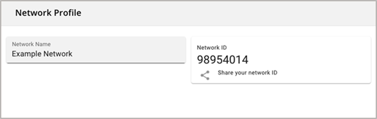

This guide provides documentation for Wickr Enterprise. If you're using AWS Wickr, see [AWS Wickr
Administration Guide](../adminguide/what-is-wickr.md "../adminguide/what-is-wickr.md").

# Network profile

An Administrator can set the name of the network, which is visible to all users within
it, and also view the Network ID.

The Network ID is needed when using Federation with other networks.

