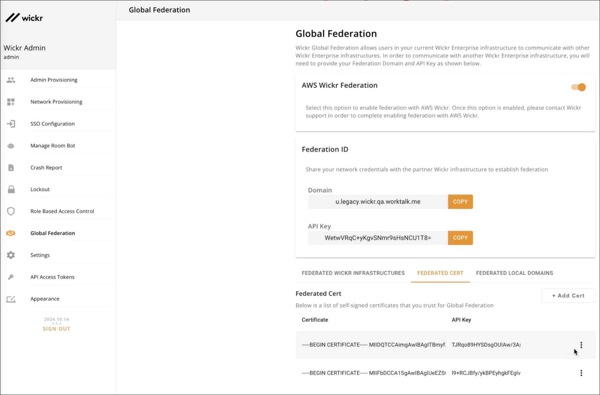

This guide provides documentation for Wickr Enterprise. If you're using AWS Wickr, see [AWS Wickr
Administration Guide](../adminguide/what-is-wickr.md "../adminguide/what-is-wickr.md").

# Wickr Federation with Untrusted/Self-Signed

Certificates

Super administrators can add self-signed/untrusted certificates in the Wickr admin
panel to allow federation between Wickr Enterprise environments.

Complete the following procedure to add self-signed/untrusted certificates.

1. Sign in to the Wickr Super Administrator Console.

 2. In the navigation pane, choose **Global Federation**. 3. In the **Federation ID** section, enter the **Domain**
and **API Key** for the infrastructure that needs to be federated. 4. Select the **Federated Cert** tab, and then choose **Add
Cert**. 5. In the **Federated Cert** section, select the API key. You will be able
to select from the API keys added in Step 3. 6. Enter the certificate description. Make sure the certificate fields are valid. 7. Choose **Save**. You can see the list of certificates in the
**Federated Cert** tab.

To add more certificates, repeat steps 3—7.
