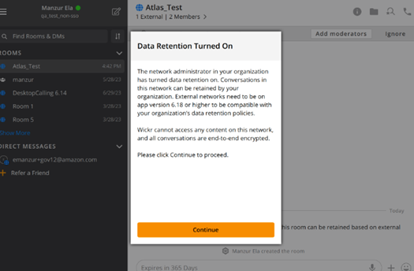
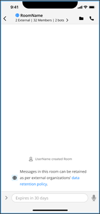

This guide provides documentation for AWS Wickr. For Wickr
Enterprise, which is the on-premises version of Wickr, see [Enterprise Administration Guide](../enterpriseadminguide/what-is-wickr.md "../enterpriseadminguide/what-is-wickr.md").

# AWS Wickr Data retention

AWS Wickr Data retention can retain all conversations in network. This includes direct
messages and conversations in Groups or Rooms between in-network (internal) members and those with
other teams (external) with whom your network is federated. Data retention is only available to
AWS Wickr Premium plan customers and enterprise customers who opt in for data retention. For
more information about the Premium plan, see [Wickr Pricing](https://aws.amazon.com/wickr/pricing/ "https://aws.amazon.com/wickr/pricing/").

When your network administrator activates data retention for your network, all messages and
files that you share in your network are retained in accordance with your organization's
compliance policies. You will see a **Data Retention Turned On**
window, informing you of this new setting.

You will also see a one-time control message in any Direct Message, Room or Group that has
members from another network (external members). The control message indicates that all messages
in the conversation can be retained as per external organizations' data retention policy. This
doesn't expose or indicate the status of any network’s data retention policy.

