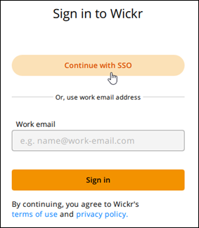
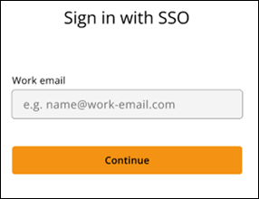
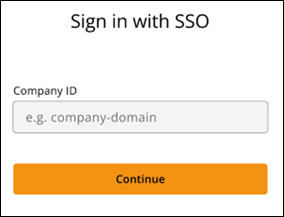
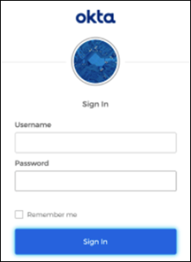
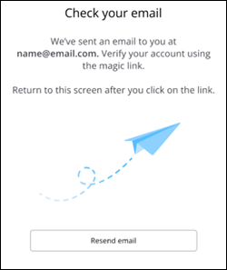
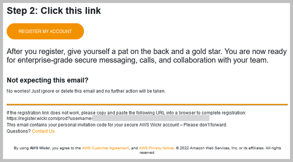
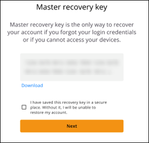

This guide provides documentation for AWS Wickr. For Wickr
Enterprise, which is the on-premises version of Wickr, see [Enterprise Administration Guide](../enterpriseadminguide/what-is-wickr.md "../enterpriseadminguide/what-is-wickr.md").

# Getting started with AWS Wickr

Get started with AWS Wickr by accepting an invitation email, or getting a Wickr company
ID from your company's Wickr administrator and downloading the client.

###### Topics

- [Prerequisites](#getting-started-prerequisites "#getting-started-prerequisites")
- [Step 1: Download and install the Wickr client](#accept-invitation-step1 "#accept-invitation-step1")
- [Step 2: Sign in to the Wickr client](#sign-in-step2 "#sign-in-step2")
- [Step 3: (Optional) Configure additional
  devices](#configure-second-device-step3 "#configure-second-device-step3")
- [Next steps](#getting-started-next-steps "#getting-started-next-steps")

## Prerequisites

After you receive a Wickr invitation email or request from your company's Wickr
administrator, download the Wickr client. If you haven't received one, contact your company's
IT department for help.

###### Note

You can also sign up for Wickr as a guest user. The Wickr guest user feature allows
individual guest users to sign in to the Wickr client and collaborate with Wickr network
users. For more information, see [AWS Wickr Guest users](guest-users.md "guest-users.md").

## Step 1: Download and install the Wickr client

Download and install the client from the invitation email that you received. You can also
download the Wickr client by going to the [AWS Wickr download page](https://aws.amazon.com/wickr/download/ "https://aws.amazon.com/wickr/download/"). The Wickr client is available for iOS, Android, macOS,
Windows, and Linux.

###### Note

Download and install the WickrGov client if your organization's administrator created
your Wickr network in AWS GovCloud (US-West). For all other AWS Regions, download and install the
standard Wickr client. Check with your Wickr administrator if you're not sure which version
of the client to download.

## Step 2: Sign in to the Wickr client

Complete one of the following procedures to sign in to the Wickr client. You can sign in
using single sign-on (SSO) or without SSO if your company doesn't use it. Contact your company's
Wickr administrator or IT support if you're unsure whether your company uses SSO or not.

Sign in with SSO

1. Open the Wickr client.

###### Important

To use the Wickr client on your mobile device and your desktop, you must sign in on
your mobile device first. Later, if you set up your desktop as the second device, you can
scan a verification code that
streamlines
the initial sign in and configuration process. 2. Choose **Continue with
SSO**.

 3. Enter your work email address and choose **Continue**.

 4. Enter your company's ID and choose **Continue**.

Contact your company's Wickr administrator or IT support if you don't know your
company's ID.

 5. At your company's SSO service provider sign in screen, enter your sign-in credentials
and choose **Sign in**. Okta is shown as the service provider in the
following example.

Wickr will send you a verification email after you sign in. You can continue to the
next step in this procedure. However, be aware that the verification email can take up to 30
minutes to reach your inbox. Don't choose **Resend email** until at least
30 minutes have passed. Keep the Wickr client open while waiting for the verification
email. If you close the client, you must reauthenticate and wait for another verification
email.

 6. In the Wickr verification email, choose **Register my account** and
return to the Wickr client that should be running in the background.

 7. The Wickr client will refresh to display your
Master
Recovery Key (MRK). You can use the MRK to sign in to Wickr on a
different device than the one you're currently using. Save your MRK in a safe location and
choose **Continue**.

###### Note

The master recovery key is blurred in the following example.

You should now be signed in to the Wickr client.

Sign in without SSO
You should've received a Wickr invitation email from your company's Wickr
administrator. Choose the register your account option in the Wickr email. If you didn't
receive an invitation email or experience any issues with these steps, contact your company's
IT department for help.

###### Sign in to the Wickr client

1. Open the Wickr client.
2. Enter your work email address and choose **Continue**.

Wickr will send you a verification email. You can continue to the next step in this
procedure. However, be aware that the verification email can take up to 30 minutes to reach
your inbox. Don't choose **Resend email** until at least 30 minutes have
passed. Keep the Wickr client open while waiting for the verification email. If you close
the client, you must reauthenticate and wait for another verification email. 3. In the Wickr verification email, choose **Register my account** and
return to the Wickr client that should be running in the background.

Alternatively, you can copy the verification code from the footer of the Wickr
invitation email that you received, and paste it into the **Enter invite
Code** screen in the Wickr client. 4. The Wickr client will refresh to display the password creation page. Enter your
chosen password, enter it a second time to confirm, and choose
**Continue**.

You should now be signed in to the Wickr client.

## Step 3: (Optional) Configure additional

devices

You can download and install the Wickr client on additional devices after configuring it
on your initial device. The client will display a code when you install it on another device. If
you signed in using SSO and your initial installation of the client was on a mobile device, you
can scan the code with that device to sign in automatically. If your initial installation was on
a desktop computer, then you must sign in using the process outlined in the [Step 2: Sign in to the Wickr client](#sign-in-step2 "#sign-in-step2") section of this topic.

## Next steps

You've completed the getting started steps. To begin using the Wickr client, see the
following sections of this guide:

- [AWS Wickr Messages](messages.md "messages.md")
- [AWS Wickr Rooms and group messages](rooms.md "rooms.md")
- [AWS Wickr Settings](settings.md "settings.md")
