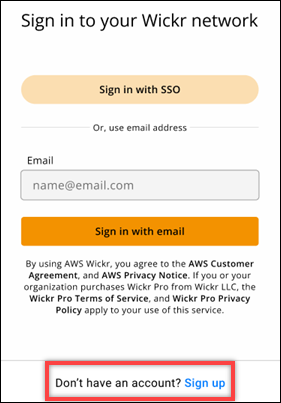
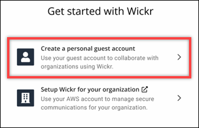
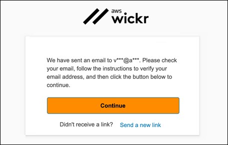
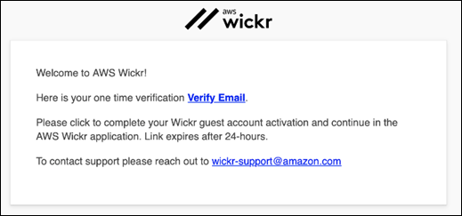
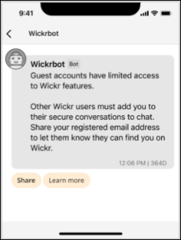

This guide provides documentation for AWS Wickr. For Wickr
Enterprise, which is the on-premises version of Wickr, see [Enterprise Administration Guide](../enterpriseadminguide/what-is-wickr.md "../enterpriseadminguide/what-is-wickr.md").

# Sign up for a guest account in the Wickr client

You can sign up for a guest user account on AWS Wickr.

Complete the following procedure to sign up for Wickr as a guest user.

1. Download and install the Wickr client. For more information, see [Download and install the Wickr
   client](getting-started.md#accept-invitation-step1 "getting-started.md#accept-invitation-step1").
2. Open the Wickr client.
3. At the bottom of the sign in screen, choose **Don't have an account?
   Sign Up**.

 4. On the **Get started with Wickr** page, choose
**Create a personal guest account**.

 5. On the **Sign up with a new account** page, enter your first
name, last name, email address, and password. 6. Choose **Sign up**.

Wickr will send you a verification email after you sign in. You can continue
to the next step in this procedure. However, be aware that the verification
email can take up to 30 minutes to reach your inbox. Don't choose **Send
a new link** until at least 30 minutes have passed. Keep the
Wickr client open while waiting for the verification email.

 7. In the Wickr verification email, choose **Verify
Email**.

 8. Choose **Continue** and sign in to the Wickr client. 9. The Wickr client will display your Master Recovery Key (MRK). You can use
the MRK to sign in to Wickr on a different device than the one you're
currently using. Save your MRK in a safe location and choose
**Next**.

###### Note

The master recovery key is blurred in the following example.

You should now be signed in to the Wickr client. You will receive a message
from the Wickrbot showing your guest account limitations.

At this point, Wickr network users can add you to their conversations.
However, guest user access must be enabled for their Wickr network. If you
have difficulties communicating with other Wickr users in a Wickr network,
those users should contact their Wickr administrator to troubleshoot the
problem.

###### Note

If you are a guest user, you can become a Wickr network user by creating a
network. For more information, see [Getting started with
AWS Wickr](../adminguide/getting-started.md "../adminguide/getting-started.md") in the _AWS Wickr Administration
Guide_.
