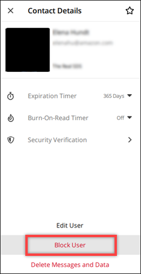
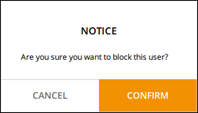

This guide provides documentation for AWS Wickr. For Wickr
Enterprise, which is the on-premises version of Wickr, see [Enterprise Administration Guide](../enterpriseadminguide/what-is-wickr.md "../enterpriseadminguide/what-is-wickr.md").

# Block a user in the Wickr client

You can block a user in the Wickr client. Blocked users can't message or call
you.

To block a Wickr user, complete the following steps.

1. Sign in to the Wickr client. For more information, see [Sign in to the Wickr client](getting-started.md#sign-in-step2 "getting-started.md#sign-in-step2").
2. In the navigation pane, find and select the name of the user who you want to
   block.
3. Select the information icon (
   
   ) in the message window to view contact details.
4. In the **Contact Details** pane that appears, choose
   **Block User** to block the user.

 5. Select **Confirm** in the pop-up window.

