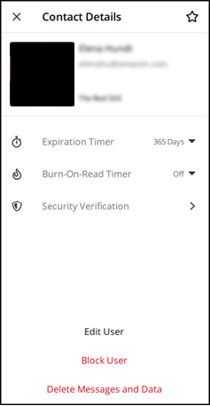

This guide provides documentation for AWS Wickr. For Wickr
Enterprise, which is the on-premises version of Wickr, see [Enterprise Administration Guide](../enterpriseadminguide/what-is-wickr.md "../enterpriseadminguide/what-is-wickr.md").

# View message contact details in the Wickr

client

You can view message contact details and message settings in the Wickr
client.

To view contact details and message settings, complete the following steps.

1. Sign in to the Wickr client. For more information, see [Sign in to the Wickr client](getting-started.md#sign-in-step2 "getting-started.md#sign-in-step2").
2. In the navigation pane, find and select the name of the user whose details you
   want to view.
3. Choose the information icon (
   
   ) in the message window to view contact details.

The **Contact Details** pane displays the user's full name,
email address, and company name. It also displays message settings, such as
expiration timer, burn-on-read timer, security verifications, user block, and
message and data deletion options.

