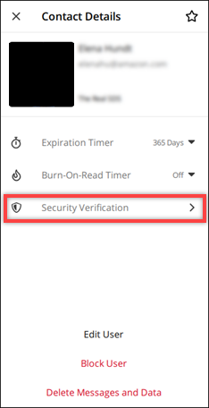
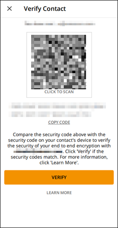

This guide provides documentation for AWS Wickr. For Wickr
Enterprise, which is the on-premises version of Wickr, see [Enterprise Administration Guide](../enterpriseadminguide/what-is-wickr.md "../enterpriseadminguide/what-is-wickr.md").

# View and verify message security in the Wickr

client

You can verify the security of end-to-end message encryption with another Wickr
user.

To view and verify message security, complete the following steps.

1. Sign in to the Wickr client. For more information, see [Sign in to the Wickr client](getting-started.md#sign-in-step2 "getting-started.md#sign-in-step2").
2. In the navigation pane, find and select the name of the user who you want to
   verify message security for.
3. Select the information icon (
   
   ) in the message window to view contact details.
4. In the **Contact Details** pane that appears, choose
   **Security Verification**.

The **Verify Contact** pane that appears displays a QR code
and a verification code string. You can share either of these with your contact
to determine if they match.

 5. If the other Wickr user confirms that the QR or verification codes match,
select **Verify** to confirm the end-to-end encryption security
of your messages.
