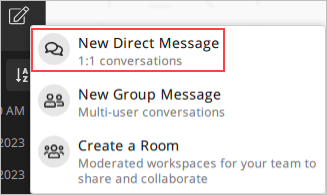
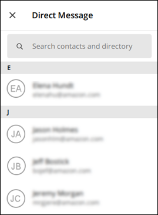
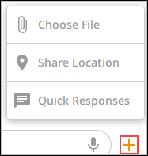

This guide provides documentation for AWS Wickr. For Wickr
Enterprise, which is the on-premises version of Wickr, see [Enterprise Administration Guide](../enterpriseadminguide/what-is-wickr.md "../enterpriseadminguide/what-is-wickr.md").

# Write a direct message in the Wickr client

Direct messages are one-on-one conversations between Wickr users. You can send a
direct message to another Wickr user in the Wickr client.

To send a direct message to another Wickr user, complete the following steps.

1. Sign in to the Wickr client. For more information, see [Sign in to the Wickr client](getting-started.md#sign-in-step2 "getting-started.md#sign-in-step2").
2. In the navigation pane, choose the new message
   icon (
   
   ), and then choose **New Direct
   Message**.

 3. In the **Direct Message** dialog box, search contacts and
directory for the user that you want to
message.

 4. When you find the contact that you want to message, choose their name to open
a new message window. 5. Type your message into the text box and select **Enter** to
send it.

You can also choose the plus icon (

) to send a file, share your location, or view quick
responses.

