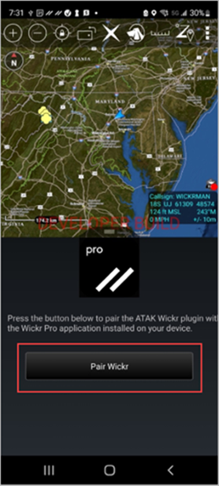
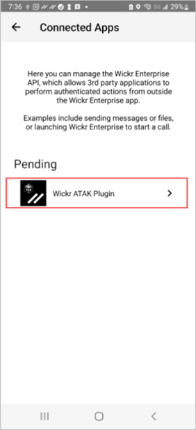
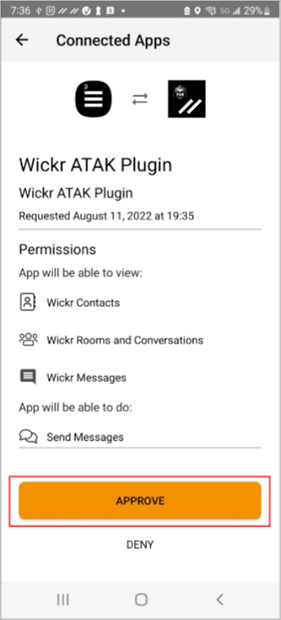
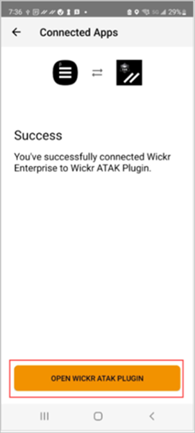

This guide provides documentation for AWS Wickr. For Wickr
Enterprise, which is the on-premises version of Wickr, see [Enterprise Administration Guide](../enterpriseadminguide/what-is-wickr.md "../enterpriseadminguide/what-is-wickr.md").

# Pair ATAK with Wickr

You can pair the ATAK application with Wickr after you
successfully installed the Wickr plugin for ATAK.

Complete the following procedure to pair the ATAK application with Wickr after you
successfully installed the Wickr plugin for ATAK.

1. In the ATAK application, choose the menu icon
   
   at the top-right of the screen, and choose **Wickr Plugin**.
2. Choose **Pair Wickr**.

A notification prompt will appear asking you to review permissions for the
Wickr plugin for ATAK. If the notification prompt doesn't appear, open the
Wickr client and go to **Settings**, then **Connected
Apps**. You should see the plugin under the
**Pending** section of the screen as shown in the following
example.

 3. Choose **Approve** to pair.

 4. Choose **Open Wickr ATAK Plugin** button to go back to the
ATAK application.

You have now successfully paired the ATAK plugin and Wickr, and can use the
plugin to send messages and collaborate using Wickr without exiting the ATAK
application.
