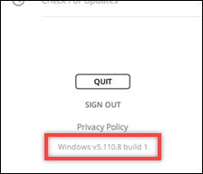

This guide provides documentation for AWS Wickr. For Wickr
Enterprise, which is the on-premises version of Wickr, see [Enterprise Administration Guide](../enterpriseadminguide/what-is-wickr.md "../enterpriseadminguide/what-is-wickr.md").

# View current version in the Wickr client

You can view the current version of the Wickr client that you are using.

Complete the following steps to view your current version of the Wickr
client.

1. Sign in to the Wickr client. For more information, see [Sign in to the Wickr client](getting-started.md#sign-in-step2 "getting-started.md#sign-in-step2").
2. In the navigation pane, choose
   
   .

The bottom of the navigation pane, as shown in the following example, displays
the current version of the Wickr client you have installed.

