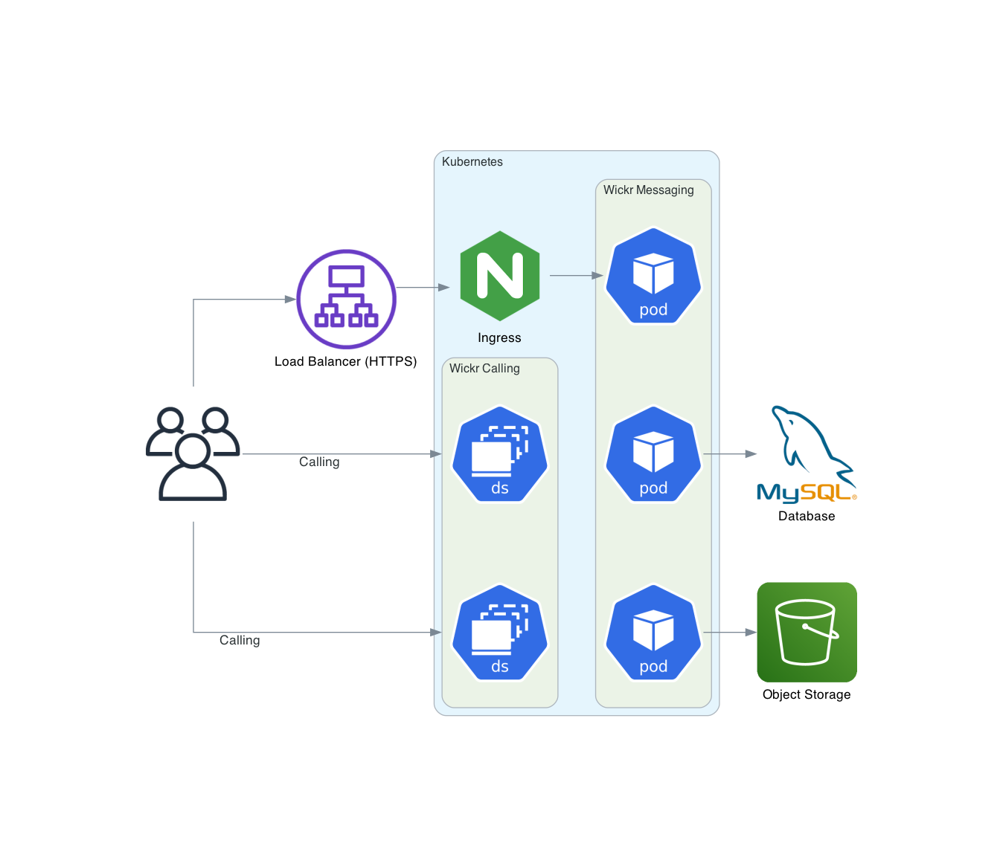
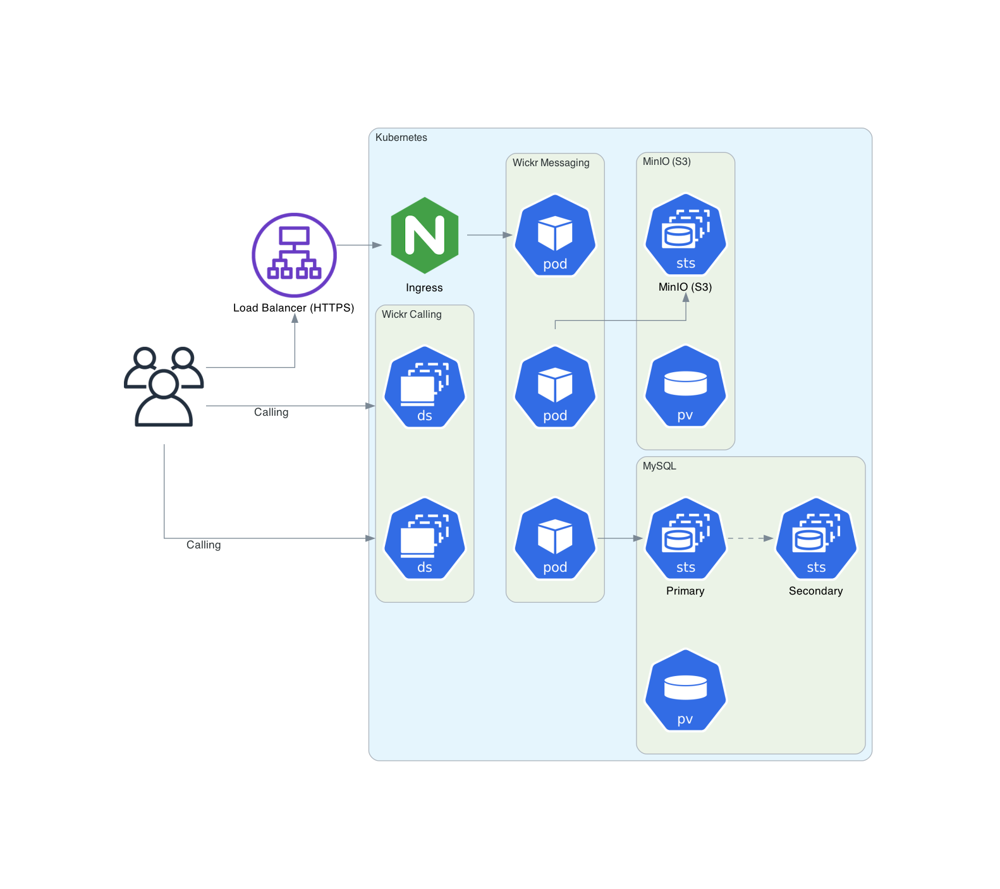

This guide provides documentation for Wickr Enterprise. If you're using
AWS Wickr, see [AWS Wickr
Administration Guide](../adminguide/what-is-wickr.md "../adminguide/what-is-wickr.md") or [AWS Wickr
User Guide](../userguide/what-is-wickr.md "../userguide/what-is-wickr.md").

# Architecture

**Recommended Production Architecture**

The diagram below shows Wickr Enterprise configured as recommended for production, with
both MySQL and Object Storage services situated outside of the Kubernetes cluster.

**Internal or Test Architecture**

The diagram below displays the configuration of Wickr Enterprise, utilizing the internal
MYSQL and Object Storage services. Although it may satisfy the specific needs of certain
deployments, it is not recommended for general production use.

