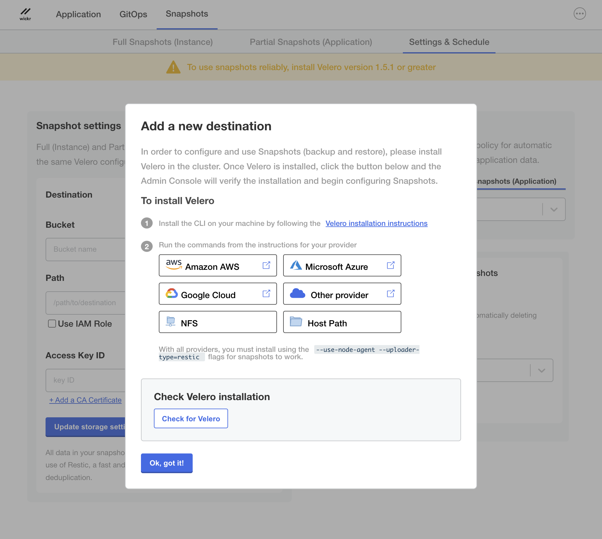

This guide provides documentation for Wickr Enterprise. If you're using
AWS Wickr, see [AWS Wickr
Administration Guide](../adminguide/what-is-wickr.md "../adminguide/what-is-wickr.md") or [AWS Wickr
User Guide](../userguide/what-is-wickr.md "../userguide/what-is-wickr.md").

# Backups

Wickr Enterprise utilizes Velero for Backup purposes. Velero provides the necessary tools
for backing up and restoring Kubernetes cluster resources and persistent volumes, whether
operating on a cloud provider or on-premises.

**Velero backups with Minio**: Currently Velero backups are only enabled
for Minio in Low Resource Mode.

## Installation using Velero documentation

- Install the Velero CLI. For more information, see [Installing the
  Velero CLI](https://docs.replicated.com/enterprise/snapshots-velero-cli-installing "https://docs.replicated.com/enterprise/snapshots-velero-cli-installing").
- Install Velero on your cluster and configure storage based on your provider:
  - [AWS](https://velero.io/docs/v1.0.0/aws-config/ "https://velero.io/docs/v1.0.0/aws-config/").
  - [GCP](https://velero.io/docs/v1.0.0/gcp-config/ "https://velero.io/docs/v1.0.0/gcp-config/").
  - [Azure](https://velero.io/docs/v1.0.0/azure-config/ "https://velero.io/docs/v1.0.0/azure-config/").
  - [Other
    providers](https://velero.io/docs/v1.10/supported-providers/ "https://velero.io/docs/v1.10/supported-providers/").
