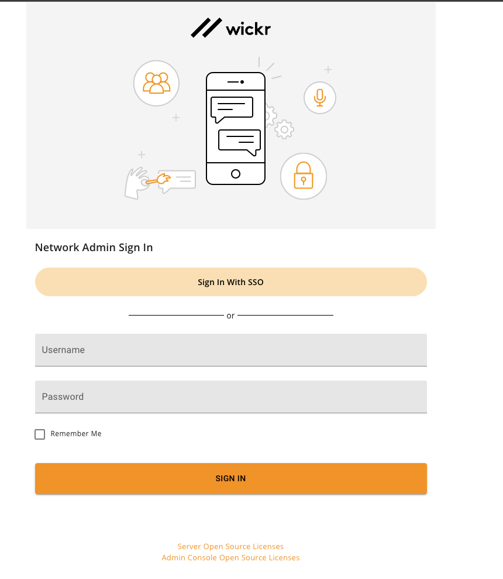

This guide provides documentation for Wickr Enterprise. If you're using
AWS Wickr, see [AWS Wickr
Administration Guide](../adminguide/what-is-wickr.md "../adminguide/what-is-wickr.md") or [AWS Wickr
User Guide](../userguide/what-is-wickr.md "../userguide/what-is-wickr.md").

# Custom installation

In the **Custom installation** section, you will learn how to install
Wickr Enterprise.

###### Topics

- [Requirements](requirements.md "requirements.md")
- [Architecture](architecture.md "architecture.md")
- [Installation](installation.md "installation.md")
- [Ingress settings](ingress-settings.md "ingress-settings.md")
- [Database settings](database-settings.md "database-settings.md")
- [S3 File storage](s3-file-storage.md "s3-file-storage.md")
- [Persistent volume claim settings](persistent-volume-claim-settings.md "persistent-volume-claim-settings.md")
- [TLS certificate settings](tls-certificate-settings.md "tls-certificate-settings.md")
- [Calling settings](calling-settings.md "calling-settings.md")
- [Calling ingress settings](calling-ingress-settings.md "calling-ingress-settings.md")
- [Kubernetes cluster autoscaler (optional)](kubernetes-cluster-autoscaler.md "kubernetes-cluster-autoscaler.md")
- [Backups](backups.md "backups.md")
- [Airgap installation](airgap-installation.md "airgap-installation.md")
- [Wickr admin console](#wickr-admin-console "#wickr-admin-console")
- [Security settings](security-settings.md "security-settings.md")
- [FAQ](faq.md "faq.md")

## Wickr admin console

The Wickr Admin Console interface is used for administering the Wickr Enterprise
application itself. It can be used to set up networks, users, federation, and more. It's
accessible over HTTPS at the DNS name that you configured to point to your Load Balancer. The
default username is admin, with the password Password123. You will be required to change this
password on first log in.

