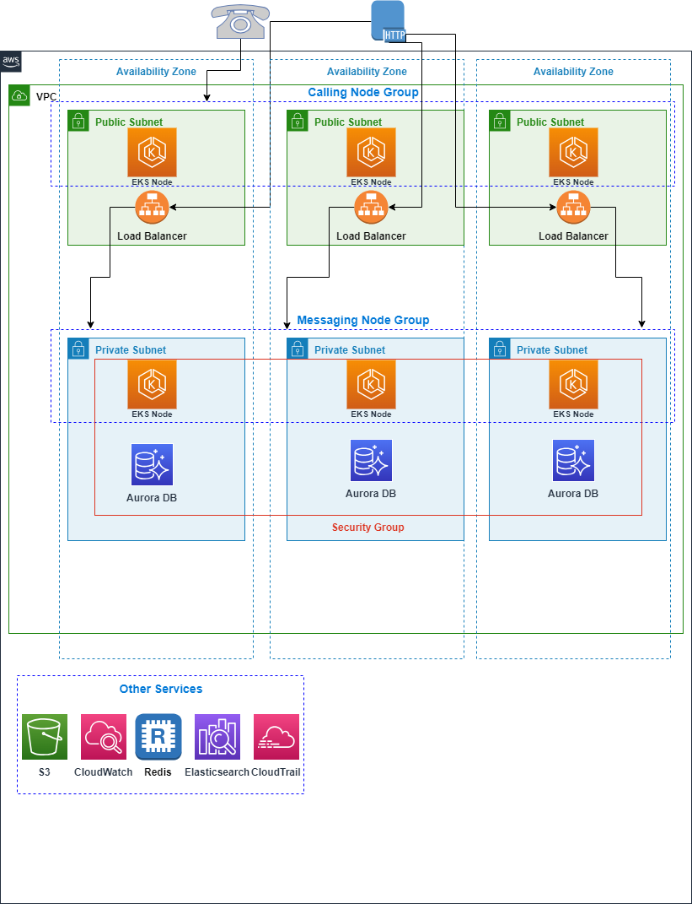

This guide provides documentation for Wickr Enterprise. If you're using
AWS Wickr, see [AWS Wickr
Administration Guide](../adminguide/what-is-wickr.md "../adminguide/what-is-wickr.md") or [AWS Wickr
User Guide](../userguide/what-is-wickr.md "../userguide/what-is-wickr.md").

# Getting started with Wickr Enterprise

###### Topics

- [Requirements](#getting-started-requirements "#getting-started-requirements")
- [Install dependencies](#getting-started-install-dependencies "#getting-started-install-dependencies")
- [Configure](#getting-started-configure "#getting-started-configure")
- [Bootstrap](#getting-started-bootstrap "#getting-started-bootstrap")
- [Deploy](#getting-started-deploy "#getting-started-deploy")
- [Generate KOTS Config](#getting-started-generate-kots-config "#getting-started-generate-kots-config")

## Requirements

Before you start, verify that the following requirements are met:

- Download Node.js 16+
- AWS CLI configured with credentials for your account.

These will be sourced either from your config file at `~/.aws/config` or using
the `AWS_` environment variables.

- Install kubectl. For more information, see [Installing or updating kubectl](../../../eks/latest/userguide/install-kubectl.md "../../../eks/latest/userguide/install-kubectl.md") in
  the _Amazon EKSUser Guide_.
- Install kots CLI. For more information, see [Installing the kots
  CLI](https://docs.replicated.com/reference/kots-cli-getting-started "https://docs.replicated.com/reference/kots-cli-getting-started").
- Ports to allowlist: 443/TCP for HTTPS and TCP Calling traffic; 16384-19999/UDP for UDP
  Calling traffic; TCP/8443

**Architecture**



## Install dependencies

You can add all dependencies to the default package with the following command:

```
 npm install
```

## Configure

AWS Cloud Development Kit (AWS CDK) uses context values to control the configuration of the application. Wickr
Enterprise uses CDK context values to provide control over settings such as the domain
name of your Wickr Enterprise installation or the number of days to retain RDS backups. For
more information, see [Runtime
context](../../../cdk/v2/guide/context.md "../../../cdk/v2/guide/context.md") in the _AWS Cloud Development Kit (AWS CDK) Developer Guide_.

There are multiple ways to set context values, but we recommend editing the values in
`cdk.context.json` to fit your particular use case. Only context values that begin
with `wickr/` are related to the Wickr Enterprise deployment; the rest are
CDK-specific context values. To keep the same settings the next time you make an update
through the CDK, save this file.

At a minimum, you must set `wickr/licensePath`, `wickr/domainName`,
and either `wickr/acm:certificateArn` or `wickr/route53:hostedZoneId` and
`wickr/route53:hostedZoneName`.

**With a public hosted zone**

If you have a Route 53 public hosted zone in your AWS account, we recommend using the
following settings to configure your CDK context:

- `wickr/domainName` - The domain name to use for this Wickr Enterprise
  deployment. If you use a Route 53 public hosted zone, DNS records and ACM certificates for this
  domain name will be automatically created.
- `wickr/route53:hostedZoneName` - Route 53 hosted zone name in which to create
  DNS records.
- `wickr/route53:hostedZoneId` - Route 53 hosted zone ID in which to create DNS
  records.

This method creates an ACM certificate on your behalf, along with the DNS records pointing
your domain name to the load balancer in front of your Wickr Enterprise deployment.

**Without a public hosted zone**

If you don't have a Route 53 public hosted zone in your account, an ACM certificate must be
created manually and imported into the CDK using the `wickr/acm:certificateArn`
context value.

- `wickr/domainName` - The domain name to use for this Wickr Enterprise
  deployment. If you use a Route 53 public hosted zone, DNS records and ACM certificates for this
  domain name will be automatically created.
- `wickr/acm:certificateArn` - The ARN of an ACM certificate to use on the load
  balancer. This value must be supplied if a Route 53 public hosted zone isn't available in your
  account.

**Importing a certificate to ACM**

You can import an externally obtained certificate with the following command:

```
aws acm import-certificate \
   --certificate fileb://path/to/cert.pem \
   --private-key fileb://path/to/key.pem \
   --certificate-chain fileb://path/to/chain.pem
```

The output will be the Certificate ARN, which should be used for the value of the
`wickr/acm:certificateArn` context setting. It's important that the uploaded
certificate is valid for the `wickr/domainName`, or HTTPS connections will be unable
to validate. For more information, see [Importing a certificate](../../../acm/latest/userguide/import-certificate-api-cli.md "../../../acm/latest/userguide/import-certificate-api-cli.md") in
the _AWS Certificate Manager User Guide_.

**Create DNS records**

Because there is no public hosted zone available, DNS records must be created manually after
the deployment is finished to point to the load balancer in front of your Wickr Enterprise
deployment.

**Deploying into an existing VPC**

If you require the use of an existing VPC you can use one. However, the VPC must be
configured to meet the specifications necessary for EKS. For more information, see [View Amazon EKS networking requirements for VPC and subnets](../../../eks/latest/userguide/network-reqs.md "../../../eks/latest/userguide/network-reqs.md") in
the _Amazon EKS User Guide_, and ensure that the VPC to be used meets these requirements.

Additionally, it is highly recommended to ensure you have VPC endpoints for the following services:

- CLOUDWATCH
- CLOUDWATCH_LOGS
- EC2
- EC2_MESSAGES
- ECR
- ECR_DOCKER
- ELASTIC_LOAD_BALANCING
- KMS
- SECRETS_MANAGER
- SSM
- SSM_MESSAGES

To deploy resources into an existing VPC, set the following context values:

- `wickr/vpc:id` - The VPC ID to deploy resources into (e.g.
  `vpc-412beef`).
- `wickr/vpc:cidr` - The IPv4 CIDR of the VPC (e.g.
  `172.16.0.0/16`).
- `wickr/vpc:publicSubnetIds` - A comma-separated list of public subnets in the
  VPC. The Application Load Balancer and calling EKS worker nodes will be deployed in these
  subnets (e.g. `subnet-6ce9941,subnet-1785141,subnet-2e7dc10`).
- `wickr/vpc:privateSubnetIds` - A comma-separated list of private subnets in the
  VPC. The EKS worker nodes and bastion server will be deployed in these subnets (e.g.
  `subnet-f448ea8,subnet-3eb0da4,subnet-ad800b5`).
- `wickr/vpc:isolatedSubnetIds` - A comma-separated list of isolated subnets in
  the VPC. The RDS database will be deployed in these subnets (e.g.
  `subnet-d1273a2,subnet-33504ae,subnet-0bc83ac`).
- `wickr/vpc:availabilityZones` - A comma-separated list of availability zones
  for the subnets in the VPC (e.g. `us-east-1a,us-east-1b,us-east-1c`).

For more information on interface VPC endpoints, see [Access an AWS service using an interface VPC endpoint](../../../vpc/latest/privatelink/create-interface-endpoint.md "../../../vpc/latest/privatelink/create-interface-endpoint.md").

**Other settings**

For more information, see [Context values](context-values.md "context-values.md").

## Bootstrap

If this is your first time using CDK on this particular AWS account and Region, you
must first _bootstrap_ the account to begin using
CDK.

```
npx cdk bootstrap
```

## Deploy

This process will take around 45 minutes.

```
npx cdk deploy --all --require-approval=never
```

After it's complete, the infrastructure has been created and you can begin installing
Wickr Enterprise.

**Create DNS records**

This step isn't required if you used a public hosted zone when configuring the
CDK.

The output from the deployment process will include a value
`WickrAlb.AlbDnsName`, which is the DNS name of the load balancer. The output will
look like:

```
WickrAlb.AlbDnsName = Wickr-Alb-1Q5IBPJR4ZVZR-409483305.us-west-2.elb.amazonaws.com
```

In this case, the DNS name is
`Wickr-Alb-1Q5IBPJR4ZVZR-409483305.us-west-2.elb.amazonaws.com`. That is the value
that should be used when creating a CNAME or A/AAAA (ALIAS) record for your domain name.

If you don't have the output from the deployment, run the following command to display the
load balancer DNS name:

```
aws cloudformation describe-stacks --stack-name WickrAlb \
   --query 'Stacks[0]`.Outputs`[?OutputKey==`AlbDnsName`]`.OutputValue`' \
   --output text
```

## Generate KOTS Config

###### Warning

This file contains sensitive information about your installation. Do not share or save it
publicly.

The Wickr Enterprise installer requires a number of configuration values about the
infrastructure in order to install successfully. You can use a helper script to generate the
configurations values.

```
./bin/generate-kots-config.ts > wickr-config.json
```

If you imported an external certificate into ACM in the first step, pass the
`--ca-file` flag to this script, for example:

```
./bin/generate-kots-config.ts --ca-file path/to/chain.pem > wickr-config.json
```

If you receive an error saying the stack does not exist, set the `AWS_REGION`
environment variable (`export AWS_REGION=us-west-2`) to your selected Region and try
again. Or, if you set the context value `wickr/stackSuffix`, pass the suffix with the
`--stack-suffix` flag.
