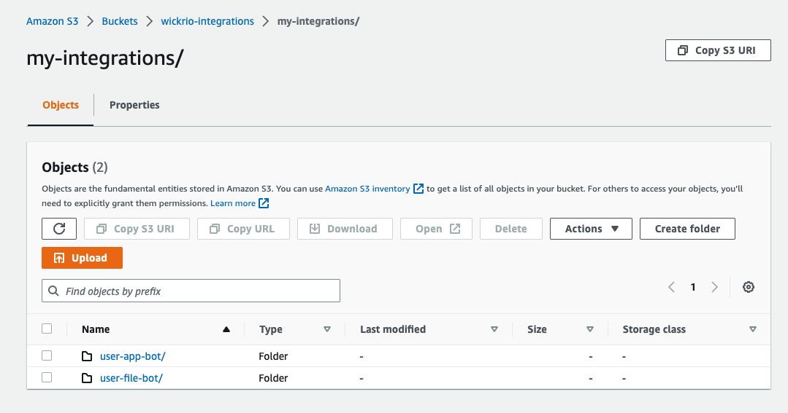

This guide provides documentation for Wickr IO Integrations. If you're
using AWS Wickr, see [AWS Wickr
Administration Guide](../adminguide/what-is-wickr.md "../adminguide/what-is-wickr.md").

# Automatic Configuration

As of the 5.116 release you can use AWS services to define the bot credentials, token values and other configuration information. You can use Wickr published docker images (i.e. bot-enterprise and bot-cloud) to start the bots. If you do use this method to automatically configure your bots you will not need to use the CLI to add the bots to your running docker image. All the credentials for the bots configured using this method will be secure in the AWS secrets manager service.

To use this method to configure your bots you will need to use the AWS_SECRET_NAME environment variable to identify the AWS secret that contains the configuration information.

## Secrets Manager Value

The AWS_SECRET_NAME environment variable will identify an ARN that is used to access the specific secret which contains the configuration information needed to start the bots. The following is an example:

```
AWS_SECRET_NAME='arn:aws:secretsmanager:us-east-1:999999999999:secret:wickenterprise/beta/my-test-bot-zZzZzz'
```

This secret contains the "wickr_config" key with the value being the configuration information needed to configure and start the bots on the docker image. The configuration information is stored in the secret as an escaped JSON string, for example the following is the plaintext secret value:

```
{"wickr_config":"{  \"clients\":[  {  \"integration\":\"wickrio-file-bot\",  \"name\":\"user-file-bot\",  \"password\":\"password\",  \"configS3File\": {    \"key\" : \"configs_9-3-21/conf.wickr\",    \"bucket\" : \"bots-for-enterprise\",    \"region\" : \"us-west-2\"  },  \"configPassword\":\"password\",  \"tokens\":[  {  \"name\":\"CLIENT_NAME\",  \"value\":\"user-file-bot\"  },  {  \"name\":\"WICKRIO_BOT_NAME\",  \"value\":\"user-file-bot\"  },  {  \"name\":\"DATABASE_ENCRYPTION_CHOICE\",  \"value\":\"no\"  }  ]  }  ] }"}
```

The following is the un-escaped value for the "wickr_config" key, in the specified secret.

```
{
  "clients":[
    {
      "name":"user-file-bot",
      "password":"password",
      "integration":"wickrio-file-bot",
      "configS3File":{
        "key":"configs_9-3-21/conf.wickr",
        "bucket":"bots-for-enterprise",
        "region":"us-west-2"
      },
      "configPassword":"password",
      "tokens":[
        {
          "name":"CLIENT_NAME",
          "value":"user-file-bot"
        },
        {
          "name":"WICKRIO_BOT_NAME",
          "value":"user-file-bot"
        },
        {
          "name":"DATABASE_ENCRYPTION_CHOICE",
          "value":"no"
        }
      ]
    }
  ]
}
```

This is an example of an enterprise version, it contains the "configS3File and "configPassword" key/values which are needed to identify the conf.wickr file. The "key" value for the "configS3File" identifies the folder and filename for the config.wickr file. The "configPassword" identifies the password necessary to descrypt the config.wickr file. These values are not needed for bots running on the bot-cloud Docker images.

## Using Custom Integrations

You can also use AWS S3 to load your own custom integrations. You will store them in an AWS S3 bucket, which can then be used by a Wickr IO docker image. The following environment variables will identify the S3 bucket and folder where these custom integrations will be located.

```
AWS_S3_INTEGRATIONS_REGION='us-east-1'
AWS_S3_INTEGRATIONS_FOLDER='test'
AWS_S3_INTEGRATIONS_BUCKET='wickrio-integrations'
```

The contents of the AWS S3 bucket/folder will contain one or more folders, one folder for each integration you want to be used by the Wickr IO bot. The name of the folder is used as the name of the integration that you will use to work with your bots. For example, see the image below, there are two folders in the bucket/folder. They are "user-app-bot" and "user-file-bot", which are the names of those two integrations. If the "integration" value in the "client" entry (see above) has the value "user-app-bot" or "user-file-bot" it will use the integration code from that folder.



The contents of each of the integration folders will be the software.tar.gz file that contains all of the integration files (see the section on developing your own custom bots).
