This guide provides documentation for Wickr IO Integrations. If you're
using AWS Wickr, see [AWS Wickr
Administration Guide](../adminguide/what-is-wickr.md "../adminguide/what-is-wickr.md").

# BroadcastBot Integration

The Wickr IO BroadcastBot allows you to broadcast messages to all of the members of your
network or specific security groups. The messages will be sent to each individual within the
network or security group using Wickr 1on1 conversations. You can broadcast either messages,
files or voice memos. Users that receive a broadcast from the BroadcastBot can also acknowledge
receiving messages (using the /ack command).

The BroadcastBot will maintain the status for each message sent on a per user basis. You can
retrieve a detailed or summary report of the status for the broadcasts that you have sent.

You can interact with the BroadcastBot using any one of the following types of
applications:

- Wickr interface - Interact with the BroadcastBot using Wickr commands.
- Web interface - Interact with the BroadcastBot using a web-based interface.
- REST API interface - Interact with the BroadcastBot using REST APIs.
  The Wickr interface supports a set of commands that allow you to send broadcast messages
  and retrieve status information associated with the broadcast messages you send. You will interact
  with the BroadcastBot on a Wickr 1on1 conversation. Details of the supported commands are
  described in [BroadcastBot Wickr Interface](#broadcastbot-wickr-interface "#broadcastbot-wickr-interface").

The web interface is a web-based application that allows you to interact with the
BroadcastBot. The web interface is initiated by a command you enter in the BroadcastBot's Wickr
1on1 conversation. Details of the commands and interaction with the BroadcastBot via the web
interface are described in [BroadcastBot Web Interface](#broadcastbot-web-interface "#broadcastbot-web-interface").

The REST API interface is provided to allow you to easily integrate the BroadcastBot features
into your own applications. The REST API provides the same commands to interact with the
BroadcastBot as the other methods of interacting with the BroadcastBot. Details of the REST APIs
are described in [BroadcastBot REST API](#broadcastbot-rest-api "#broadcastbot-rest-api").

The Wickr IO BroadcastBot is a public integration. See [Broadcast Bot Installation](#broadcastbot-pro-installation "#broadcastbot-pro-installation") or [Broadcast Bot Enterprise
Installation](#broadcastbot-enterprise-installation "#broadcastbot-enterprise-installation") for details on installation and configuration of the specific Wickr Docker images.

## Broadcast Bot Installation

This section describes the requirements and configuration of the BroadcastBot for Wickr
networks.

### Requirements

Before you can install and configure the BroadcastBot, you will need to create a Wickr
Bot user via the appropriate Wickr admin console. The [Step 1: Create a bot user](create-bot-user.md "create-bot-user.md")
section describes how to create a Wickr IO client on the Wickr Admin console.

The following is a list of tokens that are required to start/configure a Wickr
BroadcastBot integration:

- `WICKRIO_BOT_NAME` - The name of the BroadcastBot Wickr client. This
  value should be automatically set.
- `DATABASE_ENCRYPTION_CHOICE` - Identifies if you want to encrypt the
  BroadcastBot information. Choices are 'yes' or 'no'.
- `DATABASE_ENCRYPTION_KEY` - A random sequence of bytes used to encrypt the
  BroadcastBot information. This string must be at least 16 characters in length. Entering a
  value with less than 16 characters will not encrypt the BroadcastBot information. It is
  not required to be encrypted but is highly recommended.
- `ADMINISTRATORS` - A comma separated list of Wickr users that can use the
  BroadcastBot to send broadcast messages. These are the only users that can use the
  BroadcastBot. Additional admin users can be added via the `/admin`
  command.
- `WEB_INTERFACE` - Identifies if you want to use the Web Interface and/or
  the REST API interface. Choices are 'yes' or 'no'.
- `WEB_APPLICATION` - Identifies if you want to use the Web Interface.
  Choices are 'yes' or 'no'. This is only valid if the `WEB_INTERFACE` is
  'yes'.
- `WEBAPP_HOST` - This is the public IP address or host that users will use
  to get access to the Web Interface application.
- `WEBAPP_PORT` - This is the public IP port that users will use to get
  access to the Web Interface application.
- `REST_APPLICATION` - Identifies if you want to use the REST API. Choices
  are 'yes' or 'no'. This is only valid if the `WEB_INTERFACE` is 'yes'.
- `BOT_PORT` - This is the docker internal port that is used to interface
  with the web applications.
- `BOT_KEY` - The API Key that is used in every endpoint call. This is the
  `<api key="">` value that is contained in every endpoint URL, as is
  shown in the table in the previous section.
- `BOT_AUTH_TOKEN` - The authentication string used to generate the Base64
  value to be sent in the authorization field of the HTTP Header (Recommended: 24-character
  alphanumeric string). You will need to generate a Base64 value of this token and the add
  it to the HTTP authorization header (i.e. Basic
  MDEyMzQ1Njc4OTAxMjM0NTY3ODkwMTIzNA==).
- `HTTPS_CHOICE` - Identifies if you will be using HTTPS to interact with the
  web applications of this bot. Choices are 'yes' or 'no'.
- `SSL_KEY_LOCATION` - Full path name of the .key file (only required if the
  `HTTPS_CHOICE` is 'yes'). The file must be located in the shared directory
  that the integration software running on the Docker image can access.
- `SSL_CRT_LOCATION` - Full path name of the .cert file (only required if the
  `HTTPS_CHOICE` is 'yes'). The file must be located in the shared directory
  that the integration software running on the Docker image can access.
- `BROADCAST_ENABLED` - Enter 'yes' to enable the `/broadcast`
  command and allow broadcasts to the whole network and security groups. Enter 'no' to only
  allow sending to files with the `/send` command.

### Configuration

You will need to have some familiarity with Docker in order to configure and start the
Wickr BroadcastBot. The [Step 3: Deploy and configure the Docker container](deploy-docker.md "deploy-docker.md") section has some helpful information
on working with Wickr Docker images.

The following are steps you can use to create a BroadcastBot integration:

1. Start the docker image, which will download the docker image, if needed. Note: assign
   a unique name to this docker image which you can use for other docker commands, also note
   there are 2 ports opened (4002 and 8080) with the following docker run command:

```
docker run -v /opt/WickrIOShare:/opt/WickrIO -p 4002:4002 -p 8080:8080 \
--d --restart=always --name="MyBCastBot" -ti \
public.ecr.aws/x3s2s6k3/wickrio/bot-cloud:latest
```

###### Note

If you are on Wickr GovCloud, please remember to modify the above command to
replace docker image link with GovCloud image i.e
`public.ecr.aws/x3s2s6k3/wickrio/bot-cloud-govcloud:latest` 2. Attach to the docker image, using the name from the previous step: `docker attach
 MyBCastBot` 3. Agree to the license agreement, if you have not already done so. 4. Enter the `add` command at the prompt, filling in the username and password
you created in step one. 5. Enable autologin. 6. Enter the broadcast bot integration from the list, for example
`wickrio-broadcast-bot` 7. Respond to the configuration prompts with appropriate values, see the sample output
below. 8. The broadcast bot is configured now. Start the client by entering `start`
and then `y` and then the password.

If you have followed along so far you now have the broadcast bot running on your
network!

The following is sample output from adding a broadcast bot:

```
Enter command:add
Enter the user name:bcast_bot
Enter the password:********
Creating user:  "bcast_bot"

Begin registration with password.
Begin register new user context.

Begin register existing user context.

Successfully created user

Successfully logged in as new user!

Our work is done here, logging off!

Return code from provision is: 0

The autologin capability allows you to start a bot without having to enter the
password, after the initial login.
NOTE: The bot client's password is NOT saved to disk.

Do you want to use autologin? (default: yes):
Searching NPM registry
Searching NPM registry
Searching NPM registry

These integrations are local:
  - hubot

These integrations are from the NPM registry:
  - wickrio_web_interface
  - wickrio-file-bot
  - wickrio-hello-world-bot
  - wickrio-example-app
  - wickrio-broadcast-bot

Please enter one of:
  - The full integration name from the list above
  - The word "search" to search the NPM registry for an integration
  - The word "import" to import an integration
  - The word "quit" to cancel adding the bot

Enter the bot integration to use:wickrio-broadcast-bot
**********************************************************************
Begin setup of wickrio-broadcast-bot software for bcast_bot
Copying wickrio-broadcast-bot software

Installing wickrio-broadcast-bot software
Installing
Installing
Begin configuration of wickrio-broadcast-bot software for bcast_bot
Adding ADMINISTRATORS to the list of tokens
Adding VERIFY_USERS to the list of tokens
 Do you want to encrypt the configuration values [yes|no]: (no) :
 Do you want to setup the web interface (REST API or WEB Application) [yes/no]: (no) :yes
 Do you want to use the web application [yes/no]: (no) :yes
 Please enter the host name or ip address to reach the web application: (false) :54.1.2.3
 Please enter the host port to use to reach the web application: (false) :8080
 Do you want to use the REST application [yes/no]: (no) :yes
 Please enter your client bot's port: (false) :4002
 Please enter your client bot's API-Key: (false) :ABCDEF
 Please create an Web API Basic Authorization Token, we recommend an alphanumeric string with at least 24 characters: (false) :12345678901234567890ABCD
 Do you want to set up an HTTPS connection with the Web API Interface, highly recommended [yes/no]: (no) :
 Do you want to map users locations when you send broadcasts [yes/no]: (no) :
 Enter the list of administrators: (N/A) :auser01,auser02
 Enter the mode to verify users: (automatic) :
Finished Configuring!

Integration files written to:
/opt/WickrIO/clients/bcast_bot/integration/wickrio-broadcast-bot

End of setup of wickrio-broadcast-bot software for bcast_bot
**********************************************************************
Successfully added record to the database!
Enter command:start 1
Do you really want to start the client with the name bcast_bot:yes
Enter password for this client:************************
Enter command:
```

For assistance in starting and running the BroadcastBot Docker image please contact
wickr-support@amazon.com.

## Broadcast Bot Enterprise

Installation

This section describes the requirements and configuration of the BroadcastBot for Wickr
Enterprise networks.

**Requirements:**

Before you can install and configure the BroadcastBot, you will need to create a Wickr Bot
user via the appropriate Wickr admin console, in a specific network. The associated Wickr
username and password will be used when creating the BroadcastBot bot. [Step 1: Create a bot user](create-bot-user.md "create-bot-user.md") describes how to create a Wickr IO client on the Wickr Admin
console.

When running a BroadcastBot in a Wickr enterprise network you will need to download the
appropriate Wickr configuration file. This file will need to be copied to the system where the
BroadcastBot docker image is running. The Configuration section below identifies the location
this configuration file is to be placed.

The following is a list of tokens that are required to start/configure a Wickr Enterprise
BroadcastBot integration:

- WICKRIO_BOT_NAME - The name of the BroadcastBot Wickr client. This value should be
  automatically set.
- DATABASE_ENCRYPTION_CHOICE - Identifies if you want to encrypt the BroadcastBot
  information. Choices are 'yes' or 'no'.
- DATABASE_ENCRYPTION_KEY - A random sequence of bytes used to encrypt the BroadcastBot
  information. This string must be at least 16 characters in length. Entering a value with
  less than 16 characters will not encrypt the BroadcastBot information. It is not required to
  be encrypted but is highly recommended.
- ADMINISTRATORS - A comma separated list of Wickr users that can use the BroadcastBot
  to send broadcast messages. These are the only users that can use the BroadcastBot.
  Additional admin users can be added via the /admin command.
- WEB_INTERFACE - Identifies if you want to use the Web Interface and/or the REST API
  interface. Choices are 'yes' or 'no'.
- WEB_INTERFACE_PORT - The port number to use for the Web Interface and REST API
  interface. This value is required if WEB_INTERFACE is 'yes'.
- WEB_INTERFACE_SSL - Identifies if you want to use SSL for the Web Interface and REST API
  interface. Choices are 'yes' or 'no'.
- WEB_INTERFACE_SSL_KEY_LOCATION - The location of the SSL key file. This value is
  required if WEB_INTERFACE_SSL is 'yes'.
- WEB_INTERFACE_SSL_CERT_LOCATION - The location of the SSL certificate file. This value
  is required if WEB_INTERFACE_SSL is 'yes'.
- API_AUTH_TOKEN - A random sequence of bytes used as the API authorization token. This
  value is required if WEB_INTERFACE is 'yes'.
- HTTPS_CHOICE - Identifies if you want to use HTTPS for the Web Interface. Choices are
  'yes' or 'no'.
- GOOGLE_MAPS_API_KEY - Your Google Maps API key. This is required if you want to use the
  /map command.
- BROADCAST_ENABLED - Enter 'yes' to enable the /broadcast command and allow broadcasts to
  the whole network and security groups. Enter 'no' to only allow sending to files with the
  /send command.

**Configuration:**

You will need to have some familiarity with Docker in order to configure and start the
Wickr BroadcastBot. [Integration setup](integration-setup.md "integration-setup.md") has some helpful information on
working with Wickr Docker images.

When running in a Wickr enterprise environment you will need to get a Wickr
configuration file and place it on the system where you will be running the BroadcastBot. The
location must be visible to the software running on the WickrIO docker container, this is
identified by the shared location option (-v) assigned by the "docker run" command. This
configuration file must be present when you create the BroadcastBot. We recommend the location
of where to place the Wickr configuration file is the following location, where "WickrIOShare"
is the location used with the docker run command:

```
/WickrIOShare/wickr-enterprise.conf
```

The following are steps you can use to create a Wickr Enterprise BroadcastBot
integration:

1. Start the Wickr IO Docker image.
2. Enter the `add` command at the prompt, filling in the username and password
   you created in step one.
3. Enable autologin.
4. Enter the broadcast bot integration from the list, for example
   `wickrio-broadcast-bot`
5. Respond to the configuration prompts with appropriate values, see the sample output
   below.
6. The broadcast bot is configured now. Start the client by entering `start` and
   then `y` and then the password.

If you have followed along so far you now have the broadcast bot running on your
network!

For assistance in starting and running the BroadcastBot Docker image please contact
wickr-support@amazon.com.

## BroadcastBot Wickr Interface

You can interact with the BroadcastBot using commands sent to the BroadcastBot over a 1to1
Wickr conversation. When administrators are being used only those approved Wickr users will
have access to all of the BroadcastBot commands, without that setting all users will have full
access to the functionality of the BroadcastBot. There are a small set of commands that all
Wickr users can use regardless of whether administrators are being used (like the /ack command).
Approved users are initially identified when the BroadcastBot is installed and configured, which
is described in the Configuration section below. Additional approved users can be added or removed
by any approved user on a 1on1 conversation to the BroadcastBot, using /admin commands.

To use the BroadcastBot you will interact via a 1on1 conversation with the BroadcastBot
Wickr client. The BroadcastBot will prompt you for any necessary information related to what you
are going to broadcast. The following shows a sample dialog with the BroadcastBot to send a
broadcast message:

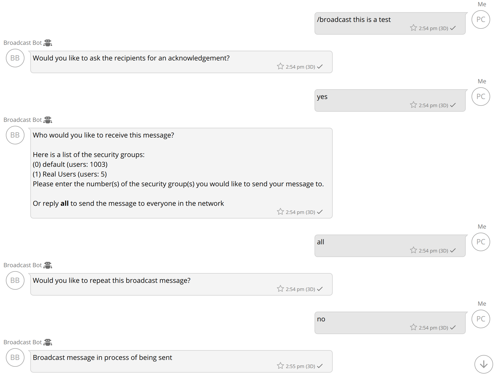

The BroadcastBot will send the message, file or voice memo to the destination group(s) you
select. The broadcast message will be sent on 1on1 conversations between the BroadcastBot and each
member of the destination group. The broadcast message will include the identity of who the
broadcast was initiated by, for example:

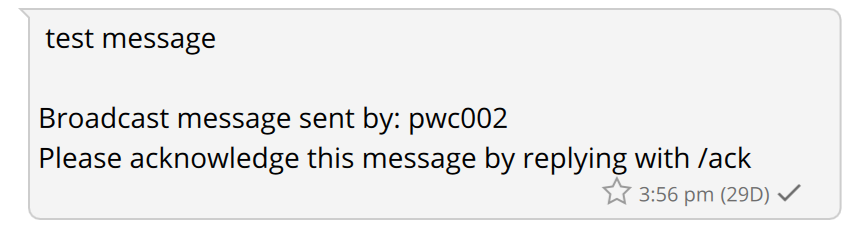

If you want the user to acknowledge the receipt of the broadcast message that will be
mentioned in the broadcast message as well. If you broadcast a file or a voice memo an additional
message will be sent to include the identity of the broadcast user as well as the acknowledgement
request.

**Usage:**

To get a list of commands available with the BroadcastBot, the /help command will present the
list of the commands and a description of what each one does. The following is a list of the
commands supported by the BroadcastBot, the commands in bold can only be used by approved Wickr
users if administrators are being used:

| Command                   | Description                                                                                                                                                                                                                                                                                                                                                   |
| ------------------------- | ------------------------------------------------------------------------------------------------------------------------------------------------------------------------------------------------------------------------------------------------------------------------------------------------------------------------------------------------------------- |
| **/abort**                | Stops sending any remaining broadcast messages. This command is useful if you are<br>sending to a large network or security group and need to stop the broadcast. The /status and<br>/report statistics will indicate how many messages were aborted.                                                                                                         |
| **/ack**                  | Acknowledges all messages you have received from the BroadcastBot.                                                                                                                                                                                                                                                                                            |
| **/admin list**           | Returns a list of the admin users.                                                                                                                                                                                                                                                                                                                            |
| **/admin add <users>**    | Add one or more admin users. A message will be sent to all admin users identifying the<br>new admin user.                                                                                                                                                                                                                                                     |
| **/admin remove <users>** | Remove one or more admin users. A message will be sent to all admin users identifying<br>the removed admin user.                                                                                                                                                                                                                                              |
| **/broadcast <message>**  | Send the text following the command to the Wickr network associated with the<br>BroadcastBot. The BroadcastBot will prompt you to identify who to send the message to, if you<br>want an acknowledgement, and if you want the message to be repeated.                                                                                                         |
| **/cancel**               | This command can be entered when you are in the process of setting up a broadcast<br>message. It will NOT cancel a message that is in process of being sent.                                                                                                                                                                                                  |
| **/delete**               | This command can be used to delete a file that was previously made available for the<br>/send command.                                                                                                                                                                                                                                                        |
| **/files**                | Returns a list of saved files that are available for the /send command. You can also<br>select a file from the list and have a copy of that file sent to you.                                                                                                                                                                                                 |
| **/help**                 | Returns a list of commands and information on how to interact with the<br>BroadcastBot                                                                                                                                                                                                                                                                        |
| **/map**                  | Displays a Google Maps link that shows a map that contains pins for the user locations<br>for a specific broadcast message. Users must send their location to the broadcast bot in order<br>for them to be included in the map.                                                                                                                               |
| **/panel**                | Displays the link and token to the web user interface. This command is available only if<br>the web application was set up during the configuration process.                                                                                                                                                                                                  |
| **/report**               | Retrieves a detailed report identifying the list of users a broadcast was to be sent to.<br>The report identifies the state of the message for that user including if the user<br>acknowledged it. Status values include: pending, sent, failed or acknowledged. If a message<br>failed to be sent to a user there will be a message to indicate the failure. |
| **/send <message>**       | Send the text following the command to a predetermined list of users. The list of users<br>will come from one of the files that has been uploaded to the bot and made available for this<br>command during the file upload process.                                                                                                                           |
| **/start**                | Start a new broadcast                                                                                                                                                                                                                                                                                                                                         |
| **/status**               | Return summary statistics associated with a broadcast.                                                                                                                                                                                                                                                                                                        |
| **<file>**                | To broadcast a file, send a file to the BroadcastBot, answer the sequence of questions<br>and the file will be broadcast to the designated users.                                                                                                                                                                                                             |
| **<voice memo>**          | To broadcast a voice memo, send a voice memo to the BroadcastBot, answer the sequence of<br>questions and the file will be broadcast to the designated users.                                                                                                                                                                                                 |
| **/version**              | Returns the version of your Wickr integration.                                                                                                                                                                                                                                                                                                                |

When you broadcast a file or a voice memo, the BroadcastBot will then prompt you to identify
the destinations of the broadcast (security groups or network).

When you broadcast a text-based message the BroadcastBot will ask you if you want to send the
message multiple times and how many minutes between each iteration of sending the broadcast.
Currently, you are allowed to wait 5, 10 or 15 minutes between each iteration of sending the
broadcast.

Detailed reports are returned in a CSV format, which can be imported into programs such as
Excel or Pages. The following image shows a sample summary of a broadcast message, as well as the
types of status information maintained by the BroadcastBot:

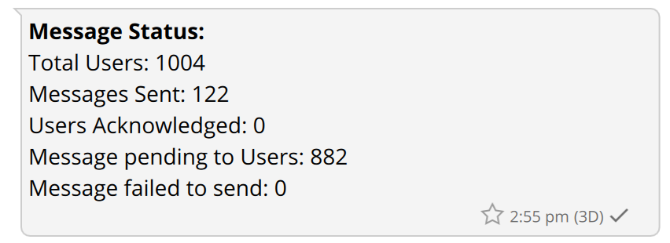

###### Note

The current broadcast bot does not support commands via a room or group conversation.

### /start Command

The start command is used to initiate a broadcast. When a broadcast is initiated the user
will be asked recipients of the broadcast. This can be configured using a User File (a .txt file
of Wickr usernames), or by stating the Security Group(s) to which this broadcast will go
out.

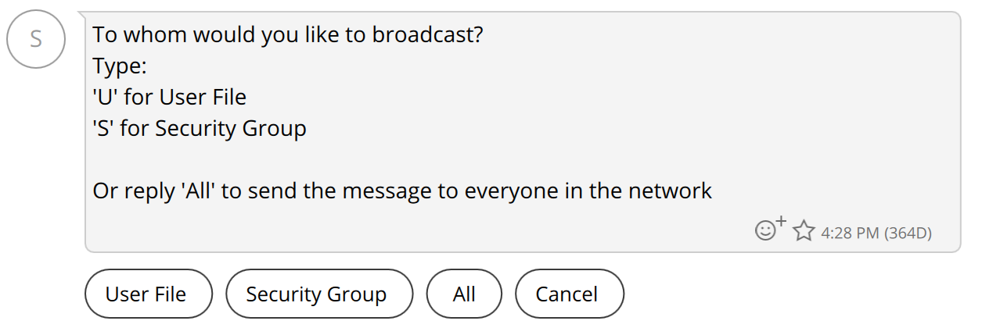

If the user selects User File, they can choose from a list of previously uploaded user files
or upload a new one by hitting the '+' sign on the navigation bar:

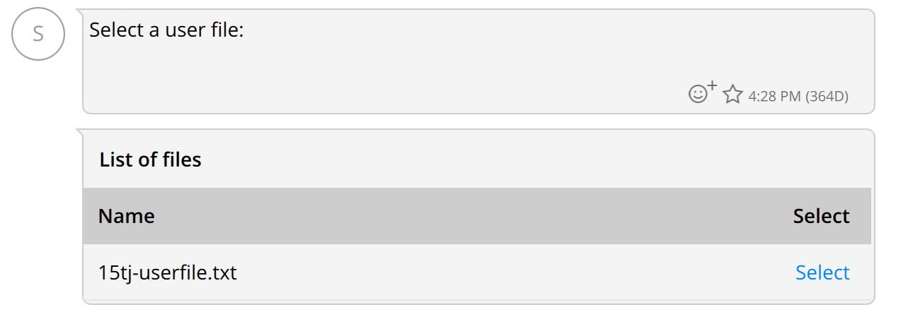

If the user selects Network or All, they have the option to broadcast the message to the
whole network or to one or more security groups:

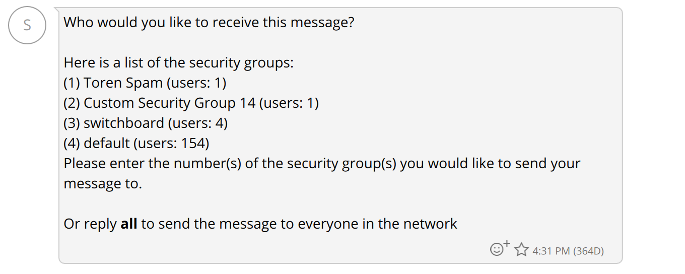

The sender can configure the broadcast to request that recipients acknowledge the message,
acknowledge with their location or acknowledge with a Response.

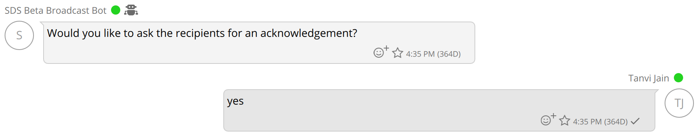

If there are other broadcasts in the queue before the user, they will get a message with an
estimated wait time:

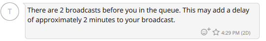

Once the user's broadcast is sent, they will receive a confirmation of this send and a
status message to indicate the status of the broadcast. At any point the user can see the status
of their broadcast using the /status command or the user can generate a report by running the
/report command:

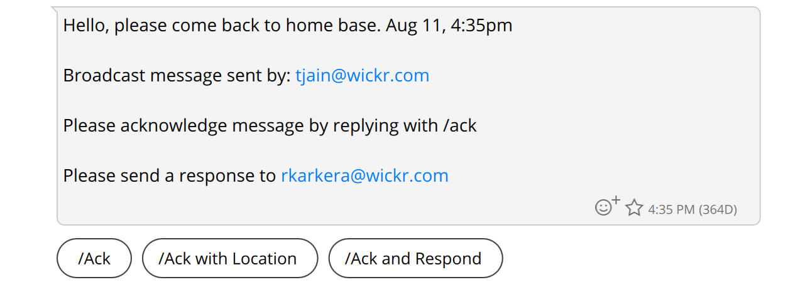

### /send Command

The send command is used to send a message to a predetermined list of users in your Wickr
Network. These users will recieve the message in a 1 on 1 conversation with the broadcast bot. In
order to use this command you must first upload a file of Wickr user ID's and make that file
available for the bot and the /send command.

The file format is simple. Just write the Wickr user ID of each user you wish to send a
message to on its own line in a text file (.txt). Commas or any other delimiters at the end of
each line should not be included. An example is shown below:

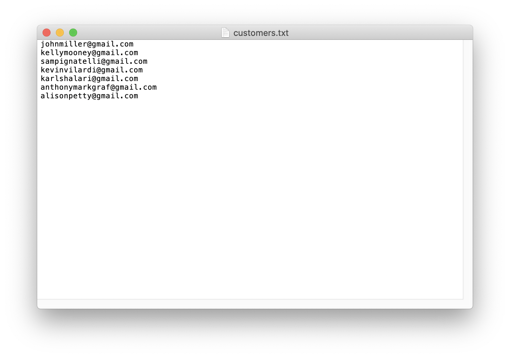

Once you have a text file of users, you are ready to upload it and make it available to the
broadcast bot and send command. To do this go to your direct message conversation with the
broadcast bot and click on the plus sign in the bottom right hand corner. A menu will pop up.
Click on the option that says "choose file."

You will then be asked what you want to do with the file. Respond by pressing the 'u' key
and then pressing enter. If you've been following along then you have just uploaded your file to
the bot and made it available for the send command.

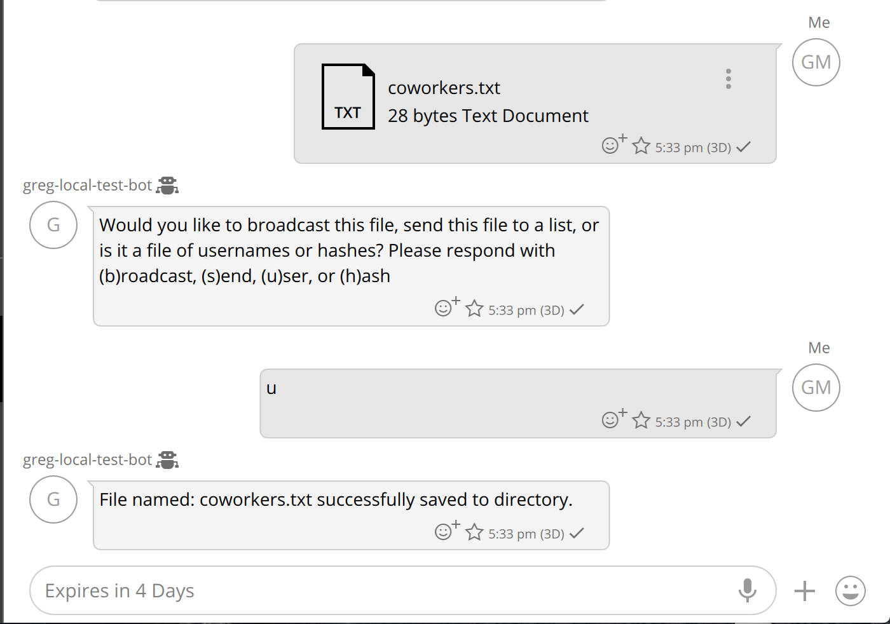

Now you are ready to send a message. To begin the process type /send followed by the message
you want to send. For example if you wanted to tell people there is cake in the break room you
would type the following: "/send There is cake in the break room!" You will then be prompted to
choose which file of users you want to send to. Next you will be prompted if you want an
acknowledgement response. Once you make a selection the message will be sent to each user and you
will recieve a status message(s) detailing the progress of the message.

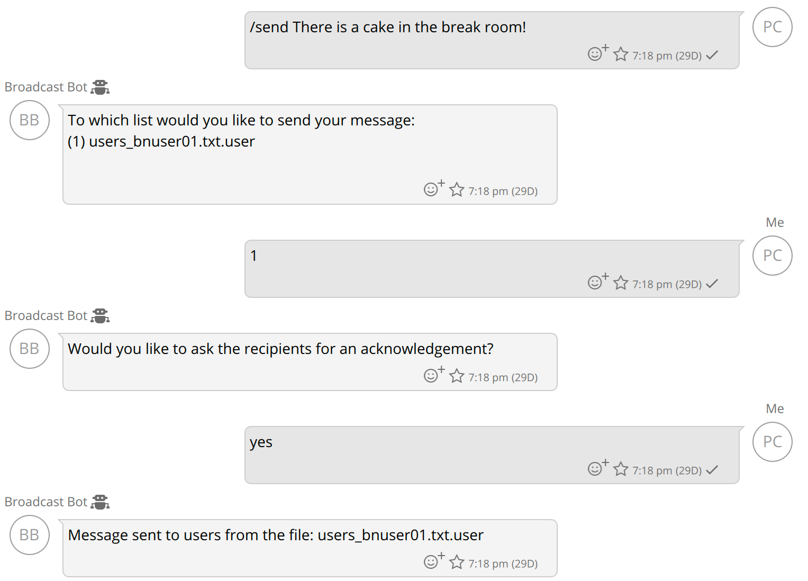

### /map Command

This command was added in the 5.60 release of the broadcast bot.

The /map command will display Google Maps link that will display a map that contains pins
for all of the users associated with a specific broadcast message. Only the users that send their
location to the broadcast bot will be shown on the map. The following image shows the Google Maps
image where two users sent their location to the broadcast bot:

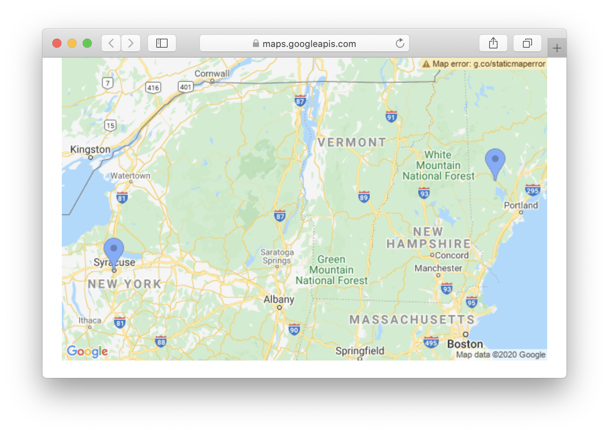

The /map command will only work if it has been configured properly with a Google Maps API
key. The following shows the prompts for the config entries associated with the /map command
setup.

```

 Do you want to map users locations when you send broadcasts [yes/no]: (no) :yes
 Please enter your google maps api key: (false) :AIzaSyCkPH2u5f5GAOXabcdef-aJEJFjeaisl

```

When a user receives a broadcast message they can reply with their location. If the user
received multiple broadcast messages and wants to share their location, they can only respond to
the most recent one and that location will be used for all of the proceeding broadcasts.

Let's look at an example where a broadcast is sent out to a group of users in the morning
three days in a row. The users in this group do alot of travelling during these three days. User
A is in Washington DC the first day, on day two he is in New York City and day three is in
Boston. Each day when he receives the broadcast, he sends his location. User B is also travelling
with user A to the same locations, but he does not send his location until he reaches Boston. At
the end of the three days, when you retrieve the map associated with day one you will see User A
in Washington DC and User B in Boston. The map associated with day two will show User A in New
York City and User B in Boston. The map associated with day three will show both users in
Boston.

## BroadcastBot Web Interface

This section describes the web interface supported by the
BroadcastBot. The web interface is a browser-based interface to interact
with the BroadcastBot. Use the /panel command on the BroadcastBot's
Wickr interface. The /panel command will return a link that you can use
to bring up the web interface. WARNING: the link you receive is only
valid for a limited time. If the link expires you will not be able to access the web
interface you will have to get a new link using the /panel command.

**NOTE:** The BroadcastBot's web interface is initially supported as of version 5.56.

The screenshot below shows the main landing page for the
BroadcastBot's web interface. On this page you can send a broadcast
message and view the list of broadcast messages that you have already
sent.

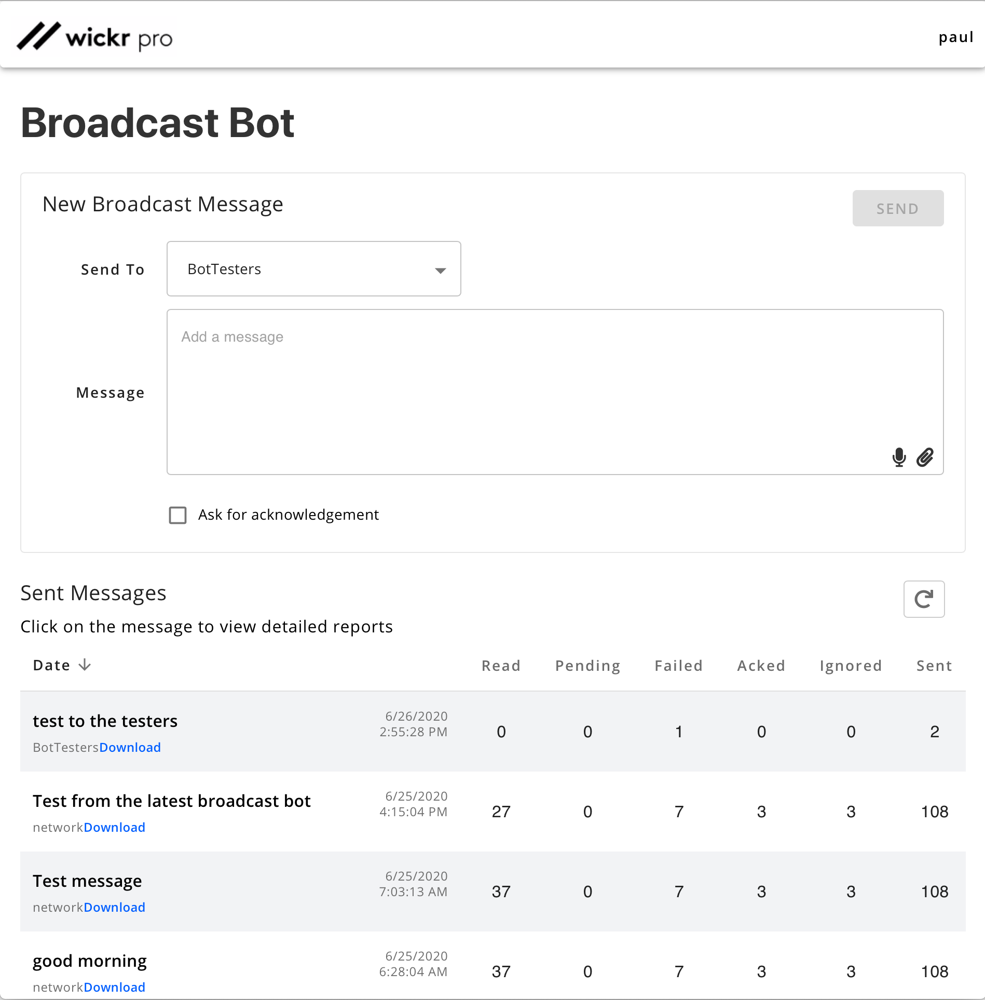

To begin you will want to select the recipients for the broadcast
message. Using the drop down box that says "Select Security Groups" you
can choose which security group will receive your broadcast message. You
also have the option to broadcast to everyone in your network by
selecting the "Whole Network" option.

Next write the content of your message in the text box. By clicking
on the paperclip in the lower right hand corner of the text box you can
attach a file to your broadcast message. You also have the option to ask
each recipient for an acknowledgment of your broadcast message. To
enable this feature simply check the box next to the words "Ask for
acknowledgement". Once your message is ready, click on the "Send" button
in the upper right hand corner to begin broadcasting your message.

The list of sent broadcast messages will show information about the broadcast including at least the following:

- Starting text from the message sent, or the name of the file sent.
- Name of the security group or "network" (if sent to the entire network) that the message was broadcast to.
- Date and time the message was sent.
- The number of Wickr users that read the message. The Read count is
  only supported if read receipts are enabled for the security group.
- The number of users that are pending to be sent to.
- The number of users that the broadcast was not sent to because of
  some transmit failure or user failure. Details of the reason for the
  failed transmits can be seen in the message details screen. Failures are
  typically associated with user accounts that are in a bad state.
- The Acked count is the number of users that acknowledged the
  message. Messages are acknowledged by the /ack command or sending your
  location to the broadcast bot.
- The Ignored count is the number of users that were not broadcast to.
  If a bot is in the destination security group or network, they will not
  be broadcast to and will account for the ignored value.
- The Sent count is the number of users the message was sent to
  without receiving a send failure. This does not account for any receive
  failures that may have occurred.

If you click on the message text of any of the sent messages the
detailed list of the users associated with the broadcast will be
displayed. You will see the same statistics that were shown on the main
screen as well as details of the transmission to each user in the list
of users the broadcast is associated with. You can also download a JSON
report of the information displayed on this screen.

To update the statistics on your broadcasted/broadcasting messages
click on the refresh button in the top right hand corner of the "Sent
Messages" table. Messages can also be sorted by date by clicking on the
arrow next to the "Date" column header. If the arrow is pointing up messages in the table will be sorted from earliest sent
to latest sent. If the arrow is pointing down messages in the table will
be sorted from latest sent to earliest sent.

## BroadcastBot REST API

This section describes the REST APIs supported by the BroadcastBot. This capability is
initially supported in version 5.56 of the BroadcastBot. The following table identifies each of
the actions the API supports, the type of HTTP request and the URL used.

| API                         | HTTP   | URL                                                                                                                                 |
| --------------------------- | ------ | ----------------------------------------------------------------------------------------------------------------------------------- |
| Get security groups         | GET    | https://<host>:<port>/WickrIO/V2/Apps/Broadcast/<API<br>Key>/SecGroups                                                              |
| Broadcast a message or file | POST   | https://<host>:<port>/WickrIO/V2/Apps/Broadcast/<API<br>Key>/Broadcast                                                              |
| Get list of messages sent   | GET    | https://<host>:<port>/WickrIO/V2/Apps/Broadcast/<API<br>Key>/Messages?page=<Page>&limit=<Limit>                                     |
| Get broadcast summary       | GET    | https://<host>:<port>/WickrIO/V2/Apps/Broadcast/<API<br>Key>/Summary?messageID=<MessageID>                                          |
| Get broadcast details       | GET    | https://<host>:<port>/WickrIO/V2/Apps/Broadcast/<API<br>Key>/Report?messageID=<MessageID>&page=<Page>&limit=<Limit>&filter=<filter> |
| Abort broadcast message     | POST   | https://<host>:<port>/WickrIO/V2/Apps/Broadcast/<API<br>Key>/Abort?messageID=<MessageID>                                            |
| Set Event URL Callback      | POST   | https://<host>:<port>/WickrIO/V2/Apps/Broadcast/<API<br>Key>/EventRecvCallback?callbackurl=<url>                                    |
| Get Event URL Callback      | GET    | https://<host>:<port>/WickrIO/V2/Apps/Broadcast/<API<br>Key>/EventRecvCallback                                                      |
| Delete Event URL Callback   | DELETE | https://<host>:<port>/WickrIO/V2/Apps/Broadcast/<API<br>Key>/EventRecvCallback                                                      |

The <API Key> value is the value you entered during the configuration of the Wickr
Web Interface integration.

For all of the BroadcastBot REST APIs, the "Authorization" HTTP header will have a value
that is "Basic " followed by the base64 encoded value of the Authorization Token value created
when the BroadcastBot is configured. For example, the Authorization Token value of "The big red
fox" encodes to "VGhlIGJpZyByZWQgZm94" in base64, so you would send the string "Basic
VGhlIGJpZyByZWQgZm94" in the "Authorization" HTTP header.

### Get Security Groups API

This API is used to get the list of security groups that can be used to broadcast
to.

```
https://<host>:<port>/WickrIO/V2/Apps/Broadcast/<API Key>/SecGroups
```

The get security groups REST API is an HTTP GET command.

The response will return a JSON array of security group information containing the ID and
name of the security groups that you have access to. The following is an example of a response
to the get security groups REST API:

```
[
    { "id": "2jOtbNpA", "name": "only bob" },
    { "id": "h-R3zBuV", "name": "Custom Security Group 5" },
    { "id": "hgQfaqbM", "name": "default" },
    { "id": "iNc4VjAx", "name": "Real Users" },
    { "id": "jBfxwk5u", "name": "Empty Security Group" }
]
```

###### Note

The ID value returned is the value that will be used in the broadcasting APIs. The name
value is for display purposes only.

### Broadcast a Message or File API

This API can be used to broadcast a message or a file. The destination for this broadcast
can be either a security group, the entire network or a list of users. If you want to send to
a security group, you will include the security group ID in the "security_group" value. To
send to the entire network you will not send the "security_group" and "users" object in the
request. To send to a list of users you will send the "users" object with the list of users.
Samples are below.

This is the endpoint associated with the API:

```
https://<host>:<port>/WickrIO/V2/Apps/Broadcast/<API Key>/Broadcast
```

The broadcast message or file API is an HTTP POST command.

The body of the POST request is JSON and the contents of that JSON will determine the type
of broadcast message to send as well as who the broadcast message is going to be sent to.
There are several JSON fields used by this API and depending on the type of message being
sent. The following table lists all of the JSON fields that are supported by the Send Message
API.

| KEY            | Description                                                                                                                                                                                                                                                                                                                                |
| -------------- | ------------------------------------------------------------------------------------------------------------------------------------------------------------------------------------------------------------------------------------------------------------------------------------------------------------------------------------------ |
| message        | String value that is the message to be broadcast. This value is required.                                                                                                                                                                                                                                                                  |
| security_group | This is the security group ID to send to. Do not include this entry if sending to<br>the entire network.                                                                                                                                                                                                                                   |
| users          | This is a JSON list of users to send to. Do not include this entry if sending to<br>the entire network or a security group. The object for each user can also include a<br>"meta" object that will be associated with the user's entry for the broadcast message.<br>See the examples below that show different uses of the "meta" object. |
| acknowledge    | Indicates if an acknowledgement request should be part of the broadcast message.<br>If this is "true" then the acknowledgement request will be included in the broadcast<br>message. This value is optional, if not included an acknowledgement is not<br>requested.                                                                       |
| repeat_num     | The number of times to repeat the broadcast message. This value is optional, if<br>not included then the message will not be repeated.                                                                                                                                                                                                     |
| freq_num       | The number of minutes to wait between repeating a broadcast message. This value<br>is optional but is required if the "repeat_num" value is present.                                                                                                                                                                                       |
| bor            | The burn-on-read value to use when sending the message. This value is optional,<br>will default to the current value set for the conversation.                                                                                                                                                                                             |
| ttl            | The time-to-live value to use when sending the message (referred to as Expiration<br>Time in clients). This value is optional, will default to the current value set for<br>the conversation.                                                                                                                                              |
| user_meta      | This is a boolean value (true or false) that indicates whether the meta data<br>associated with each user should be included in the broadcast message status<br>information.                                                                                                                                                               |

#### Broadcasting Messages

To broadcast a message, the HTTP Header must include the Content-Type value of
"application/json". The following is a sample JSON object to send a broadcast to the "only
bob" security group from the get security group API description above. The security group ID
for the "only bob" security group is included in the "security_group" JSON object:

```
{
    "security_group": "2jOtbNpA",
    "message": "Welcome to Wickr! This message will self-destruct in 5 seconds."
}
```

The following is a sample JSON object to broadcast a message to the entire
network:

```
{ "message" : "This is a broadcast to a group of users",
}
```

The following is a sample JSON object to broadcast a message to a list of users:

```
{ "message" : "This is a broadcast to a group of users",
  "users" : [{"name" : "user1@company.com"},
             {"name" : "biguser44@company.com"},
             {"name" : "smalluser232@company.com"},
             {"name" : "myuser@company.com"},
             {"name" : "thelastuser@company.com"}]
}
```

The following is a sample JSON object to broadcast a message to a list of users and
include meta data for each of the users:

```
{ "message" : "This is a broadcast to a group of users",
  "users" : [{"name" : "user1@company.com", "meta" : "this is data for User 1 AKA Bit User" },
             {"name" : "biguser44@company.com", "meta" : {"lang":"en", "id":1122324} },
             {"name" : "smalluser232@company.com", "meta" : {"lang":"en", "id":123243} },
             {"name" : "myuser@company.com"},
             {"name" : "thelastuser@company.com", "meta" : "Me" }],
  "user_meta" : true
}
```

The value of the "meta" object can be a JSON object or a string. When you perform a
report command, the value of the "meta" object will be returned for each user in the
response.

The response will be a normal HTTP 200 status if successful, or an HTTP error depending
on the failure that occurred. The broadcast will go through several stages before the actual
broadcast begins, specifically setting up the tables for the broadcast message status
information as well as preparing the user information for the users to be broadcast to.
Depending on the number of users being broadcast to this pre-broadcast process may take a
few minutes (typical when sending to thousands of users).

If the broadcast is initiated successfully a JSON response will be sent containing
information associated with the broadcast, including the message sent, the messageID
associated with the message and the identity of the destination of the broadcast.

The following is a sample of the output for a broadcast to the entire network:

```
{
    "data": {
        "message": "This is a broadcast test",
        "message_id": "54",
        "securityGroups": []
    }
}
```

The following is a sample of the output for a broadcast to a list of users:

```
{
    "data":{
        "message":"This is a broadcast test and another test",
        "message_id":"56",
        "users":["user1@company.com"]
    }
}
```

You can use the "message_id" value returned for subsequent calls to get the broadcast
message's status and report.

#### Broadcasting Files

To broadcast a file, the Content-Type HTTP header used for this REST API is different
because it has a value of "multipart/form-data'. This is necessary so the file can be part
of the request. The body will have two parts, one for the file to broadcast, and the other
part to identify who to broadcast to and if there are other broadcast settings (similar to
the Broadcast Message API).

The part that identifies the file to transmit has a key value of "attachment", and the
value is the actual file to transmit.

The part that contains the broadcast information is a JSON string that is exactly the
same as that defined above. The "message" object is used to send a message that is also
broadcast with the file.

The response will be a normal HTTP 200 status if successful, or an HTTP error depending
on the failure that occurred. The broadcast will go through several stages before the actual
broadcast begins, specifically setting up the tables for the broadcast message status
information as well as preparing the user information for the users to be broadcast to.
Depending on the number of users being broadcast to this pre-broadcast process may take a
few minutes (typical when sending to thousands of users).

### Get List of Messages Sent API

This API is used to get a list of the broadcast messages that were sent via the REST
application APIs.

```
https://<host>:<port>/WickrIO/V2/Apps/Broadcast/<API Key>/Messages?page=<Page>&limit=<Limit>
```

The get list of messages sent API is an HTTP GET command.

The number of broadcasts sent can grow over time so you will have to limit the size of the
response by selecting an appropriate "Page" and "Limit" values. The "Page" value starts at 0.
The "Limit" value identifies the number of message entries in each page. A page size of 1000
is likely to be okay. If you have more than 1000 broadcast messages, then you will have to
make multiple calls to page through the messages. Each response will contain a "max_entries"
value which indicates the total number of broadcast messages associated with the Wickr
user.

The response to the get list of messages sent API will look like the following
example:

```
{
    "list": [
        {
            "message": "Hello. This is a broadcast to a list of users",
            "message_id": "3",
            "sender": "user123@wickr.com",
            "target": "USERS",
            "when_sent": "2020-06-08T21:18:15.511Z"
        },
        {
            "message": "Hello this is a sample broadcast to a security group",
            "message_id": "4",
            "sender": "user123@wickr.com",
            "target": "hgQfa8TM",
            "when_sent": "2020-06-08T22:08:59.855Z"
        },
        {
            "message": "This was a broadcast to an entire network",
            "message_id": "5",
            "sender": "user123@wickr.com",
            "target": "NETWORK",
            "when_sent": "2020-06-08T22:16:20.463Z"
        },
        {
            "message": "This was a broadcast of a file",
            "message_id": "13",
            "sender": "user123@wickr.com",
            "target": "NETWORK",
            "when_sent": "2020-06-09T22:17:48.469Z"
        }
    ],
    "max_entries": 5,
    "source": "user123@wickr.com"
}
```

The "max_entries" value identifies how many broadcast entries are associated with the
"source" user. This value can be used to help identify how many pages of messages you may have
to download.

The "target" value in each of the "list" entries identifies if the broadcast was to a
specific security group, the entire network ("NETWORK") or a list of users ("USERS").

### Get Broadcast Summary API

This API is used to get the summary status of a specific broadcast message. The message is
identified by the message ID value, use the Get List of Messages Sent API to get the
appropriate message ID.

```
https://<host>:<port>/WickrIO/V2/Apps/Broadcast/<API Key>/Summary?messageID=<MessageID>
```

The get broadcast summary API is an HTTP GET command.

This API will return a JSON object with the following values:

| KEY      | Description                                                                                                                                   |
| -------- | --------------------------------------------------------------------------------------------------------------------------------------------- |
| aborted  | Number of users that were not sent to because the message was aborted. See the<br>Abort REST API for details.                                 |
| acked    | Number of users that acknowledged receiving this message using the /ack<br>command.                                                           |
| failed   | Number of users that did not get the message due to a failure to send the<br>message. See the detail report for details on failure types.     |
| ignored  | Number of users that were not sent to because the account was a bot. Bots will<br>not be broadcast to.                                        |
| num2send | Number of users that are associated with this message.                                                                                        |
| pending  | Number of users that have not been sent to yet.                                                                                               |
| read     | Number of users that have read the message sent to them. This will only be set if<br>read receipts are supported by your Wickr servers.       |
| sent     | Number of users that have been sent to for this broadcast.                                                                                    |
| status   | A status value that will be a value of "Preparing" if the broadcast is in the<br>preparation state, pending the actual broadcast of messages. |

The response to this API will include all of these values. The "status" value will only be
included if the broadcast is preparing the broadcast data structures. For large broadcasts
this may take some time. When in this state the other status values will have a value of 0.

### Get Broadcast Details API

This API is used to get the detailed status of a specific broadcast message. The
information returned is a list of entries, one for each user the broadcast was transmitted to.
Use the Get List of Messages Sent API to get the appropriate message ID. Since it is possible
the broadcast will be sent to thousands of users your request will have to identify the page
and page size values. It is recommended to not make the page size too large. This API supports
a filter option to select one or more status types to retrieve for the associated
MessageID.

```
https://<host>:<port>/WickrIO/V2/Apps/Broadcast/<API Key>/Report?messageID=<MessageID>&page=<Page>&limit=<Limit>&filter=<Filter>
```

The get broadcast details API is an HTTP GET command.

The filter value is used to select which status entries to retrieve. The <Filter>
value is a comma separated list of the filters to retrieve. The status values that you can use
to filter on are: "pending" "sent" "failed" "acked" "ignored" "aborted" "read". This filter is
optional, if you do not want to filter then do not include the filter parameter.

The response to this request will be a list of entries with the following fields:

| KEY           | Description                                                                                                                                                                                                                                             |
| ------------- | ------------------------------------------------------------------------------------------------------------------------------------------------------------------------------------------------------------------------------------------------------- |
| user          | The Wickr ID of the user associated with this entry                                                                                                                                                                                                     |
| status        | This is the status of the broadcast to this specific user. This value can be one<br>of the values shown in the Get Broadcast Summary API section above.                                                                                                 |
| statusMessage | This is a message associated with the status value. If the status is "failed"<br>this field will identify why the send failed. If the user acknowledges the message by<br>sending their location, this field will have a URL that shows their location. |
| sentDate      | This is the date and time the message was sent. The date format is the following:<br>2020-06-14 17:27:27 UTC                                                                                                                                            |
| readDate      | This is the date and time the message was read, if read receipts are supported by<br>your Wickr server. The date format is the following: 2020-06-14 17:27:27 UTC                                                                                       |

### Abort Broadcast Message API

This API is used to abort a broadcast message that is currently being transmitted. This is
typically only useful for broadcasts to large numbers of users. Broadcasts to small numbers of
users will likely complete too quickly for this API to be useful. Use the Get List of Messages
Sent API to get the appropriate message ID.

```
https://<host>:<port>/WickrIO/V2/Apps/Broadcast/<API Key>/Abort?messageID=<MessageID>
```

The abort broadcast message API is an HTTP POST command.

The response will be a normal HTTP 200 status if successful, or an HTTP error depending on
the failure that occurred. The response body will contain a JSON object with a "result" string
and a "status" object that contains the summary status associated with the MessageID used to
perform the abort operation. The following is a sample output from a successful abort
command:

```
{
    "result": "Success",
    "status": "{
        "aborted": 1900,
        "acked": 0,
        "failed": 0,
        "ignored": 0,
        "num2send": 2000,
        "pending": 0,
        "read": 0,
        "sent": 100
    }
}
```

Abort commands that fail will return a string identifying the type of error. Typical
errors invalid messageID values or trying to abort a messageID that is not associated with the
bot user.

### Event Callbacks

Event callbacks will define a URL that the bot client will connect to when a messaging
event occurs. Information about the event will be sent to the defined URL. It is assumed that
there is an application consuming, and acknowledging, events that are pushed to this URL. For
example, if you run a process on the same machine as the Wickr IO client you can use a URL
like the following:

```
http://localhost:4100
```

Events that are posted to the set URL will have the following sample format:

```
{
    "message_id" : "9",
    "reason" : "Failed verification",
    "user" : "user555@somewher.com"
}
```

#### Set Event Callback URL API

You will need to configure the specific URL that the Wickr IO client will send events
to. To set the URL callback value, send an HTTP POST request using the following URI:

```
https://<host>:<port>/WickrIO/V2/Apps/Broadcast/<API Key>/EventRecvCallback?callbackurl=<url>
```

The client will respond back with a success or failure response. Any events that occur
after this call is performed will be sent to the defined URL.

#### Get Event Callback URL API

To get the currently set URL callback send an HTTP GET request using the following
URI:

```
https://<host>:<port>/WickrIO/V2/Apps/Broadcast/<API Key>/EventRecvCallback
```

The client will respond with either a success (200) or failure response. If there is a
URL callback defined the following is the format of the body:

```
{
    "callbackurl": "https://localhost:4008"
}
```

#### Delete Event Callback URL API

If a URL callback is no longer needed, then the delete URL callback API should be used.
To delete a URL callback, send an HTTP DELETE request using the following URI:

```
https://<host>:<port>/WickrIO/V2/Apps/Broadcast/<API Key>/EventRecvCallback
```

The client will respond with a success or failure response.

## Broadcastbot Message Send Failures

It is possible that when broadcasting to a group of users there may be a failure with the
destination user's account. This section will describe some of the possible failures that may
happen when sending a broadcast.

| KEY                                          | Description                                                                                                                                                                                                                    |
| -------------------------------------------- | ------------------------------------------------------------------------------------------------------------------------------------------------------------------------------------------------------------------------------ |
| "Failed verification"                        | This failure message indicates the account is not valid. Could be in a suspended<br>state as well.                                                                                                                             |
| "Could not find user record"                 | This failure message also indicates the account is not valid. Could be in a<br>suspended state as well.                                                                                                                        |
| "Message failed to send, check user account" | This failure usually indicates an issue with the user account being sent to.<br>Something like no active devices associated with the account.                                                                                  |
| "msgSvcSend failed"                          | This failure is due to an internal issue. Could be the process associated with<br>transmitting messages was not fully initialized, this could be very rare. Retransmitting<br>the message to the effected user(s) should work. |
| "sendFile failed"                            | This failure can happen when broadcasting a file but is very rare as well.<br>Retransmitting the message to the effected user(s) should work.                                                                                  |
| "No users on the 1to1"                       | This failure is an internal error and is very rare. If this type of error does<br>occur, retransmitting should work.                                                                                                           |

There are other failures possible and they are associated with network or system issues that
may occur. If those errors do occur retransmitting the message to the effected user(s) should
work.
