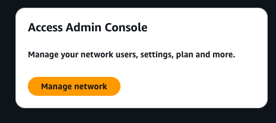
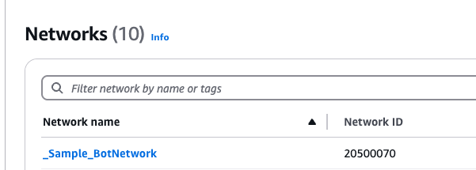
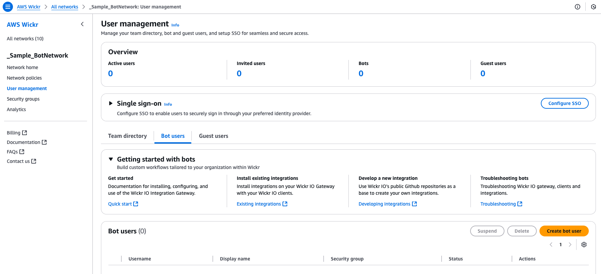
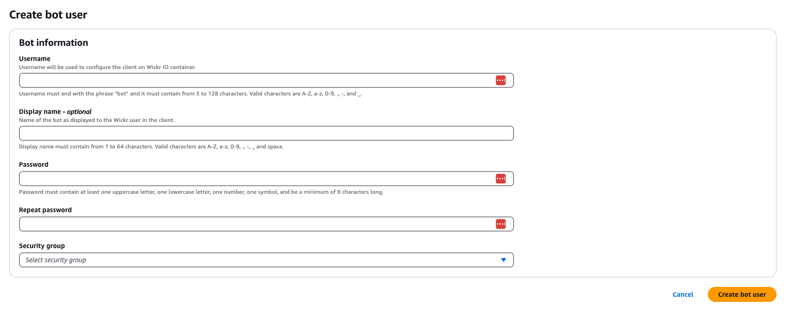

This guide provides documentation for Wickr IO Integrations. If you're
using AWS Wickr, see [AWS Wickr
Administration Guide](../adminguide/what-is-wickr.md "../adminguide/what-is-wickr.md").

# Step 1: Create a bot user

You can create a bot user in the Wickr console.

Complete the following procedure to create a bot user.

1. Log in to the AWS Wickr console at [https://console.aws.amazon.com/wickr/](https://console.aws.amazon.com/wickr/ "https://console.aws.amazon.com/wickr/")
2. In the **Access Admin Console** section of the page, choose
   **Manage network**.

 3. Select your Wickr network by finding it using its Network name or Network ID on the
Manager network page. If necessary, search for the network by its Network name.

 4. In the left navigation, choose **User management** to access the User
Management page. This page allows you to add, remove, and set properties for all kinds of
Wickr user types including licensed users, bots, and guest users.

 5. Choose the **Bot users** tab and choose **Create bot
user**.

 6. Enter the following information:

    * **Username** — The internal username of the bot.
    * **Display name** — The bot name that will be shown to end users.
    * **Password** — The password that you'll need to register and log in to
     the bot.
    * **Security group** — Controls permissions for the bot and how it's
     allowed to communicate.
