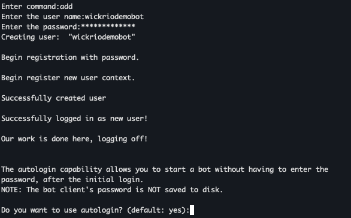
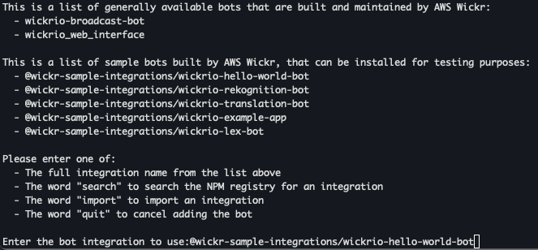
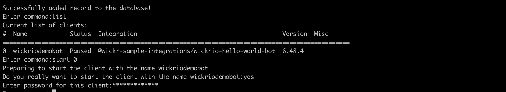
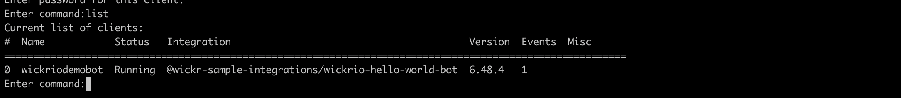
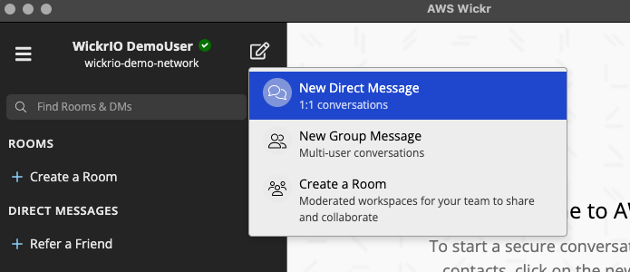
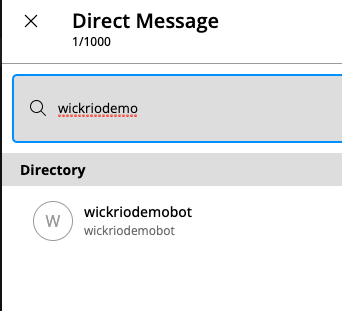
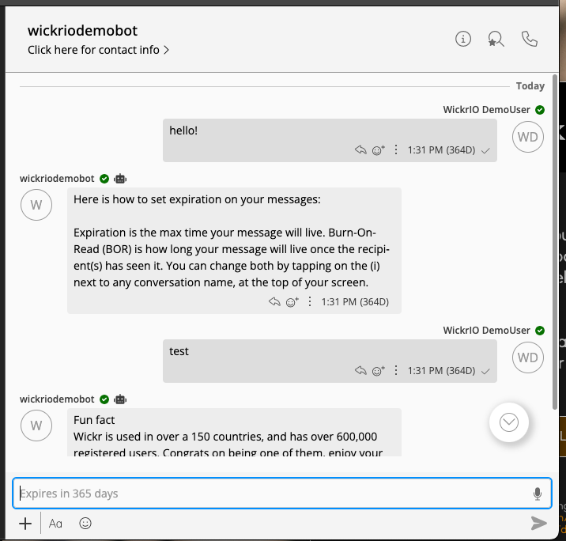

This guide provides documentation for Wickr IO Integrations. If you're
using AWS Wickr, see [AWS Wickr
Administration Guide](../adminguide/what-is-wickr.md "../adminguide/what-is-wickr.md").

# Deploy an existing bot

Complete the following procedure to deploy an existing bot.

**Wickr IO Hello World Bot**

1. Follow Steps 1-3 in [Quick start](quick-start.md "quick-start.md") to get the bot container created and
   running.
2. At the **Enter command:** prompt, enter the command
   **add**.

 3. Over the next several prompts, enter the **username** and
**password** created in the previously. 4. Next you are prompted to select an integration. In the sample, we used
`@wickr-sample-integrations/wickrio-hello-world-bot`.

 5. Start the bot by doing the following:

    1. Use the **list** command to view a list of available bots.

    
    2. Using the number of the bot that you just created (0 in the example), type the command
     **start #**, where # is the bot number (0 in the example).
    3. Enter the password for the bot.
    4. Wait several seconds, and then use the **list** command again to verify
     that the bot is running.

    

6. Interact with the bot:
   1. Using your Wickr user, choose the **New Direct Message**
      button.

    2. In the search bar, search for your bot by display name.

    3. Select your bot for a direct message, and send a message.

   
